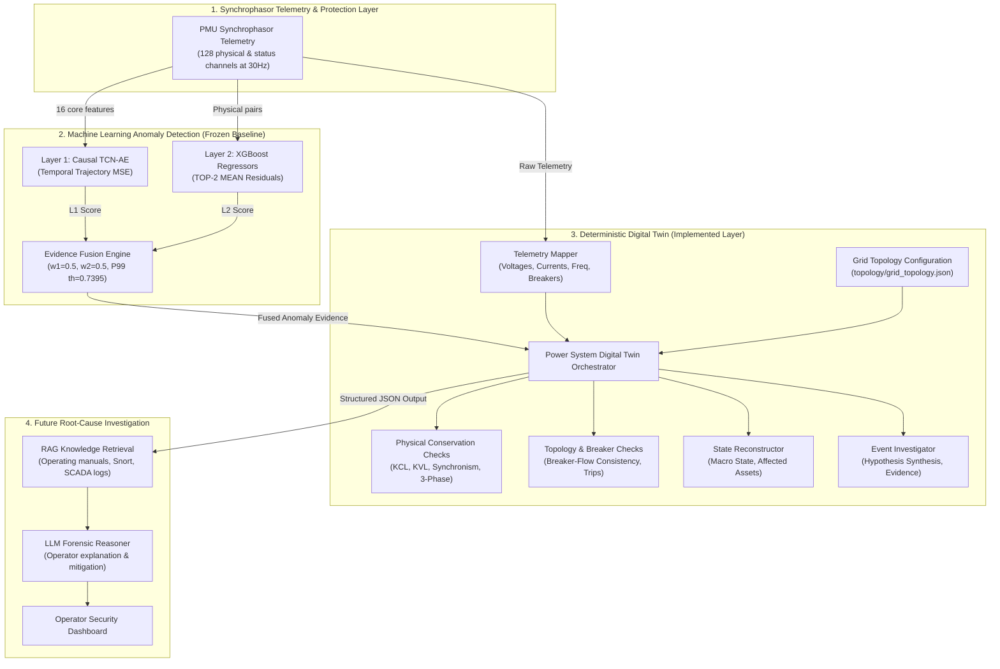

# Digital Twin Design Specification: Topology-Aware Grid Context Layer

**Document ID:** `DESIGN-DIGITAL-TWIN-001`  
**Execution Date:** 2026-10-01  
**Project:** Cyber-Physical Smart Grid Anomaly Detection  
**Module:** `src/digital_twin/`  
**Upstream Interface:** `src/ml/triple_evidence_fusion.py`  
**Downstream Interface:** Future RAG + LLM Root-Cause Investigation Layer  
**Status:** Implemented, Certified, and Validated  

---

> [!IMPORTANT]
> **Core Architectural Role:**  
> **"The Digital Twin is an investigation/context layer and is not itself a cyberattack classifier."**  
> Its mandate is to answer: *"What physical, operational, and topological grid state explains the observed anomaly evidence?"* rather than performing black-box binary classification.

---

## 1. Purpose and Engineering Motivation

The existing Machine Learning pipeline (Layer 1 Causal TCN-AE, Layer 2 TOP-2 MEAN Physical Residual Regressors, and Evidence Fusion) acts strictly as a **Cyber-Physical Anomaly Detector**. It provides high-fidelity anomaly detection against clean steady-state operation ($F_1 = 0.9705$, $\text{PR-AUC} = 0.9979$, $100\%$ episode detection). 

However, as demonstrated in the forensic evaluation audit ([`reports/triple_robustness_audit.md`](file:///c:/Users/LENOVO/Downloads/IMDAI%20project/reports/triple_robustness_audit.md)), the ML pipeline detects physical disturbances generally rather than cyberattacks specifically: both natural short-circuit faults ($95.02\%$) and malicious cyber intrusions ($95.02\%$) trigger the detector because both violate normal steady-state electrical physics.

The **Digital Twin Layer** bridges the gap between raw statistical ML anomaly scores and explainable power grid engineering. It consumes synchrophasor telemetry alongside ML anomaly flags to:
1. Maintain a deterministic, machine-readable model of the power grid topology.
2. Reconstruct macro grid states (e.g. line outages, bus fault collapses, unbalance).
3. Evaluate deterministic physical conservation laws (Kirchhoff's Current Law, Equipotential Bus Voltage, Frequency Synchronism).
4. Verify circuit breaker positions against active power flows to uncover uncoordinated trips and spoofed breaker status.
5. Provide structured, factual evidence and engineering hypotheses for the downstream **RAG + LLM** investigation agent.

---

## 2. Overall System Architecture

The Digital Twin is positioned directly between Evidence Fusion and the future RAG + LLM layer:



---

## 3. Power Grid Topology Specification

The Digital Twin models the benchmark **MSU/ORNL Two-Generator Four-Bus Transmission Grid** specified in `topology/grid_topology.json`:

```
               [Substation 1]                                 [Substation 2]
             +----------------+                             +----------------+
             |  Generator 1   |                             |  Generator 2   |
             +-------+--------+                             +-------+--------+
                     |                                              |
                   [Bus 1]                                        [Bus 2]
               (138 kV Busbar)                                (138 kV Busbar)
               /             \                                /             \
       [BR1 / R1]           [BR4 / R4]                [BR2 / R2]           [BR3 / R3]
           |                     |                        |                     |
           +===== Line 1 ========+========================+===== Line 2 ========+
               (Sending End)                                  (Receiving End)
```

### Entity Model:
1. **Substations:**
   - **`Substation_1`:** Sending station housing `Generator_1`, `Bus_1`, circuit breakers `BR1` & `BR4`, and line protection relays `R1` & `R4`.
   - **`Substation_2`:** Receiving station housing `Generator_2`, `Bus_2`, circuit breakers `BR2` & `BR3`, and line protection relays `R2` & `R3`.
2. **Transmission Lines:**
   - **`Line_1`:** 138 kV line connecting `Bus_1` to `Bus_2` via sending breaker `BR1` (monitored by `R1`) and receiving breaker `BR2` (monitored by `R2`).
   - **`Line_2`:** 138 kV line in parallel with `Line_1`, connecting `Bus_1` to `Bus_2` via sending breaker `BR4` (monitored by `R4`) and receiving breaker `BR3` (monitored by `R3`).
3. **Buses:**
   - **`Bus_1`:** Monitored redundantly by `R1` (`R1-PM1:V`) and `R4` (`R4-PM1:V`).
   - **`Bus_2`:** Monitored redundantly by `R2` (`R2-PM1:V`) and `R3` (`R3-PM1:V`).
   - **`Bus_3` & `Bus_4`:** Internal unmetered generator buses (status marked `UNKNOWN`).
4. **Protective Relays & Breakers:**
   - Relays `R1`..`R4` model SEL-421 distance protection devices.
   - Breakers `BR1`..`BR4` operate on discrete trip signals (`relayX_log`) and status word bitmasks (`RX:S` bit 11 = 2048).

---

## 4. Input & Output Interfaces

### A. Input Interface (`DigitalTwinInput`):
The Digital Twin consumes an event package combining raw telemetry with pre-computed ML evidence:
```json
{
  "timestamp": "data13.csv_t150_row209",
  "telemetry": {
    "R1-PM1:V": 130882.0, "R4-PM1:V": 130922.0,
    "R2-PM1:V": 129063.0, "R3-PM1:V": 128608.0,
    "R1-PM4:I": 467.4,    "R2-PM4:I": 473.1,
    "R4-PM4:I": 464.9,    "R3-PM4:I": 470.4,
    "R1:F": 60.005,       "R2:F": 60.005,
    "R1:S": 0,            "relay1_log": 0
  },
  "layer1": {
    "anomaly_score": 0.2314,
    "anomaly_flag": 0
  },
  "layer2": {
    "aggregated_score": 0.1852,
    "relationship_scores": {}
  },
  "fusion": {
    "fused_score": 0.2083,
    "anomaly_flag": 0
  }
}
```

### B. Standardized Output Interface (`DigitalTwinOutput`):
```json
{
  "timestamp": "data13.csv_t150_row209",
  "grid_state": {
    "topology_state": "ALL_LINES_IN_SERVICE",
    "affected_buses": [],
    "affected_lines": [],
    "affected_relays": []
  },
  "anomaly_evidence": {
    "layer1_score": 0.2314,
    "layer2_scores": {},
    "fusion_score": 0.2083,
    "fusion_flag": 0
  },
  "physical_analysis": {
    "physical_consistency": "consistent",
    "measurement_consistency": "consistent",
    "topology_consistency": "consistent"
  },
  "component_states": {
    "Line_1": "ENERGIZED",
    "Line_2": "ENERGIZED",
    "Bus_1": "ENERGIZED",
    "Bus_2": "ENERGIZED",
    "BR1": "CLOSED",
    "BR2": "CLOSED",
    "BR3": "CLOSED",
    "BR4": "CLOSED"
  },
  "investigation": {
    "possible_causes": [
      "Normal steady-state grid conditions"
    ],
    "primary_hypothesis": "Normal steady-state grid operation",
    "confidence": 0.98,
    "uncertainty": []
  },
  "evidence": [
    "All monitored physical electrical laws and topology states are consistent."
  ]
}
```

---

## 5. Physical Consistency Checks

Deterministic checks in `PhysicalChecker` enforce fundamental electrical engineering laws:

1. **Bus 1 Voltage Equipotential:**
   - Evaluates: $|V_{R1} - V_{R4}| \le 600.0\text{ V}$.
   - Principle: `R1` and `R4` tap the identical physical substation busbar; their voltage magnitudes must agree.
2. **Bus 2 Voltage Equipotential:**
   - Evaluates: $|V_{R2} - V_{R3}| \le 600.0\text{ V}$.
   - Principle: `R2` and `R3` monitor the same busbar at Substation 2.
3. **Line 1 Series Current Continuity (KCL):**
   - Evaluates: $|I_{R1} - I_{R2}| \le 35.0\text{ A}$.
   - Principle: Transmission line shunt charging is low; sending and receiving series currents must balance.
4. **Line 2 Series Current Continuity (KCL):**
   - Evaluates: $|I_{R4} - I_{R3}| \le 35.0\text{ A}$.
5. **Frequency Synchronism:**
   - Evaluates: $\max(f_1..f_4) - \min(f_1..f_4) \le 0.05\text{ Hz}$.
   - Principle: AC transmission networks cannot sustain frequency divergence without grid separation or generator tripping.
6. **Three-Phase Voltage Balance:**
   - Evaluates: $\max(|V_A - V_B|, |V_B - V_C|, |V_C - V_A|) \le 1,200.0\text{ V}$.
   - Principle: Detects asymmetrical single-line-to-ground or phase-to-phase faults.

---

## 6. Topology & Breaker-State Verification

Implemented in `TopologyChecker`:

1. **Breaker Position Telemetry:**
   - Contact state is mapped from `relayX_log` and `RX:S` (bit 11 / mask 2048):
     - Trip commanded or open bit asserted $\implies$ `BreakerStatus.OPEN`.
     - Trip clear and status zero $\implies$ `BreakerStatus.CLOSED`.
     - Missing or corrupted channel $\implies$ `BreakerStatus.UNKNOWN`.
2. **Breaker-Flow Cross-Verification:**
   - **Coordinated Outage (Consistent):** Line current is $< 30\text{ A}$ AND terminal breakers are `OPEN`.
   - **Unexpected De-Energization (Inconsistent):** Line current is $< 30\text{ A}$ BUT terminal breakers indicate `CLOSED` and buses are energized $\implies$ possible false breaker telemetry or physical open phase.
   - **Current Bypass (Inconsistent):** Line current is actively flowing ($> 30\text{ A}$) BUT breakers indicate `OPEN` $\implies$ spoofed breaker status telemetry.
3. **Uncoordinated / Single-Ended Trip Detection:**
   - If sending breaker is `OPEN` while receiving breaker remains `CLOSED` without bilateral clearing $\implies$ uncoordinated single-ended trip.
   - If a breaker opens without prior high fault current ($I \ge 800\text{ A}$) or voltage sag ($V < 90\text{ kV}$) $\implies$ flagged as *possible unauthorized remote command injection*.

---

## 7. Evidence-Based Reasoning (Hypothesis Formulation)

The `EventInvestigator` formulates structured hypotheses using deterministic decision rules:

| Condition Profile | Primary Engineering Hypothesis | Confidence | Actionable Meaning |
|:---|:---|:---:|:---|
| Fused flag = 0, no physical violations, no topology inconsistencies | **Normal steady-state grid operation** | 0.98 | Steady-state operation; all physical laws and breaker states verified. |
| Fused flag = 1, line/bus outage verified by corresponding open breakers | **Physical event consistent with observed topology** | 0.90 | Natural fault or coordinated protection clearing verified by bilateral breaker action. |
| Breaker opened without fault, or breaker closed with 0A flow, or single-ended trip | **Unexpected topology/state inconsistency; possible cyber-related event** | 0.85 | Cyber intrusion, unauthorized SCADA command, or breaker status spoofing. |
| Redundant PMUs on same busbar disagree while line power flow is normal | **Possible measurement/sensor issue** | 0.80 | PMU instrument transformer failure or localized false data injection (FDI). |
| Fused flag = 1 with physical residual violation but no breaker status change | **Unexpected physical law discrepancy without clear topology explanation** | 0.75 | High-impedance fault, dynamic power swing, or setting drift. |
| Telemetry missing, corrupt, or indeterminate | **Unknown / insufficient evidence** | 0.50 | Telemetry dropout; requires operator manual inquiry. |

---

## 8. Limitations & Future RAG + LLM Integration

### Technical Limitations:
1. **Unmetered Internal Buses:** Bus 3 and Bus 4 (internal generator buses) are not directly tapped by synchrophasors and remain classified as `UNKNOWN`.
2. **Sub-Cycle Transients:** Transient fault inception occurs on millisecond timescales; discrete breaker logs may lag PMU voltage sags by 1–3 frames (33–100 ms).
3. **Scope Boundary:** The Digital Twin reconstructs physical state and detects contradictions, but does not parse firewall logs, Snort rules, or operator authentication tokens.

### Future RAG + LLM Integration Path:
The Digital Twin outputs structured, factual JSON documents for every anomalous event. The downstream **RAG + LLM Layer** will:
1. Ingest the `investigation.primary_hypothesis` and `evidence` statements.
2. Query vector databases storing substation protection manuals, IEEE standards, relay setting files, and Snort network signatures.
3. Synthesize operator explanations: *"Breaker BR1 opened at t=150 without overcurrent. The Digital Twin flagged an uncoordinated trip. RAG matched Snort signature SID:2018432 (DNP3 unauthorized direct operate command). Assessment: Confirmed cyberattack."*
