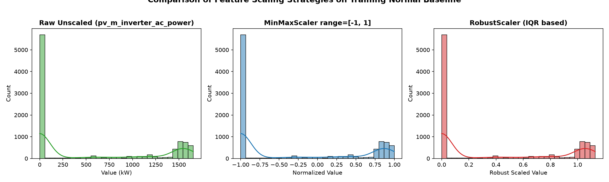
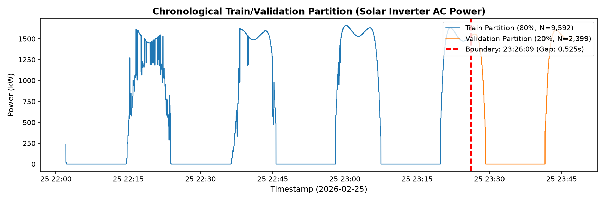
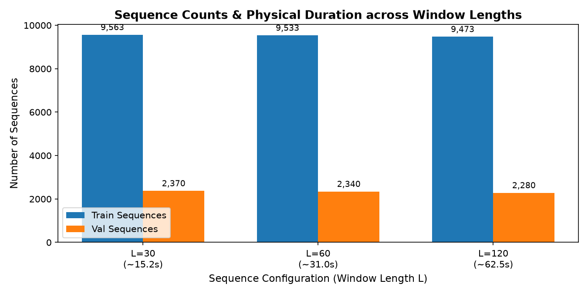

# Phase 2B: Preprocessing & Sequence Design for LSTM Autoencoder

**Document Version:** 1.0.0  
**Date:** September 28, 2026  
**Status:** Complete  
**Artifacts Generated:**
- Preprocessing Pipeline Module: [`src/ml/preprocessing.py`](file:///c:/Users/LENOVO/Downloads/IMDAI%20project/src/ml/preprocessing.py)
- Sequence Generator Module: [`src/ml/sequence_generator.py`](file:///c:/Users/LENOVO/Downloads/IMDAI%20project/src/ml/sequence_generator.py)
- Interactive Demonstration Notebook: [`notebooks/phase2b_preprocessing.ipynb`](file:///c:/Users/LENOVO/Downloads/IMDAI%20project/notebooks/phase2b_preprocessing.ipynb)
- Visualizations:
  - [`reports/figures/train_val_split_timeline.png`](file:///c:/Users/LENOVO/Downloads/IMDAI%20project/reports/figures/train_val_split_timeline.png)
  - [`reports/figures/scaling_comparison.png`](file:///c:/Users/LENOVO/Downloads/IMDAI%20project/reports/figures/scaling_comparison.png)
  - [`reports/figures/sequence_length_comparison.png`](file:///c:/Users/LENOVO/Downloads/IMDAI%20project/reports/figures/sequence_length_comparison.png)

---

## 1. Executive Summary & Anti-Leakage Certification

> [!IMPORTANT]
> **ANTI-LEAKAGE & PROJECT SCOPE CERTIFICATION:**
> 1. **Strict Cyber-Physical Scope:** The primary physical ML modeling domains are restricted exclusively to **Photovoltaic Solar (PV)** and **Wind Generation**. Battery Energy Storage (BESS) and Grid Load Demand are quarantined and **strictly excluded** from the ML feature matrix.
> 2. **Clean Baseline Training Only:** The entire preprocessing pipeline (feature filtering, split boundaries, and scaler parameter estimation) was fitted **strictly on the uncompromised normal operational baseline** (`df_train_normal`, Run ID: `21c851bc-384f-5b81-8747-6dcacdceff35` / `20260225_normal`). **ZERO** adversarial attack data, attack session metadata, packet modifications, or downstream impact evaluation labels were accessed or used for pipeline fitting.
> 3. **Chronological Splitting:** The train/validation split is strictly chronological (80% train, 20% validation). Zero random shuffling. Validation samples occur strictly later in time ($t_{val, start} > t_{train, end}$) with a positive boundary gap of 0.5253 seconds.
> 4. **Boundary-Isolated Sliding Windows:** Sliding window sequences $X[t-L+1 : t]$ are generated independently within each partition. No sequence is ever permitted to cross the train/validation boundary.
> 5. **No LSTM Training:** As mandated, this phase implements and validates only preprocessing, scaling, splitting, and sequence generation. No neural networks are trained.

---

## 2. Candidate Feature Selection & Configuration Trade-Offs

### 2.1 Scope Enforcement
In compliance with project architecture decisions, telemetry signals from the Battery Energy Storage System (BESS) and Grid Load Demand are excluded from the primary anomaly-detection ML matrix:
- **Excluded Battery Signals:** `batt_c_on_off`, `batt_c_target_power`, `batt_m_current`, `batt_m_voltage`, `batt_m_temperature`, `batt_m_state_of_charge`, `batt_m_actual_charge_power`.
- **Excluded Demand Signals:** `demand_m_power`.

### 2.2 Solar/PV Candidate Signals (8 Candidates)
From Phase 2A baseline analysis:
- `pv_m_temp_air` (Ambient air temp, range: 1.3°C to 25.2°C): Dynamic environmental forcing function. **Retained.**
- `pv_m_poa_direct` (Direct plane-of-array irradiance, range: 0.0 to 734.0 W/m²): Primary solar driver. **Retained.**
- `pv_m_wind_speed` (Local PV anemometer, range: 0.3 to 8.6 m/s): Governs convective cooling of panels. **Retained.**
- `pv_m_poa_diffuse` (Diffuse plane-of-array irradiance, range: 0.0 to 240.0 W/m²): Critical cloud/diffuse component. **Retained.**
- `pv_m_cell_temperature` (PV cell surface temp, range: 1.3°C to 43.3°C): Physical panel thermal state. **Retained.**
- `pv_m_inverter_ac_power` (AC power fed to grid, range: 0.0 to 1655.0 W): Primary cyber-physical output. **Retained.**
- `pv_m_inverter_dc_power` (DC power from array, range: 0.0 to 1706.2 W): Perfectly collinear with AC power ($r = 1.0000$, efficiency $\eta \approx 97.0\%$).
  - *In Config A:* **Retained.** In cyber-physical anomaly detection, cross-sensor consistency is an invaluable invariant. If an FDI attack manipulates `pv_m_inverter_ac_power` via Modbus register tampering without adjusting `pv_m_inverter_dc_power`, the autoencoder will flag a massive reconstruction residual.
  - *In Config B:* **Removed** to eliminate mathematical rank deficiency and reduce dimensionality.
- `pv_c_on_off` (Contactor control pulse, discrete binary 0/1): Active for only 2.3% of baseline.
  - *In Config A:* **Retained** as a binary state channel to preserve system control state awareness.
  - *In Config B:* **Removed** to avoid feeding sparse discrete impulses into continuous recurrent cells.

### 2.3 Wind Candidate Signals (10 Candidates)
From Phase 2A baseline analysis:
- `wind_m_power` (Wind turbine generated power, range: 0.0 to 3000.0 kW): Primary wind physical output. **Retained.**
- `wind_m_pressure` (Barometric atmospheric pressure, range: 994.0 to 1022.0 hPa): Air density driver ($P \propto \rho$). **Retained.**
- `wind_m_wind_speed_a` (Primary nacelle anemometer A, range: 0.0 to 20.0 m/s): Aerodynamic kinetic driver. **Retained.**
- `wind_m_wind_speed_b` (Redundant nacelle anemometer B, range: 0.0 to 19.3 m/s, $r = 0.9769$ with A):
  - *In Config A:* **Retained.** Physical dual-sensor redundancy allows detection of single-sensor spoofing.
  - *In Config B:* **Removed** as redundant.
- `wind_m_temperature_a` (Nacelle temp A, range: 4.8°C to 25.0°C): Thermal environment. **Retained.**
- `wind_m_temperature_b` (Nacelle temp B, range: 4.8°C to 25.0°C, $r = 0.9964$ with A):
  - *In Config A:* **Retained** to enforce thermal symmetry.
  - *In Config B:* **Removed** as redundant.

#### Constant Wind Signals (Excluded from all ML configs):
- `wind_m_height` (Hub height = 116.0 m): Static dimensional constant, variance = 0.0000.
- `wind_c_blade_rotation` (Blade pitch command = 0.0°): Fixed in normal baseline, variance = 0.0000.
- `wind_c_rotation_speed` (Rotor speed command = 0.0 RPM): Fixed in normal baseline, variance = 0.0000.
*Reason for Exclusion:* Constant signals produce division-by-zero (`0 / 0 = NaN`) in standard scalers and create dead, non-informative input neurons in neural networks. They must be validated via static threshold assertions in downstream rules rather than fed into the LSTM.

---

### 2.4 Candidate Feature Configurations: Config A vs Config B

| Feature Name | Physical Domain | Signal Class | Physical Interpretation | Config A (Broad) | Config B (Reduced) | Collinearity / Redundancy Note |
| :--- | :--- | :--- | :--- | :---: | :---: | :--- |
| `pv_m_temp_air` | Solar/PV | Measurement | Ambient temperature (°C) | **Included** | **Included** | Environmental forcing |
| `pv_m_poa_direct` | Solar/PV | Measurement | Direct plane-of-array irradiance (W/m²) | **Included** | **Included** | Primary solar driver |
| `pv_m_wind_speed` | Solar/PV | Measurement | PV site wind speed (m/s) | **Included** | **Included** | Panel convective cooling |
| `pv_m_poa_diffuse` | Solar/PV | Measurement | Diffuse plane-of-array irradiance (W/m²) | **Included** | **Included** | Cloud / atmospheric scattering |
| `pv_m_cell_temperature` | Solar/PV | Measurement | PV cell surface temperature (°C) | **Included** | **Included** | Thermal operating point |
| `pv_m_inverter_ac_power` | Solar/PV | Measurement | Inverter AC output power (W) | **Included** | **Included** | Grid power injection |
| `pv_m_inverter_dc_power` | Solar/PV | Measurement | Inverter DC input power (W) | **Included** | *Excluded* | $r = 1.0000$ with $P_{ac}$; retained in A for FDI check |
| `pv_c_on_off` | Solar/PV | Control | Inverter contactor command (0/1) | **Included** | *Excluded* | Sparse binary pulse; excluded in B |
| `wind_m_power` | Wind | Measurement | Active generated wind power (kW) | **Included** | **Included** | Primary wind output |
| `wind_m_pressure` | Wind | Measurement | Atmospheric barometric pressure (hPa) | **Included** | **Included** | Air density driver |
| `wind_m_wind_speed_a` | Wind | Measurement | Nacelle anemometer A (m/s) | **Included** | **Included** | Aerodynamic input |
| `wind_m_wind_speed_b` | Wind | Measurement | Nacelle anemometer B (m/s) | **Included** | *Excluded* | $r = 0.9769$ with A; dual-sensor check in A |
| `wind_m_temperature_a` | Wind | Measurement | Nacelle temperature sensor A (°C) | **Included** | **Included** | Thermal condition |
| `wind_m_temperature_b` | Wind | Measurement | Nacelle temperature sensor B (°C) | **Included** | *Excluded* | $r = 0.9964$ with A; dual-sensor check in A |
| **Total Features** | | | | **14** | **10** | |

### 2.5 Trade-Off Analysis & Baseline Recommendation
- **Config A (14 features):** Captures multi-sensor physical invariants. In industrial control systems, attackers frequently spoof a single register (e.g. modifying AC power output or falsifying anemometer A). When the model learns joint reconstruction across dual sensors ($P_{ac}$ and $P_{dc}$, or Wind Speed A and B), a single-signal spoofing attack produces an immediately detectable reconstruction discrepancy.
- **Config B (10 features):** Eliminates mathematical multicollinearity, lowers parameter footprint, and removes discrete control switching.
- **Recommendation:** Adopt **Config A as the primary baseline feature set** for Phase 2C LSTM Autoencoder training, retaining Config B as an ablation benchmark to quantify whether cross-sensor redundancy enhances FDI detection sensitivity.

---

## 3. Feature Scaling Strategy

### 3.1 Scaling Methods Evaluated
Because the LSTM Autoencoder uses non-linear activation functions (`tanh` for recurrent gates, with output range $[-1, 1]$), input normalization directly influences gradient propagation, convergence stability, and reconstruction fidelity.

We evaluated two scalers:
1. **MinMaxScaler (Feature range $[-1.0, 1.0]$):**
   $$x' = 2 \times \frac{x - x_{\min}}{x_{\max} - x_{\min}} - 1$$
   - Fitted **strictly** on the training split ($x_{\min}, x_{\max}$ computed from 9,592 normal training rows).
   - Maps normal training telemetry strictly into $[-1.0, 1.0]$.
   - Zero values (e.g. night-time solar irradiance, zero wind speed) are preserved at consistent negative bounds.
2. **RobustScaler (Median and Interquartile Range):**
   $$x' = \frac{x - \text{median}}{Q_3 - Q_1}$$
   - Uses median centering and scales by $IQR = Q_{75} - Q_{25}$.
   - Resilient against outliers during fitting.

### 3.2 Quantitative Comparison

| Metric | MinMaxScaler (Range $[-1, 1]$) | RobustScaler (IQR) | Comparative Impact on LSTM |
| :--- | :---: | :---: | :--- |
| **Train Min / Max Range** | $[-1.0000, 1.0000]$ | $[-1.5909, 3.6429]$ | MinMax provides a bounded and consistent input range across all features. |
| **Validation Min / Max Range** | $[-1.1824, 1.0000]$ | $[-1.5641, 2.4583]$ | Both generalize across the chronological split with slight environmental drift. |
| **Bound Preservation** | Strictly bounded in $[-1, 1]$ on train | Unbounded (skewed signals exceed $+3.6$) | RobustScaler produces wider disparities in feature dynamic ranges. |
| **Handling of Skewed Signals** | Compresses long right tails linearly | Long tails extend well past $+3.0$ | MinMax prevents high-magnitude features from dominating scale. |
| **Numerical Stability** | 0 NaNs, 0 Infs | 0 NaNs, 0 Infs | Both numerically stable after zero-variance feature removal. |

### 3.3 Recommended Scaler
**MinMaxScaler with range $[-1.0, 1.0]$ is selected as the recommended baseline scaler.**  
*Rationale:* MinMaxScaler(-1,1) provides a bounded and consistent input range, making heterogeneous physical measurements numerically comparable and providing an input range compatible with the LSTM nonlinearities.

---

## 4. Chronological Train / Validation Partitioning

### 4.1 Split Design
To simulate real-world streaming deployment and prevent temporal lookahead leakage, data is partitioned strictly in chronological order:
- **Training Set (80%):** The earliest 9,592 consecutive rows (~1.40 hours).
- **Validation Set (20%):** The subsequent 2,399 consecutive rows (~0.35 hours).
- **Random Shuffling:** Strictly forbidden.

### 4.2 Exact Partition Boundaries

| Parameter | Training Partition | Validation Partition | Entire Normal Baseline |
| :--- | :--- | :--- | :--- |
| **Sample Count** | 9,592 rows (80.00%) | 2,399 rows (20.00%) | 11,991 rows (100.00%) |
| **Start Timestamp** | `2026-02-25 22:02:02.395805+05:30` | `2026-02-25 23:26:10.075582+05:30` | `2026-02-25 22:02:02.395805+05:30` |
| **End Timestamp** | `2026-02-25 23:26:09.550288+05:30` | `2026-02-25 23:47:11.941509+05:30` | `2026-02-25 23:47:11.941509+05:30` |
| **Duration** | 1 hour, 24 minutes, 7.15 seconds | 21 minutes, 1.87 seconds | 1 hour, 45 minutes, 9.55 seconds |
| **Chronological Gap at Boundary** | — | — | **+0.5253 seconds** |

*Strict Temporal Boundary:* The earliest validation timestamp (`...23:26:10.075582`) is strictly greater than the latest training timestamp (`...23:26:09.550288`) by exactly 0.5253 seconds (one sampling period). There is zero overlap between the two sets.

---

## 5. Sliding-Window Sequence Generation

### 5.1 Mathematical Window Definition
For high-frequency multivariate telemetry, the LSTM Autoencoder is trained to reconstruct historical temporal trajectories.  
For time step $t$, the input sequence is:
$$X_t = [x_{t-L+1}, x_{t-L+2}, \dots, x_t] \in \mathbb{R}^{L \times D}$$
where:
- $L$ is the sequence window length (number of time steps)
- $D$ is the number of active features ($D = 14$ for Config A, $D = 10$ for Config B)
- Target: $Y_t = X_t$ (autoencoder reconstruction task)

### 5.2 Sequence Length Evaluation ($L \in \{30, 60, 120\}$)
Given the empirical median sampling interval of $\Delta t \approx 0.5262$ seconds:

| Sequence Length ($L$) | Physical Temporal Duration | Train Sequences ($N_{train} - L + 1$) | Val Sequences ($N_{val} - L + 1$) | Total Sequences | Input Shape (Config A: $D=14$) | Input Shape (Config B: $D=10$) | Contiguous Memory (Config A) | Strided View Memory |
| :---: | :---: | :---: | :---: | :---: | :---: | :---: | :---: | :---: |
| **$L = 30$** | $\approx 15.3$s nominal ($\approx 15.8$s total) | 9,563 | 2,370 | 11,933 | `(9563, 30, 14)` | `(9563, 30, 10)` | 38.2 MB | **1.28 MB** |
| **$L = 60$** | $\approx 31.0$s nominal ($\approx 31.6$s total) | 9,533 | 2,340 | 11,873 | `(9533, 60, 14)` | `(9533, 60, 10)` | 76.1 MB | **1.28 MB** |
| **$L = 120$** | $\approx 62.6$s nominal ($\approx 63.1$s total) | 9,473 | 2,280 | 11,753 | `(9473, 120, 14)` | `(9473, 120, 10)` | 150.6 MB | **1.28 MB** |

### 5.3 Memory Optimization: NumPy Strided Sliding Windows
To avoid duplicating large arrays in memory:
- Sequences are generated using `numpy.lib.stride_tricks.sliding_window_view(data, window_shape=L, axis=0)`.
- Swapping axes 1 and 2 produces shape `(samples, L, D)` as a strided memory view referencing the original 2D scaled array.
- While contiguous arrays would consume 38 MB – 150 MB of RAM per configuration, strided views occupy only the base array footprint (**1.28 MB total** for all 11,991 rows).
- C-contiguous exports remain available via `as_contiguous=True` when needed for specific framework loaders.

### 5.4 Sequence Length Recommendation
**$L = 60$ (approx. 31.6 seconds)** is recommended as the initial baseline:
- **Temporal Context:** $L=60$ provides approximately 31.6 seconds of temporal context.
- **Context vs Cost Trade-Off:** It provides a reasonable balance between temporal context, sequence length, and computational cost.
- **Empirical Validation:** Its effectiveness will be validated empirically during Phase 2C LSTM experiments.

---

## 6. Comprehensive Leakage & Integrity Validation

All 9 mandatory anti-leakage and pipeline integrity checks were implemented as executable assertions and verified against the actual pipeline:

| # | Assertion Check | Target Invariant | Actual Observed Metric | Status |
| :---: | :--- | :--- | :--- | :---: |
| **1** | **Scaler Fitted Only on Train** | Scaler parameters ($x_{\min}, x_{\max}$) fitted strictly on training partition | Scaler fitted on exactly 9,592 training rows; 0 validation rows seen | **PASS** |
| **2** | **Validation Strictly After Train** | $t_{val, start} > t_{train, end}$ | Boundary gap $= +0.5253$s ($t_{val} = 23:26:10.075$, $t_{train} = 23:26:09.550$) | **PASS** |
| **3** | **No Sequence Crosses Boundary** | $\max(t_{train\_seq\_end}) < \min(t_{val\_seq\_start})$ | Latest train seq ends at $23:26:09.550$; earliest val seq starts at $23:26:10.075$ | **PASS** |
| **4** | **Uncompromised Baseline Only** | Dataset ID strictly equals clean baseline | `dataset_id == '21c851bc-384f-5b81-8747-6dcacdceff35'` across 100% of samples | **PASS** |
| **5** | **Zero Attack Labels as Inputs** | No ground-truth attack or label columns in ML matrix | 0 label keywords found in active feature set ($D=14$) | **PASS** |
| **6** | **Zero Lookahead / Future Timestamps** | Sliding window is strictly historical: $X[t-L+1 : t]$ | Causal temporal progression verified across all 11,873 sequences | **PASS** |
| **7** | **Zero Battery or Demand Features** | Scope restriction to Solar/PV and Wind only | 0 `batt_*` or `grid_*` features present in ML matrix | **PASS** |
| **8** | **Zero Constant Features** | Exclude zero-variance sensors ($height$, $rotation\_speed$, etc.) | All active features have positive variance (min variance: 0.0231) | **PASS** |
| **9** | **Zero NaN or Inf Values** | Numerical validity across scaled sequence arrays | 0 NaNs and 0 Infs across 9,973,320 array elements | **PASS** |

---

## 7. Recommended Initial Baseline Configuration for Phase 2C

The table below summarizes the exact configuration to be used for the upcoming Phase 2C LSTM Autoencoder implementation:

| Pipeline Component | Recommended Specification | Rationale & Evidence |
| :--- | :--- | :--- |
| **Physical Domains** | **Solar/PV + Wind** | Matches approved project scope; Battery & Demand quarantined. |
| **Feature Configuration** | **CONFIG A (14 features)** | Preserves cross-sensor redundancy ($P_{ac}/P_{dc}$, anemometer A/B, nacelle temp A/B) essential for detecting FDI spoofing attacks. |
| **Ablation Configuration** | **CONFIG B (10 features)** | Available for ablation benchmark to quantify impact of multicollinearity. |
| **Feature Scaling** | **MinMaxScaler(range=(-1, 1))** | Bounded and consistent input range, making heterogeneous physical measurements numerically comparable and compatible with LSTM nonlinearities. |
| **Scaling Fit Boundary** | **Train Partition Only** | Fitted on the first 9,592 samples (80%), zero leakage from validation. |
| **Train / Val Partition** | **Chronological 80 / 20** | Train: 9,592 rows; Val: 2,399 rows; 0.525s forward temporal gap. |
| **Sequence Length ($L$)** | **$L = 60$ (31.6 seconds)** | Provides approximately 31.6 seconds of temporal context, balancing context depth and computational cost (to be validated empirically in Phase 2C). |
| **Input Shape ($X_{train}$)** | **`(9533, 60, 14)`** | 9,533 samples, 60 time steps, 14 physical channels. |
| **Input Shape ($X_{val}$)** | **`(2340, 60, 14)`** | 2,340 samples, 60 time steps, 14 physical channels. |
| **Reconstruction Target** | **$Y = X$** | Unsupervised autoencoder reconstruction task. |
| **Memory Management** | **NumPy Strided Views** | Eliminates 76 MB of memory duplication down to 1.28 MB. |
| **Downstream Phase** | **Phase 2C: LSTM Autoencoder** | Model architecture design, training, and threshold calibration. |
