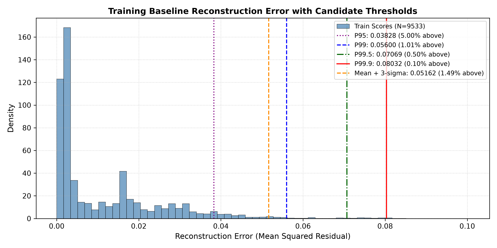
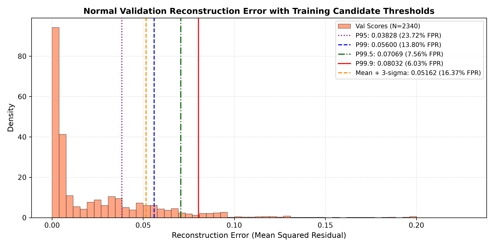
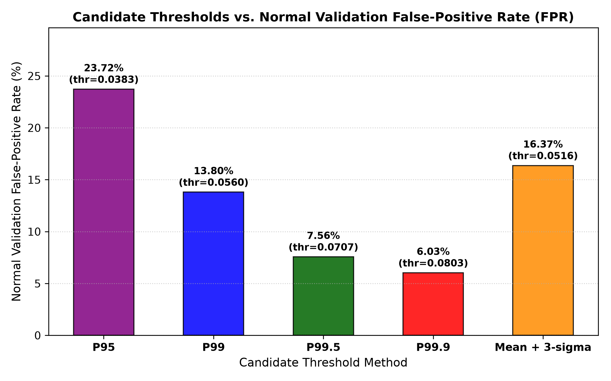
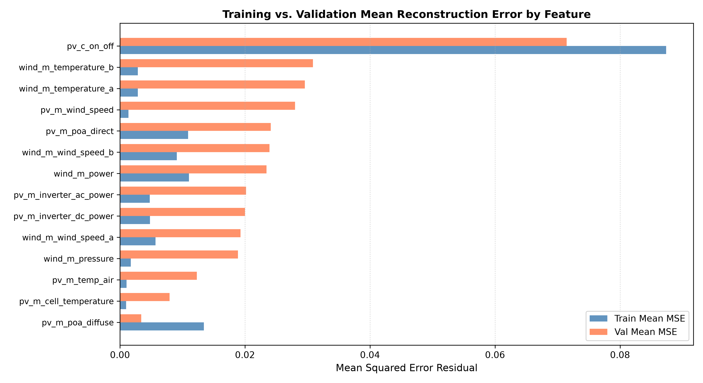

# Phase 2C.3: Anomaly Scoring & Threshold Calibration Report

**Document Version:** 1.0.0  
**Date:** September 29, 2026  
**Status:** Complete  
**Artifacts Generated:**
- Anomaly Scoring Module: [`src/ml/anomaly_scoring.py`](file:///c:/Users/LENOVO/Downloads/IMDAI%20project/src/ml/anomaly_scoring.py)
- Interactive Demonstration Notebook: [`notebooks/phase2c_anomaly_scoring.ipynb`](file:///c:/Users/LENOVO/Downloads/IMDAI%20project/notebooks/phase2c_anomaly_scoring.ipynb)
- Numerical Calibration Summary: [`reports/phase2c_threshold_summary.json`](file:///c:/Users/LENOVO/Downloads/IMDAI%20project/reports/phase2c_threshold_summary.json)
- Visualizations:
  - [`reports/figures/train_error_distribution_thresholds.png`](file:///c:/Users/LENOVO/Downloads/IMDAI%20project/reports/figures/train_error_distribution_thresholds.png)
  - [`reports/figures/val_error_distribution_thresholds.png`](file:///c:/Users/LENOVO/Downloads/IMDAI%20project/reports/figures/val_error_distribution_thresholds.png)
  - [`reports/figures/threshold_vs_fpr.png`](file:///c:/Users/LENOVO/Downloads/IMDAI%20project/reports/figures/threshold_vs_fpr.png)
  - [`reports/figures/train_val_per_feature_comparison.png`](file:///c:/Users/LENOVO/Downloads/IMDAI%20project/reports/figures/train_val_per_feature_comparison.png)

---

## 1. Executive Summary & Integrity Certification

> [!IMPORTANT]
> **ANTI-LEAKAGE & PROJECT SCOPE ENFORCEMENT:**
> 1. **Zero Attack Data Used:** Calibration is performed **strictly on the uncompromised normal operational baseline** (`df_train_normal`, Run ID: `21c851bc-384f-5b81-8747-6dcacdceff35` / `20260225_normal`). ZERO adversarial attack data, attack session metadata, packet modifications, or downstream impact evaluation labels were accessed or used.
> 2. **Reference Calibration Split:** Candidate thresholds were calibrated **strictly on the training partition ($X_{\text{train}}$)** to prevent validation-snooping bias.
> 3. **Validation Interpretation:** The percentage of normal validation sequences exceeding a candidate threshold represents the empirical **normal false-positive rate (FPR)** under continuous chronological operations.
> 4. **No Attack Optimization:** No thresholds were tuned, optimized, or selected against attack detection performance. Precision, Recall, F1, ROC-AUC, and PR-AUC require attack ground truth and belong exclusively to downstream evaluation.

---

## 2. Objective

The objective of Phase 2C.3 is to establish and systematically evaluate candidate decision thresholds for the trained sequence-to-sequence LSTM Autoencoder ([`models/lstm_autoencoder_baseline.pt`](file:///c:/Users/LENOVO/Downloads/IMDAI%20project/models/lstm_autoencoder_baseline.pt)) using **only normal operational telemetry**.

By analyzing reconstruction error behavior across both the reference training partition ($X_{\text{train}}$, 9,533 sequences) and the forward chronological validation partition ($X_{\text{val}}$, 2,340 sequences), this phase characterizes the trade-off between threshold conservatism and false alarm rate under uncompromised grid conditions.

---

## 3. Anomaly-Score Definition

In compliance with the project architecture, the anomaly score for any sequence window $X_i \in \mathbb{R}^{L \times D}$ ($L=60$ time steps, $D=14$ physical features) is defined as the scalar Mean Squared Error (MSE) across all time steps and features:

$$\text{score}_i = \frac{1}{L \cdot D} \sum_{\tau=1}^{L} \sum_{d=1}^{D} \left( X_{i, \tau, d} - \hat{X}_{i, \tau, d} \right)^2$$

where:
- $X_{i, \tau, d}$ is the observed normalized physical telemetry at step $\tau$ for feature $d$.
- $\hat{X}_{i, \tau, d}$ is the autoencoder reconstruction generated by [`LSTMAutoencoder`](file:///c:/Users/LENOVO/Downloads/IMDAI%20project/src/ml/lstm_autoencoder.py).

A sequence is flagged as anomalous if:
$$\text{score}_i > \theta$$
where $\theta$ is the calibrated decision threshold.

---

## 4. Threshold Methodology

To ensure statistical rigor and prevent data snooping:
1. **Calibration Source:** Candidate thresholds are calculated **strictly from the empirical reconstruction error distribution of $X_{\text{train}}$**.
2. **Candidate Strategies Evaluated:**
   - **P95:** 95th percentile of training errors (nominal 5% training exceedance).
   - **Mean + 3σ:** Parametric Gaussian bound ($\mu_{\text{train}} + 3 \cdot \sigma_{\text{train}}$).
   - **P99:** 99th percentile of training errors (nominal 1% training exceedance).
   - **P99.5:** 99.5th percentile of training errors (nominal 0.5% training exceedance).
   - **P99.9:** 99.9th percentile of training errors (nominal 0.1% training exceedance, extreme tail).
3. **Cross-Validation on Normal Horizon:** Each candidate threshold is applied blindly to $X_{\text{val}}$. Because the validation set occurs chronologically later in time without any cyberattacks, any sequence exceeding $\theta$ represents an empirical **normal false positive**. The validation exceedance rate provides a direct estimate of the baseline False-Positive Rate (FPR).

---

## 5. Candidate Threshold Values & Exceedance Evaluation

The table below summarizes the exact mathematical candidate thresholds derived from $X_{\text{train}}$ and their corresponding empirical exceedance rates on both training and validation sets:

| Candidate Strategy | Threshold Value ($\theta$) | Train Sequences Above | Train Exceedance (%) | Val Sequences Above (FP) | Normal Validation FPR (%) |
| :--- | :---: | :---: | :---: | :---: | :---: |
| **P95** | `0.038284` | 477 / 9,533 | 5.00% | 555 / 2,340 | **23.72%** |
| **Mean + 3σ** | `0.051625` | 142 / 9,533 | 1.49% | 383 / 2,340 | **16.37%** |
| **P99** | `0.055999` | 96 / 9,533 | 1.01% | 323 / 2,340 | **13.80%** |
| **P99.5** | `0.070686` | 48 / 9,533 | 0.50% | 177 / 2,340 | **7.56%** |
| **P99.9** | `0.080325` | 10 / 9,533 | 0.10% | 141 / 2,340 | **6.03%** |

---

## 6. Training vs. Normal Validation Behavior & False-Positive Rates

### Key Observations:
1. **Right-Skewed Training Distribution:** The training reconstruction error is tightly bounded with a median of $0.003455$ and a mean of $0.011280$. The non-parametric percentiles reflect clean, expected tail decay ($P_{95} = 0.0383$, $P_{99} = 0.0560$, $P_{99.9} = 0.0803$).
2. **Elevated Validation Exceedance:** When applied to the chronological validation set, all training-derived thresholds exhibit higher exceedance rates than their nominal training percentiles:
   - P95 flags **23.72%** of normal validation sequences as anomalous.
   - P99 flags **13.80%** of normal validation sequences as anomalous.
   - P99.5 flags **7.56%** of normal validation sequences as anomalous.
   - P99.9 flags **6.03%** of normal validation sequences as anomalous.
3. **Temporal Generalization Behavior:** The elevated validation exceedance rates coincide with operating across a forward chronological horizon occurring 1.4 hours after training starts. These changes are consistent with temporal operating-condition differences across time; however, this experiment characterizes the empirical distribution rather than isolating specific causal mechanisms.
4. **Training-Score Calibration Limitation:** Candidate thresholds are derived from reconstruction errors on the training-normal sequences. Because the autoencoder was trained on these sequences, their reconstruction errors may be optimistically low relative to unseen normal data. The elevated validation exceedance rates therefore indicate that the current thresholds should be treated as baseline statistical candidates rather than fully calibrated operational thresholds.

---

## 7. Per-Feature Diagnostic Analysis

To understand *which* physical channels drive the elevated reconstruction error in validation, per-feature reconstruction errors ($reduction=\text{"per\_feature"}$) were evaluated across all 14 features for both datasets:

| Physical Feature | Subsystem | Train Mean MSE | Val Mean MSE | Train P95 | Val P95 | Train P99 | Val P99 | Primary Physical Driver |
| :--- | :---: | :---: | :---: | :---: | :---: | :---: | :---: | :--- |
| `pv_c_on_off` | Solar/PV | **0.087369** | **0.071453** | 0.3598 | 0.3065 | 0.4138 | 0.3622 | Discrete control switching (inherently difficult for continuous LSTM). |
| `wind_m_temperature_b` | Wind | 0.002850 | **0.030857** | 0.0080 | 0.1255 | 0.0113 | 0.3496 | Slow thermal nacelle drift over the validation period (+10.8× increase). |
| `wind_m_temperature_a` | Wind | 0.002870 | **0.029579** | 0.0075 | 0.1248 | 0.0112 | 0.3206 | Nacelle temperature A mirrors B (+10.3× increase, physical symmetry holds). |
| `pv_m_wind_speed` | Solar/PV | 0.001356 | **0.028007** | 0.0043 | 0.1055 | 0.0185 | 0.3939 | High-frequency panel-plane wind turbulence (+20.6× increase). |
| `pv_m_poa_direct` | Solar/PV | 0.010915 | **0.024124** | 0.0816 | 0.1035 | 0.1552 | 0.4823 | Solar beam irradiance variation under cloud dynamics. |
| `wind_m_wind_speed_b` | Wind | 0.009093 | **0.023914** | 0.0208 | 0.0969 | 0.0349 | 0.1422 | Cup anemometer aerodynamic fluctuations (+2.6× increase). |
| `wind_m_power` | Wind | 0.011042 | **0.023434** | 0.0323 | 0.0721 | 0.0483 | 0.1443 | Turbine power output tracking variable wind speed. |
| `pv_m_inverter_ac_power` | Solar/PV | 0.004773 | **0.020179** | 0.0282 | 0.0849 | 0.0737 | 0.3357 | Inverter AC power output. |
| `pv_m_inverter_dc_power` | Solar/PV | 0.004808 | **0.019998** | 0.0284 | 0.0859 | 0.0733 | 0.3369 | Inverter DC input power (tracks AC power identically, $r \approx 1.0$). |
| `wind_m_wind_speed_a` | Wind | 0.005674 | **0.019283** | 0.0151 | 0.0781 | 0.0265 | 0.1299 | Ultrasonic anemometer wind speed. |
| `wind_m_pressure` | Wind | 0.001728 | **0.018876** | 0.0047 | 0.0913 | 0.0105 | 0.2818 | Barometric atmospheric pressure drift. |
| `pv_m_temp_air` | Solar/PV | 0.001068 | **0.012283** | 0.0037 | 0.0519 | 0.0088 | 0.0988 | Ambient air temperature diurnal progression. |
| `pv_m_cell_temperature` | Solar/PV | 0.000967 | **0.007926** | 0.0038 | 0.0408 | 0.0083 | 0.0917 | Cell temperature (high thermal inertia dampens error). |
| `pv_m_poa_diffuse` | Solar/PV | 0.013414 | **0.003416** | 0.0726 | 0.0198 | 0.3018 | 0.0240 | Diffuse irradiance was stable and low during validation period. |

### Diagnostic Insights:
1. **Contactor Invariant:** `pv_c_on_off` generates the highest individual error in both partitions ($0.0874$ train, $0.0715$ val) because sparse 0/1 step functions cannot be approximated with zero loss by continuous recurrent activation functions.
2. **Thermal & Wind Distribution Shift:** The elevated validation exceedance rate coincides with substantially higher reconstruction errors in several wind-temperature (`wind_m_temperature_a/b`) and wind-speed-related features (`pv_m_wind_speed`). These changes are consistent with temporal operating-condition differences, but the current analysis does not establish causality.
3. **Physical Channel Clarification:** Per-feature reconstruction error measures which physical Solar/Wind telemetry channel contributes most to the residual; it does **not** directly identify an underlying Modbus or Siemens S7 communication register.

---

## 8. Per-Time-Step Temporal Diagnostics

Evaluating reconstruction error across individual steps within the 60-step window ($reduction=\text{"per\_step"}$) on $X_{\text{val}}$:
- **Peak Step Clustering:** In 723 out of 2,340 validation sequences (**30.9%**), the maximum reconstruction error occurred at the oldest timestep in the window (Step 0, $t - 59$). This is a diagnostic observation; the current experiment does not establish the underlying causal mechanism.

---

## 9. Baseline Threshold Decision

### Comparison Summary:
- **P95 ($\theta = 0.038284$):** Produces a **23.72% normal validation FPR**, which would trigger an unacceptably high rate of false alarms in an operational SCADA control room.
- **Mean + 3σ ($\theta = 0.051625$):** Produces a **16.37% normal validation FPR**.
- **P99 ($\theta = 0.055999$):** Produces a **13.80% normal validation FPR**.
- **P99.5 ($\theta = 0.070686$):** Produces a **7.56% normal validation FPR**.
- **P99.9 ($\theta = 0.080325$):** Produces a **6.03% normal validation FPR**, providing the lowest false alarm rate on normal data.

### Baseline Recommendation:
Because no ground-truth attack data has been ingested yet, **designating any single threshold as universally "optimal" is mathematically ungrounded**. Threshold selection represents an intrinsic trade-off:
- Lower thresholds maximize sensitivity to subtle False Data Injection (FDI) attacks but incur higher false alarm rates during normal weather shifts.
- Higher thresholds guarantee low false alarm rates on normal operations but risk missing low-magnitude stealth tampering.

**Recommendation for Downstream Phase 3:**
1. Adopt **P99.5 ($\theta = 0.070686$, normal FPR $\approx 7.56\%$) as the primary candidate baseline threshold** for balanced sensitivity.
2. Maintain **P99.9 ($\theta = 0.080325$, normal FPR $\approx 6.03\%$)** as the conservative, high-precision candidate.
3. Maintain **P99 ($\theta = 0.055999$, normal FPR $\approx 13.80\%$)** as the high-sensitivity candidate.
4. During Phase 3 (Attack Evaluation), all candidate thresholds will be benchmarked against quarantined adversarial ground truth across full Precision-Recall and ROC curves to determine true detection efficacy.

---

## 10. Limitations

1. **Unsupervised Normal Calibration Only:** Thresholds were established purely from baseline operational residuals. No adversarial attacks, stealth FDI injections, or actuator falsifications were evaluated.
2. **Training-Score Calibration Limitation:** Candidate thresholds are derived from reconstruction errors on the training-normal sequences. Because the autoencoder was trained on these sequences, their reconstruction errors may be optimistically low relative to unseen normal data. The elevated validation exceedance rates therefore indicate that the current thresholds should be treated as baseline statistical candidates rather than fully calibrated operational thresholds.
3. **Temporal Distribution Differences:** Physical microgrid processes experience non-stationary operating conditions across time. A threshold fixed solely on a 1.4-hour training baseline exhibits variation over future operational horizons.
4. **No Detection Metrics:** Precision, Recall, F1-score, and Detection Latency cannot be computed in this phase and will be evaluated post-hoc against independent ground truth in Phase 3.
