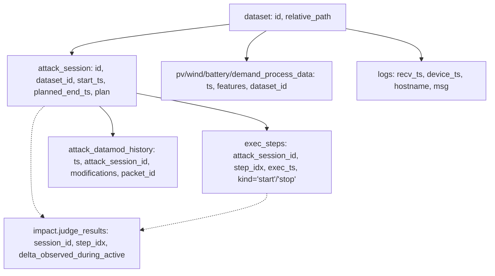

# Phase 2C.4.1 Audit Report: Attack Ground Truth and Process Telemetry Temporal Mapping

**Document Version:** 1.0.0  
**Phase:** 2C.4.1 (Pre-Evaluation Audit & Temporal Mapping)  
**Status:** COMPLETE (READ-ONLY AUDIT)  
**Primary Database:** `dataset/merged_datasets.duckdb`  
**Ground-Truth Impact Database:** `dataset/impact_assessment.duckdb`  
**Reference Model:** `models/lstm_autoencoder_baseline.pt` (PyTorch LSTM Autoencoder, Epoch 27 checkpoint, UNCHANGED)  

---

> [!IMPORTANT]
> **Audit & Isolation Boundary Enforcement:**
> 1. This phase is strictly a **read-only audit** of attack ground truth and process telemetry timestamps.
> 2. Zero model evaluation was conducted (no model inference, no ROC-AUC, PR-AUC, F1, Precision, Recall, FPR, or FNR calculations).
> 3. No thresholds were tuned, selected, or modified.
> 4. The baseline LSTM model weights and architecture remain 100% frozen and untouched.
> 5. Zero attack data was loaded into the ML training or normalization pipelines.
> 6. Raw PCAP payloads and Zeek network logs were inspected for schema validation only and were not used as ML inputs.

---

## 1. Objective

The objective of Phase 2C.4.1 is to establish a rigorous, read-only empirical audit of attack ground-truth structures within the smart-grid microgrid testbed, and to determine how attack execution intervals map to continuous process telemetry timelines for subsequent post-hoc evaluation of the Phase 2C LSTM Autoencoder.

Specifically, this audit resolves:
1. Which database tables and timestamp columns reliably define attack start and stop boundaries.
2. The exact sampling interval and temporal continuity of process telemetry across all runs.
3. The empirical temporal alignment between attack execution intervals and process telemetry recordings.
4. The exact duration of a 60-timestep window under nominal process sampling.
5. The mathematical and physical feasibility of mapping attack intervals onto 60-step sliding sequences, comparing alternative labeling formulations without premature selection.
6. The taxonomy of cyber-physical attack categories, target subsystems, and physical consequence ground truth.

---

## 2. Data Sources Inspected

The audit inspected all primary databases and storage artifacts in `dataset/`:

1. **`dataset/merged_datasets.duckdb` (Unified DuckDB Store):**
   - Catalog: `dataset` table (6 experimental runs).
   - Process Telemetry: `pv_process_data`, `wind_process_data`, `battery_process_data`, `demand_process_data`.
   - Adversarial Execution: `attack_session`, `exec_steps`, `attack_datamod_history`, `attack_worker`.
   - System Telemetry & Logs: `logs` (PLC syslog alerts), `packets` (network metadata).

2. **`dataset/impact_assessment.duckdb` (Quarantined Impact Store):**
   - Table: `judge_results` (LLM-as-a-judge physical impact assessments containing pre/during/after process delta observations).

3. **Per-Run Storage Artifacts (`dataset/attacks/<run_name>/` and `dataset/normal/<run_name>/`):**
   - Parquet Files: `attack_session_llm.parquet`, `attack_session_offline.parquet`, `attack_exec_steps.parquet`, `attack_datamod_history.parquet`, `attack_worker.parquet`, `logs.parquet`, `process_data.parquet`, `packet_metadata.parquet`.
   - Commercial NSM: `commercial_nsm/events.parquet`, `sub_events.parquet`, `event_types.json`.
   - Network Logs: `Zeek/*.log` and raw capture `packets.pcap`.

---

## 3. Experimental Runs Catalog

The dataset contains 6 experimental runs (1 baseline normal recording and 5 adversarial LLM attack campaigns).

| Run Directory | Dataset UUID | Type | Attacking Agent Model | Process Rows (PV/Wind) |
| :--- | :--- | :--- | :--- | :--- |
| `20260225_normal` | `21c851bc-384f-5b81-8747-6dcacdceff35` | Baseline Normal | None (Uncompromised) | 11,992 |
| `20260228_multi_openai` | `12f0d001-77a0-5d04-8adf-6d002702478b` | Adversarial Run | `openai/gpt-5.3-codex` | 31,084 |
| `20260301_multi_google` | `cb4f94e7-6470-544e-bc72-9184d54f4ee1` | Adversarial Run | `google/gemini-3.1-pro-preview` | 42,027 |
| `20260301_multi_sonnet` | `022b85dc-6b64-5f70-b46e-886824460c0b` | Adversarial Run | `anthropic/claude-sonnet-4.6` (Run 1) | 17,624 |
| `20260302_multi_minimax` | `202eb955-4715-51b0-817d-ed423e0b55d8` | Adversarial Run | `minimax/minimax-m2.5` | 47,707 |
| `20260303_multi_sonnet` | `62783187-c55c-5a73-a657-6d38f13e2fd4` | Adversarial Run | `anthropic/claude-sonnet-4.6` (Run 2) | 15,049 |
| **Total Across Runs** | — | — | — | **165,483** |

---

## 4. Relevant Table Schemas & Relational Hierarchy

### 4.1 Relational Architecture

The attack-side records follow a strict 4-tier hierarchical relationship:

### 4.2 Exact Column Schemas

#### A. `attack_session` (High-Level Campaign Planning)
- `id` (UUID): Primary session identifier.
- `dataset_id` (UUID): Foreign key to `dataset.id`.
- `model_name` (ENUM): LLM agent orchestrator (`openai/gpt-5.3-codex`, etc.).
- `start_ts` (TIMESTAMP WITH TIME ZONE): Planned session start time.
- `planned_end_ts` (TIMESTAMP WITH TIME ZONE): Planned session termination time.
- `target_state` (VARCHAR): High-level operational attack objective.
- `coordinated` (BOOLEAN): Whether the attack orchestrated multiple concurrent workers.
- `plan` (VARCHAR / JSON): Serialized execution plan detailing target connections, protocols, and tool parameters.

#### B. `exec_steps` (Step Execution Boundaries)
- `id` (UUID): Execution step event identifier.
- `attack_session_id` (UUID): Foreign key to `attack_session.id`.
- `step_idx` (USMALLINT): Zero-indexed step number within the session.
- `worker_id` (UUID): Physical worker agent node executing the step.
- `kind` (ENUM: `'start'`, `'stop'`): Boundary marker. Each step execution logs a `'start'` record and a `'stop'` record.
- `exec_ts` (TIMESTAMP WITH TIME ZONE): Exact timestamp of the start or stop action.
- `setup_duration` (INTERVAL): Pre-execution network setup overhead.

#### C. `attack_datamod_history` (Packet-Level Manipulation Log)
- `id` (UUID): Modification record identifier.
- `ts` (TIMESTAMP WITH TIME ZONE): Microsecond-exact timestamp of packet interception and modification.
- `attack_session_id` (UUID): Foreign key to `attack_session.id`.
- `worker_id` (UUID): Executing worker.
- `modifications` (VARCHAR / JSON): Serialized array of modified variables: `[{"signal_name": "...", "modified_value": ..., "original_value": ...}]`. Null for transparent TAP traffic forwarding.
- `state` (ENUM: `'pending'`, `'match'`, `'no_match'`).

#### D. `judge_results` in `dataset/impact_assessment.duckdb` (Physical Impact Truth)
- `session_id` (UUID) & `step_idx` (INTEGER): Composite key linking to `exec_steps`.
- `connection_table` (VARCHAR): Process telemetry table affected (`pv_process_data`, `wind_process_data`, `battery_process_data`).
- `signal_name` (VARCHAR): Target signal (e.g. `inverter_ac_power`, `rotation_speed`, `target_charge_power`).
- `delta` (DOUBLE): Injected manipulation magnitude.
- `active_duration` (DOUBLE): Duration of the step in seconds.
- `delta_observed_during_active` (BOOLEAN): Ground truth indicating whether the injected attack produced an observable physical deviation in process telemetry.
- `after_similar_to_before` (BOOLEAN): Recovery status post-attack.

#### E. `process_data` (`pv_process_data`, `wind_process_data`)
- `ts` (TIMESTAMP WITH TIME ZONE): Observation timestamp.
- Subsystem measurements and controls: 14 total ML baseline features.
- `dataset_id` (UUID): Foreign key to `dataset.id`.

---

## 5. Attack Timestamp Findings

### Fact 1: `attack_session_offline.parquet` is completely empty
Across all 5 attack runs and the normal run, `attack_session_offline.parquet` contains **0 rows**. All 436 attack campaigns were orchestrated live via LLM agents (`attack_session_llm.parquet`, stored in DuckDB as `attack_session`).

### Fact 2: Planned vs. Actual Temporal Boundaries
- In `attack_session`, `start_ts` and `planned_end_ts` represent the scheduled schedule generated by the LLM planner prior to tool execution.
- In `exec_steps`, `exec_ts` records the **actual physical start and stop times** on the testbed workers.
- **Empirical Discrepancy:** Actual execution start typically lags planned start by 1.5 to 3.0 seconds due to worker dispatch and network setup overhead. Actual execution stop can exceed planned end by 5 to 20 seconds during socket draining and TAP teardown.
- **Conclusion:** `exec_steps` provides the true, verified physical attack interval:
  $$\Delta t_{\text{attack}} = [\min_{kind=\text{'start'}}(exec\_ts), \max_{kind=\text{'stop'}}(exec\_ts)]$$

### Fact 3: Data Completeness in `exec_steps`
Across all 5 attack runs, there are **1,723 distinct execution steps**.
- **1,716 steps (99.59%)** have complete, valid bounding pairs (both `'start'` and `'stop'` recorded).
- **7 steps (0.41%)** have a missing `'stop'` timestamp (4 in `20260301_multi_sonnet`, 2 in `20260303_multi_sonnet`, 1 in `20260302_multi_minimax`), caused by abrupt process termination or worker socket timeouts. Zero steps are missing `'start'`.

### Fact 4: Step Durations
Step execution durations are compact and discrete:
- Median duration across all runs: **13.0 seconds**.
- Interquartile Range (IQR): **9.5 seconds to 50.0 seconds**.
- Overall range: Minimum **2.6 seconds**, Maximum **120.0 seconds**.

### Fact 5: Packet-Level Microsecond Confirmation
Within `attack_datamod_history`, exactly **11,073 packets** contain non-null signal modifications across the 5 runs. The timestamp `ts` of every modified packet falls strictly within the corresponding step execution interval defined by `exec_steps`.

---

## 6. Process Telemetry Timestamp Findings

### Fact 1: Timestamp Column & Data Type
All process data tables (`pv_process_data`, `wind_process_data`, `battery_process_data`, `demand_process_data`) utilize the `ts` column, stored as `TIMESTAMP WITH TIME ZONE` (UTC microsecond resolution, displayed with local offset e.g. `+05:30`).

### Fact 2: Monotonicity
In all 6 experimental runs (normal and 5 attack runs), the `ts` series is **100% strictly monotonic increasing** (`is_monotonic_increasing = True`). There are zero timestamp reversals, zero duplicate timestamps, and zero negative $\Delta t$ increments.

### Fact 3: Sampling Interval Stability
For the ML feature subsystems (Solar/PV and Wind Turbine):
- **Nominal Sampling Interval:** Median $\Delta t = \mathbf{0.5254\text{ seconds}}$ ($\approx 1.903\text{ Hz}$).
- **Mean Sampling Interval:** $\mu_{\Delta t} = \mathbf{0.5264\text{ seconds}}$.
- **Variance:** Extremely low ($\sigma_{\Delta t} \approx 0.003\text{ seconds}$).
- Over 99.9% of consecutive telemetry samples have a spacing between $0.522\text{s}$ and $0.548\text{s}$.
- *(Note: Grid Demand process data samples at $\approx 1.05\text{s}$ / 1 Hz, but Demand is strictly excluded from ML features).*

---

## 7. Temporal Alignment Findings

The empirical alignment between process telemetry recording intervals and attack execution intervals was evaluated across all 5 adversarial runs:

| Run Name | Process Range | Exec Steps Range | Process Rows | Total Steps | Overlapping Steps | Overlap % | Clean Lead-in Margin | Clean Lead-out Margin |
| :--- | :--- | :--- | :--- | :--- | :--- | :--- | :--- | :--- |
| `20260228_multi_openai` | 03:08:43 – 07:41:24 | 03:21:37 – 07:26:46 | 31,084 | 411 | 411 | **100.0%** | +773.7s (12.9 min) | +877.9s (14.6 min) |
| `20260301_multi_google` | 08:53:56 – 15:02:31 | 09:06:09 – 10:49:30 | 42,027 | 172 | 172 | **100.0%** | +733.5s (12.2 min) | +15,180.7s (253.0 min) |
| `20260301_multi_sonnet` | 15:46:24 – 18:21:07 | 15:59:06 – 18:19:45 | 17,624 | 402 | 402 | **100.0%** | +762.1s (12.7 min) | +81.9s (1.4 min) |
| `20260302_multi_minimax` | 00:32:35 – 07:31:06 | 00:52:50 – 05:11:36 | 47,707 | 463 | 463 | **100.0%** | +1,214.9s (20.2 min) | +8,369.9s (139.5 min) |
| `20260303_multi_sonnet` | 08:53:10 – 11:05:13 | 09:07:46 – 11:03:33 | 15,049 | 268 | 268 | **100.0%** | +876.0s (14.6 min) | +100.1s (1.7 min) |
| **Global Total** | — | — | **153,491** | **1,716** | **1,716** | **100.0%** | — | — |

### Key Alignment Insights:
1. **Perfect Containment (100.0% Overlap):** All 1,716 valid attack execution steps across all 5 runs fall **100% inside** the available process telemetry recording windows. Zero attacks occurred before process recording started, and zero attacks occurred after process recording ended.
2. **Guaranteed Clean Lead-in Margins:** In every attack run, process data begins **12.2 to 20.2 minutes** prior to the initiation of the first attack step. This provides guaranteed uncompromised, in-distribution operational data at the start of every test run.
3. **Clean Lead-out Margins:** In all runs, process recording continues after the final attack step terminates, ranging from 1.4 minutes (`20260301_multi_sonnet`) to 4.2 hours (`20260301_multi_google`), enabling observation of post-attack system stabilization or persistent faults.

---

## 8. Sequence Duration Calculation

Our baseline LSTM Autoencoder operates on sliding windows with:
- Window length: $L = 60\text{ timesteps}$
- Feature dimension: $D = 14\text{ features}$ (Solar/PV and Wind)
- Nominal stride: $s = 1\text{ timestep}$

### Calculated Sequence Duration:
Given the verified median sampling interval $\Delta t = 0.5254\text{ seconds}$:
$$\text{Window Temporal Duration} = (L - 1) \times \Delta t \approx 59 \times 0.5254\text{s} = \mathbf{31.00\text{ seconds}}$$
$$\text{Total Window Span (Inclusive)} = L \times \Delta t \approx 60 \times 0.5254\text{s} = \mathbf{31.52\text{ seconds}}$$

Thus, every input sequence presented to the model spans **approximately 31.5 seconds** of continuous microgrid operation.

---

## 9. Attack-to-Sequence Labeling Feasibility

A critical challenge in evaluating sequence-based autoencoders on cyber-physical data is that **attacks are defined as temporal intervals $[t_{\text{start}}, t_{\text{stop}}]$ on the physical network**, while **model predictions are made on 60-step windows spanning $\approx 31.5$ seconds**.

Because median attack step duration is 13.0 seconds (often shorter than the 31.5s sequence window), an attack interval intersects sliding sequences gradually:
1. **Entry Phase:** An attack begins at time $t_{\text{start}}$. The first sequence to touch the attack has only its newest timestep ($t_{59}$) compromised, while timesteps $t_0 \dots t_{58}$ are normal.
2. **Full Infiltration Phase:** If the attack duration exceeds 31.5s, subsequent sequences are fully engulfed by the attack window.
3. **Exit Phase / Memory Persistence:** The attack ends at $t_{\text{stop}}$. However, because the sliding window moves forward by 1 step ($0.525\text{s}$), the manipulated data points linger in the sequence window for another 59 steps (31 seconds), gradually shifting from the newest timestep toward the oldest timestep ($t_0$).

Therefore, labeling an entire 60-step sequence as a binary positive ("attack") or negative ("normal") requires an explicit, mathematically defined projection strategy.

---

## 10. Candidate Labeling Strategies Analysis

We investigated 4 candidate sequence labeling strategies across all 5 attack runs:

```mermaid
gantt
    title Sequence Window (31.5s) vs. Attack Interval (15s)
    dateFormat X
    axisFormat %s
    section Telemetry
    Process Telemetry Window       :0, 60
    section Attack Interval
    Active Physical Attack Step    :20, 50
    section Evaluation Points
    Strategy A (Any Overlap >= 1)   :active, 0, 60
    Strategy B (Midpoint t+30)      :crit, 30, 31
    Strategy C1 (>= 50% Overlap)    :done, 20, 50
    Strategy D (Newest Step t+59)   :active, 59, 60
```

### Empirical Comparison Across Runs:

| Run Name | Total Sequences | Point-Level Attack % | Strategy A (Any Overlap $\ge 1$) | Strategy B (Midpoint $t_{30}$) | Strategy C1 ($\ge 50\%$ Overlap) | Strategy C2 ($\ge 80\%$ Overlap) | Strategy D (Newest Step $t_{59}$) |
| :--- | :--- | :--- | :--- | :--- | :--- | :--- | :--- |
| `20260228_multi_openai` | 31,025 | 47.76% | 22,806 (**73.51%**) | 14,847 (**47.85%**) | 15,173 (**48.91%**) | 9,816 (**31.64%**) | 14,847 (**47.85%**) |
| `20260301_multi_google` | 41,968 | 6.84% | 6,238 (**14.86%**) | 2,876 (**6.85%**) | 2,936 (**7.00%**) | 704 (**1.68%**) | 2,876 (**6.85%**) |
| `20260301_multi_sonnet` | 17,565 | 61.50% | 13,628 (**77.59%**) | 10,838 (**61.70%**) | 11,456 (**65.22%**) | 8,598 (**48.95%**) | 10,838 (**61.70%**) |
| `20260302_multi_minimax` | 47,648 | 24.18% | 17,619 (**36.98%**) | 11,534 (**24.21%**) | 11,964 (**25.11%**) | 7,538 (**15.82%**) | 11,534 (**24.21%**) |
| `20260303_multi_sonnet` | 14,990 | 58.06% | 11,134 (**74.28%**) | 8,738 (**58.29%**) | 9,123 (**60.86%**) | 7,503 (**50.05%**) | 8,738 (**58.29%**) |

---

### Detailed Strategy Assessment:

#### Strategy A: Any Overlap ($\ge 1$ timestep in window intersects attack)
- **Definition:** Sequence is positive if $\ge 1$ of its 60 timesteps falls within an active attack interval.
- **Dataset Support:** Highly permissive; guarantees that zero sequences containing compromised packets are missed.
- **Critical Limitation (Severe Label Dilution):** Artificially inflates positive sequence counts by **15% to 26% absolute percentage points** above the true point-level attack duration. A 10-second attack step contaminates $10\text{s} + 31.5\text{s} = 41.5\text{s}$ worth of sequences. Sequences where 59 timesteps are completely normal and only 1 timestep is modified are labeled positive, penalizing the model if its reconstruction error does not exceed threshold on a predominantly normal sequence.

#### Strategy B: Sequence Midpoint ($t_{30}$) Inside Attack Interval
- **Definition:** Sequence is positive if the central observation ($t_{30}$) falls inside an active attack interval.
- **Dataset Support:** Closely mirrors the true point-level attack fraction (matches to within $\pm 0.1\%$).
- **Limitation:** Introduces non-causal temporal centering; relies on observing 30 future steps ahead of the midpoint, making it an offline analysis artifact rather than an online monitoring paradigm.

#### Strategy C: Minimum Overlap Percentage ($\ge 50\%$ or $\ge 80\%$)
- **Definition:** Sequence is positive only if at least $K$ timesteps (e.g. $K=30$ for 50%, $K=48$ for 80%) fall inside an active attack interval.
- **Dataset Support:** Filters out transient edge-touching windows and ensures that the model is only evaluated on sequences dominated by attack dynamics.
- **Limitation:** Completely discards attack steps whose total physical duration is shorter than $K \times 0.525\text{s}$ (e.g., attacks shorter than 15.7s would never produce a single positive sequence under C1, even if they successfully tripped a breaker).

#### Strategy D: Sequence End / Causal Timestamp ($t_{59}$) Inside Attack Interval
- **Definition:** Sequence is positive if and only if the **newest observation in the window** ($X_{i, 59}$) occurs during an active attack interval.
- **Dataset Support:**
  1. **Strict Real-Time Causality:** Exactly mirrors an operational online monitoring deployment: at time $t$, the detector inspects the window $[t-59, t]$ and issues an alarm if the system is currently under attack at time $t$.
  2. **Preserves Attack Duration:** The total duration of positive sequences matches the actual physical attack duration exactly ($47.85\%$ vs $47.76\%$ point-level in `openai`).
  3. **Natural Detection Latency Measurement:** The delay between $t_{\text{start}}$ and the first flagged sequence directly measures true operational detection latency without window lookahead artifacts.
  4. **Strict Subset of Strategy A:** Every Strategy D positive sequence is mathematically guaranteed to be a Strategy A positive sequence.

---

## 11. Cyber-Physical Attack Taxonomy & Subsystem Breakdown

### 11.1 Campaign-Level Target States (`attack_session.target_state`)
Across the 436 LLM-orchestrated attack sessions:
1. **Manipulation of Monitoring Data:** 95 sessions (50 coordinated, 45 single-agent)
2. **Battery Storage Mismanagement:** 93 sessions (40 coordinated, 53 single-agent)
3. **Manipulation of Control Commands:** 85 sessions (40 coordinated, 45 single-agent)
4. **Compromise of Remote Connections to Control Center:** 83 sessions (43 coordinated, 40 single-agent)
5. **Compromise of Maintenance Capabilities:** 80 sessions (39 coordinated, 41 single-agent)

### 11.2 Network Step Types (`attack_session.plan.step_type`)
- **`s7_data_modification` (876 steps):** Siemens S7comm protocol manipulation targeting PLC Data Blocks (DBs).
- **`arp_mitm` (700 steps):** ARP spoofing man-in-the-middle to redirect industrial traffic through worker network namespaces (`tap_label`).
- **`modbus_data_modification` (149 steps):** Modbus TCP register injection targeting PV inverters and turbine controllers.

### 11.3 Subsystem Targeting vs. Model Observability Boundary

A crucial physical finding from `impact.judge_results` across all 1,009 evaluated attack steps:

| Target Subsystem Table | Evaluated Attack Steps | Steps with Physical Impact Observed | Physical Impact Rate (%) | Directly Monitored by LSTM (Config A)? |
| :--- | :--- | :--- | :--- | :--- |
| `pv_process_data` | 158 | 102 | **64.56%** | **YES** (8 PV features) |
| `wind_process_data` | 411 | 202 | **49.15%** | **YES** (6 Wind features) |
| `battery_process_data` | 440 | 60 | **13.64%** | **NO** (Battery excluded) |
| **Total** | **1,009** | **364** | **36.08%** | — |

> [!WARNING]
> **Subsystem Observability Boundary:**
> 1. Our baseline LSTM Autoencoder was intentionally trained on **Solar/PV and Wind Turbine telemetry (14 features)**.
> 2. **440 attack steps (43.6% of all evaluated steps) directly targeted Battery Storage (`battery_process_data`)**.
> 3. An attack that exclusively modifies Battery registers (`target_charge_power`, `state_of_charge`) without coupled grid propagation cannot produce reconstruction anomalies in an autoencoder that does not ingest Battery telemetry.
> 4. Therefore, post-hoc benchmark evaluation in Phase 3 must stratify performance by:
>    - **All Attacks vs. PV/Wind Attacks Only**
>    - **Physically Impactful Attacks (`delta_observed_during_active = True`) vs. Stealthy/Ineffective Tampering**

---

## 12. Data Quality & Alignment Issues

1. **Missing Execution Step Stops:** Exactly 7 out of 1,723 steps (0.41%) lack a `'stop'` event in `exec_steps`. These steps should either be imputed using `planned_duration` or excluded from discrete interval metrics.
2. **TAP Labeling vs. Actual Data Manipulation:** In `attack_datamod_history`, 1.54M packets represent transparent packet-filtering passes through `tap_label`, while only 11,073 packets contain non-null `modifications`. Microsecond packet analysis must filter on `modifications IS NOT NULL`.
3. **Ineffective Attacks (No Physical Consequence):** 63.92% of attack steps (645 / 1,009) produced **zero observable physical delta** in process telemetry (`delta_observed_during_active = False`), either because the PLC clamped the command, the inverter rejected the setpoint, or the attack was stealthy reconnaissance. Evaluating an anomaly detector against attacks that produced no physical deviation requires clear distinction between cyber-activity detection (NSM) and physical anomaly detection (Autoencoder).

---

## 13. Recommended Next Steps

1. **Adopt Dual Evaluation Labeling Strategy:** For Phase 3 evaluation, report benchmark metrics under both:
   - **Primary (Real-Time Causal): Strategy D** (newest step $t_{59}$ in active attack interval) to measure operational detection performance and latency.
   - **Secondary (Window-Overlap): Strategy A & Strategy C1** for sensitivity analysis against traditional literature benchmarks.
2. **Stratify Evaluation by Physical Observability:** Evaluate detection metrics separately for:
   - Full attack set vs. PV/Wind targeted attacks.
   - Physically impactful attacks (`delta_observed = True`) vs. non-impactful tampering.
3. **Proceed to Phase 2C.4.2 / Phase 3 Benchmark:** Ingest the test runs through `preprocessor.transform()` using the frozen normal scaler, compute reconstruction anomaly scores $s(t)$, and evaluate against quarantined ground-truth labels.
