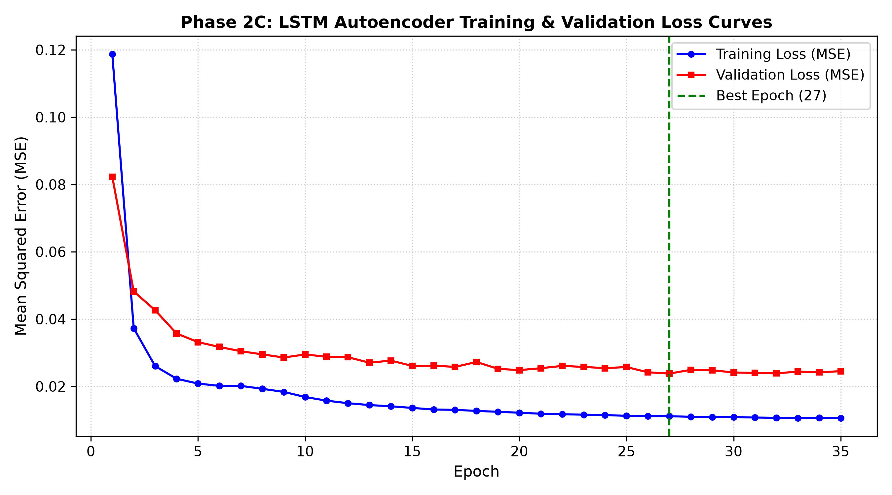
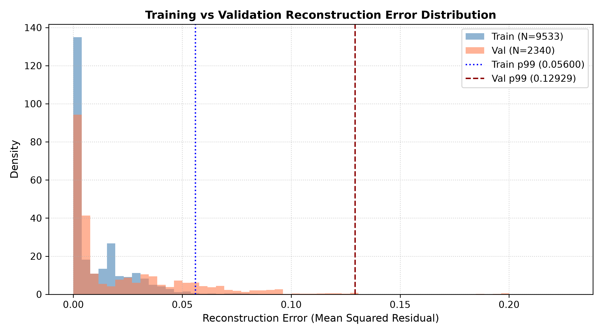
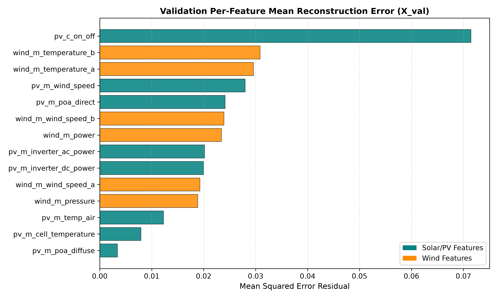

# Phase 2C: Baseline LSTM Autoencoder Training & Characterization Report

**Document Version:** 1.0.0  
**Date:** September 29, 2026  
**Status:** Complete  
**Artifacts Generated:**
- Model Architecture & Training Module: [`src/ml/lstm_autoencoder.py`](file:///c:/Users/LENOVO/Downloads/IMDAI%20project/src/ml/lstm_autoencoder.py)
- Best Model Checkpoint: [`models/lstm_autoencoder_baseline.pt`](file:///c:/Users/LENOVO/Downloads/IMDAI%20project/models/lstm_autoencoder_baseline.pt)
- Interactive Demonstration Notebook: [`notebooks/phase2c_lstm_training.ipynb`](file:///c:/Users/LENOVO/Downloads/IMDAI%20project/notebooks/phase2c_lstm_training.ipynb)
- Visualizations:
  - [`reports/figures/training_validation_loss_curves.png`](file:///c:/Users/LENOVO/Downloads/IMDAI%20project/reports/figures/training_validation_loss_curves.png)
  - [`reports/figures/training_loss_vs_epoch.png`](file:///c:/Users/LENOVO/Downloads/IMDAI%20project/reports/figures/training_loss_vs_epoch.png)
  - [`reports/figures/validation_loss_vs_epoch.png`](file:///c:/Users/LENOVO/Downloads/IMDAI%20project/reports/figures/validation_loss_vs_epoch.png)
  - [`reports/figures/reconstruction_error_distribution.png`](file:///c:/Users/LENOVO/Downloads/IMDAI%20project/reports/figures/reconstruction_error_distribution.png)
  - [`reports/figures/val_per_feature_reconstruction_error.png`](file:///c:/Users/LENOVO/Downloads/IMDAI%20project/reports/figures/val_per_feature_reconstruction_error.png)

---

## 1. Executive Summary & Anti-Leakage Certification

> [!IMPORTANT]
> **ANTI-LEAKAGE & PROJECT SCOPE ENFORCEMENT:**
> 1. **Strict Cyber-Physical Scope:** The model is trained exclusively on **Photovoltaic Solar (PV)** and **Wind Generation** telemetry. Battery Energy Storage System (BESS) and Grid Load Demand are quarantined and **strictly excluded** from the ML feature matrix.
> 2. **Clean Baseline Training Only:** The LSTM Autoencoder was trained **strictly on the uncompromised normal operational baseline** (`df_train_normal`, Run ID: `21c851bc-384f-5b81-8747-6dcacdceff35` / `20260225_normal`). **ZERO** adversarial attack data, attack session metadata, packet modifications, or downstream impact evaluation labels were accessed or used during training.
> 3. **Chronological Splitting:** The train/validation partition is chronological with no random splitting. Training sequences are shuffled at the mini-batch level during optimization, while validation sequences are not shuffled. Validation samples occur strictly later in time ($t_{\text{val, start}} > t_{\text{train, end}}$) with a positive boundary gap of 0.5253 seconds.
> 4. **Boundary-Isolated Sliding Windows:** Sliding window sequences $X[t-L+1 : t]$ are generated independently within each partition. No sequence is ever permitted to cross the train/validation boundary.
> 5. **Interpretation Contract:** The model was trained to reconstruct normal Solar/Wind temporal sequences. Reconstruction error provides an anomaly score that will be evaluated against anomalous/attack data in a subsequent phase.

---

## 2. Objective

The primary objective of Phase 2C is to establish an unsupervised deep sequence representation of normal microgrid cyber-physical dynamics using a sequence-to-sequence LSTM Autoencoder. By learning to compress multivariate temporal trajectories into a low-dimensional bottleneck representation and reconstruct them back into the original feature space, the model establishes a mathematical baseline of uncompromised physical operation.

Reconstruction error (residual discrepancy between observed telemetry and autoencoder reconstruction) serves as a continuous anomaly score:
$$r_t = \frac{1}{L \cdot D} \sum_{\tau=1}^{L} \sum_{d=1}^{D} \left( X_{t,\tau,d} - \hat{X}_{t,\tau,d} \right)^2$$

---

## 3. Data Used & Phase 2B Preprocessing Contract

The model ingests data strictly conforming to the finalized Phase 2B preprocessing contract without modification or leakage:

| Pipeline Parameter | Contract Specification | Actual Ingested Property | Status |
| :--- | :--- | :--- | :---: |
| **Baseline Dataset ID** | `21c851bc-384f-5b81-8747-6dcacdceff35` | `21c851bc-384f-5b81-8747-6dcacdceff35` | **VERIFIED** |
| **Physical Scope** | Solar/PV + Wind only | 8 Solar/PV + 6 Wind signals | **VERIFIED** |
| **Excluded Domains** | Battery (BESS) & Grid Demand | 0 `batt_*` or `grid_*` features | **VERIFIED** |
| **Feature Configuration** | Config A (14 features) | 14 active channels | **VERIFIED** |
| **Scaling Transformation** | `MinMaxScaler(feature_range=(-1.0, 1.0))` | Fitted strictly on training split (9,592 rows) | **VERIFIED** |
| **Chronological Split** | 80% Train / 20% Validation | Train: 9,592 rows; Val: 2,399 rows | **VERIFIED** |
| **Temporal Boundary Gap** | $t_{\text{val, start}} > t_{\text{train, end}}$ | $+0.5253$ seconds | **VERIFIED** |
| **Sequence Length ($L$)** | $L = 60$ time steps ($\approx 31.6$ seconds) | $L = 60$ | **VERIFIED** |
| **Training Input Shape ($X_{\text{train}}$)** | `(9533, 60, 14)` | `(9533, 60, 14)` | **VERIFIED** |
| **Validation Input Shape ($X_{\text{val}}$)** | `(2340, 60, 14)` | `(2340, 60, 14)` | **VERIFIED** |
| **Numerical Validity** | 0 NaNs, 0 Infs | 0 NaNs, 0 Infs | **VERIFIED** |

---

## 4. Model Architecture

The model is implemented in native PyTorch (`torch.nn.Module`) in [`src/ml/lstm_autoencoder.py`](file:///c:/Users/LENOVO/Downloads/IMDAI%20project/src/ml/lstm_autoencoder.py):

```
Input Telemetry: X (batch_size, 60, 14)
       │
       ▼
┌────────────────────────────────────────────────────────┐
│ LSTM Encoder: nn.LSTM(input_size=14, hidden_size=64)   │
└────────────────────────────────────────────────────────┘
       │
       ▼ Hidden State h_n[-1]
Latent Bottleneck Vector: (batch_size, 64)
       │
       ▼ Temporal Unfolding: unsqueeze(1).repeat(1, 60, 1)
Repeated Latent Matrix: (batch_size, 60, 64)
       │
       ▼
┌────────────────────────────────────────────────────────┐
│ LSTM Decoder: nn.LSTM(input_size=64, hidden_size=64)   │
└────────────────────────────────────────────────────────┘
       │
       ▼ Decoder Output: (batch_size, 60, 64)
┌────────────────────────────────────────────────────────┐
│ Linear Output Layer: nn.Linear(in_features=64, out=14) │
└────────────────────────────────────────────────────────┘
       │
       ▼
Reconstructed Telemetry: X_hat (batch_size, 60, 14)
```

### Parameter Count:
- **LSTM Encoder:** $4 \times ((14 + 64) \times 64 + 64) = 20,224$ parameters
- **LSTM Decoder:** $4 \times ((64 + 64) \times 64 + 64) = 33,024$ parameters
- **Output Linear Layer:** $(64 \times 14) + 14 = 910$ parameters
- **Total Trainable Parameters:** **54,158 parameters** (211.5 KB in 32-bit float)

---

## 5. Training Configuration & Hardware Environment

- **Compute Hardware:** NVIDIA GeForce RTX 4050 Laptop GPU (6,141 MiB VRAM)
- **CUDA Runtime:** CUDA 12.6, Driver 595.97
- **PyTorch Version:** `2.14.0+cu126`
- **Mini-Batch Size:** 64
- **Loss Function:** Mean Squared Error (`nn.MSELoss`)
- **Optimizer:** Adam ($\beta_1 = 0.9, \beta_2 = 0.999, \epsilon = 10^{-8}$)
- **Learning Rate:** $0.001$ (fixed baseline, no scheduling)
- **Maximum Epochs:** 50
- **Early Stopping:** Patience $= 8$ epochs monitoring validation loss, with automatic restoration of best weights

---

## 6. Training & Validation Convergence Results

Training converged rapidly and smoothly without gradient instability or diverging losses:

| Metric | Result |
| :--- | :--- |
| **Total Epochs Trained** | 35 epochs (Early stopping triggered at epoch 35) |
| **Best Epoch (Lowest Val Loss)** | **Epoch 27** |
| **Best Validation Loss (MSE)** | **0.023807** |
| **Minimum Training Loss (MSE)** | **0.010620** |
| **Final Training Loss (MSE)** | **0.010620** |
| **Final Validation Loss (MSE)** | **0.024536** |
| **Total Training Execution Time** | **22.24 seconds** (~0.37 minutes) |
| **Average Epoch Time** | ~0.63 seconds / epoch |



### Key Observations:
1. **Convergence Behavior:** Training loss decreased monotonically from $0.1187$ at Epoch 1 to $0.0111$ by Epoch 27. Validation loss followed closely, decreasing from $0.0823$ to $0.0238$.
2. **Generalization Gap:** The validation loss remains higher than the training loss, indicating a generalization gap (training MSE: $0.0106$, validation MSE: $0.0238$, $\Delta \approx 0.013$). Because validation occurs later chronologically, temporal/environmental distribution differences may contribute to this gap; however, this experiment does not isolate their contribution from ordinary model overfitting.
3. **Weight Restoration:** Model weights from Epoch 27 were automatically restored as the final model artifact.

---

## 7. Normal Reconstruction Error Statistics

Following training, full batch inference was executed across all 9,533 training sequences and all 2,340 validation sequences to establish empirical baseline error distributions:

| Statistic | Training Baseline ($X_{\text{train}}$, $N=9533$) | Validation Baseline ($X_{\text{val}}$, $N=2340$) |
| :--- | :---: | :---: |
| **Mean Reconstruction Error** | 0.011280 | 0.023809 |
| **Standard Deviation ($\sigma$)** | 0.013448 | 0.030341 |
| **Median ($P_{50}$)** | 0.003455 | 0.006705 |
| **Minimum Error** | 0.000436 | 0.001252 |
| **Maximum Error** | 0.083586 | 0.198582 |
| **75th Percentile ($P_{75}$)** | 0.017058 | 0.036581 |
| **90th Percentile ($P_{90}$)** | 0.030794 | 0.065017 |
| **95th Percentile ($P_{95}$)** | 0.038284 | 0.085389 |
| **99th Percentile ($P_{99}$)** | **0.055999** | **0.129294** |
| **99.9th Percentile ($P_{99.9}$)** | **0.080325** | **0.197522** |



### Distribution Properties:
- The baseline error distribution is right-skewed with a heavy concentration of low reconstruction errors (median is 3.5× lower than the mean).
- 95% of normal validation sequences reconstruct with an MSE under $0.0854$.
- The 99th percentile ($P_{99} = 0.1293$) provides an empirical point of departure for subsequent threshold calibration.

---

## 8. Per-Feature Reconstruction Behavior on Validation Data

Per-feature reconstruction error was calculated across all 2,340 validation sequences to quantify channel-by-channel fidelity:

| Rank | Feature Name | Physical Subsystem | Signal Type | Validation Mean MSE | Interpretation |
| :---: | :--- | :---: | :---: | :---: | :--- |
| **1** | `pv_c_on_off` | Solar/PV | Control | **0.071453** | Discrete binary pulses are hardest to reconstruct with smooth continuous LSTMs. |
| **2** | `wind_m_temperature_b` | Wind | Measurement | **0.030857** | Slow thermal drift across validation period. |
| **3** | `wind_m_temperature_a` | Wind | Measurement | **0.029579** | Matches sensor B closely (cross-sensor symmetry preserved). |
| **4** | `pv_m_wind_speed` | Solar/PV | Measurement | **0.028007** | High-frequency aerodynamic turbulence. |
| **5** | `pv_m_poa_direct` | Solar/PV | Measurement | **0.024124** | Dynamic cloud obscuration / solar irradiance. |
| **6** | `wind_m_wind_speed_b` | Wind | Measurement | **0.023914** | Cup anemometer aerodynamic fluctuation. |
| **7** | `wind_m_power` | Wind | Measurement | **0.023434** | Active turbine power generation. |
| **8** | `pv_m_inverter_ac_power` | Solar/PV | Measurement | **0.020179** | Grid injected AC power. |
| **9** | `pv_m_inverter_dc_power` | Solar/PV | Measurement | **0.019998** | Array DC power; tracks AC power identically ($r \approx 1.0$). |
| **10** | `wind_m_wind_speed_a` | Wind | Measurement | **0.019283** | Ultrasonic anemometer wind speed. |
| **11** | `wind_m_pressure` | Wind | Measurement | **0.018876** | Barometric pressure. |
| **12** | `pv_m_temp_air` | Solar/PV | Measurement | **0.012283** | Smooth diurnal thermal variation. |
| **13** | `pv_m_cell_temperature` | Solar/PV | Measurement | **0.007926** | Stable panel thermal mass. |
| **14** | `pv_m_poa_diffuse` | Solar/PV | Measurement | **0.003416** | Highly consistent diffuse baseline. |



> [!NOTE]
> **Attribution Clarification:** Per-feature reconstruction error measures which physical Solar/Wind telemetry channel contributes most to the reconstruction residual. It does **not** directly identify an underlying Modbus or Siemens S7 communication register.

---

## 9. Limitations & Boundary Conditions

1. **Clean Normal Operation Only:** The model has been fitted strictly on normal baseline dynamics. It has not been exposed to, evaluated on, or tuned against any attack data or system fault signatures.
2. **Discrete Control Switching:** The discrete binary signal `pv_c_on_off` contributes disproportionately to reconstruction error ($0.0715$) due to the continuous nature of LSTM tanh activations. In downstream threshold calibration, discrete vs continuous signal weighting should be taken into account.
3. **No Attack Detection Claims:** No claims are made regarding attack detection sensitivity, precision, recall, or operational readiness. Those metrics will be determined exclusively during post-hoc evaluation on quarantined adversarial test runs.

---

## 10. Saved Model Checkpoint Artifact

- **Location:** [`models/lstm_autoencoder_baseline.pt`](file:///c:/Users/LENOVO/Downloads/IMDAI%20project/models/lstm_autoencoder_baseline.pt)
- **Top-Level Checkpoint Keys:** `model_state_dict`, `sequence_length`, `n_features`, `latent_dim`, `learning_rate`, `random_seed`, `history`, `metadata`.
- **Metadata Dictionary Keys & Values:**
  - `model_name`: `baseline_lstm_autoencoder`
  - `architecture`: `Input(60,14)->LSTM(64)->Repeat(60)->LSTM(64)->Linear(14)`
  - `config_name`: `config_a`
  - `features`: Exact 14-feature name list in order
  - `sequence_length`: 60
  - `n_features`: 14
  - `latent_dim`: 64
  - `learning_rate`: 0.001
  - `random_seed`: 42
  - `scaler_type`: `minmax`
  - `scaler_feature_range`: `[-1.0, 1.0]`
  - `scaler_min` / `scaler_max`: Exact training-partition normalization vectors (14 floats each)
  - `train_row_count`: 9,592
  - `val_row_count`: 2,399
  - `train_sequence_count`: 9,533
  - `val_sequence_count`: 2,340
  - `epochs_trained`: 35
  - `best_epoch`: 27
  - `best_val_loss`: 0.023807
  - `min_train_loss`: 0.010620
  - `final_train_loss`: 0.010620
  - `final_val_loss`: 0.024536
  - `training_time_sec`: 22.24s
  - `device`: `cuda`
  - `training_configuration`: `{'epochs': 50, 'batch_size': 64, 'patience': 8, 'learning_rate': 0.001, 'optimizer': 'Adam', 'loss': 'MSE'}`
  - `split_info`: Full split timestamps and boundary metrics
- **Verification:** Successfully reloaded into an independent fresh `LSTMAutoencoder` instance; verified identical parameter tensors and output shape `(N, 60, 14)` with finite values.
