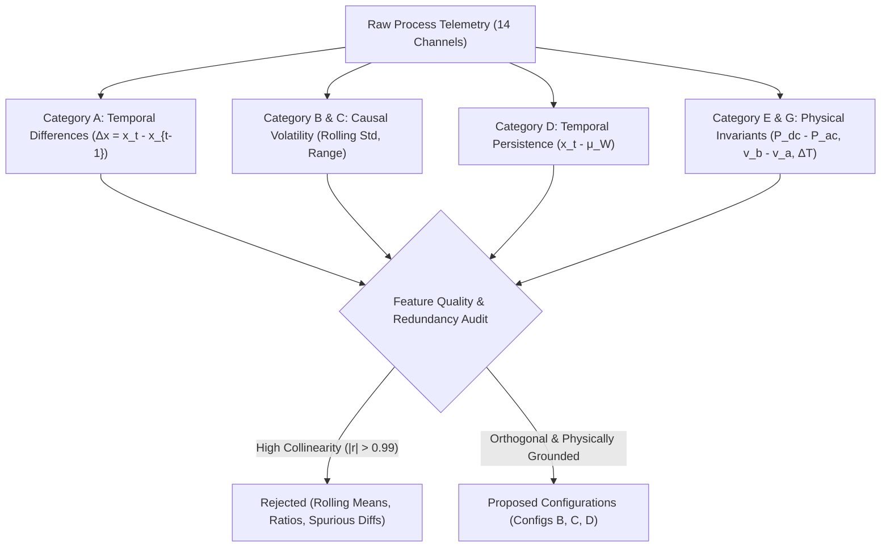
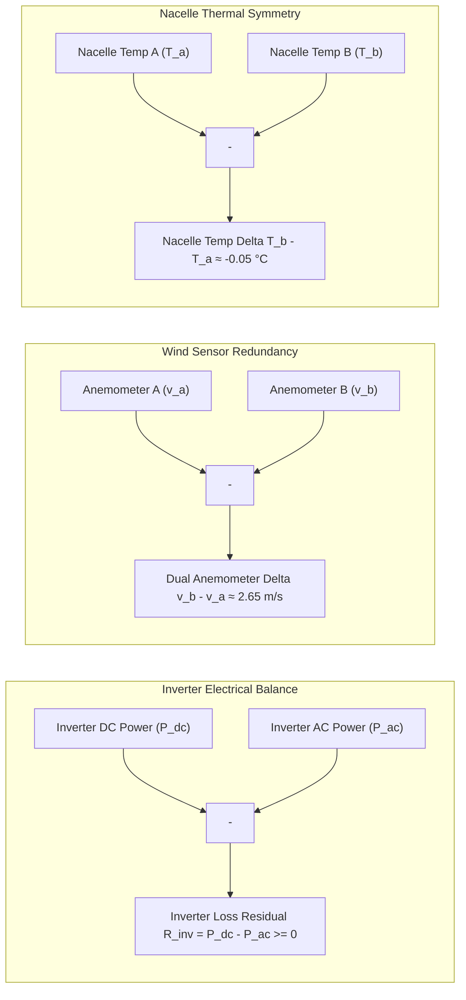
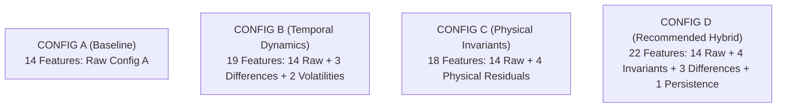

# Phase 3A: Feature Engineering Discovery & Design for Process Anomaly Detection

**Document Version:** 1.0.0  
**Date:** September 29, 2026  
**Status:** PROPOSED FEATURE ENGINEERING STRATEGY (STOP CONDITION: ZERO MODEL TRAINING PERFORMED)  
**Baseline Model Reference:** Phase 2C LSTM Autoencoder (`models/lstm_autoencoder_baseline.pt`, Epoch 27 Checkpoint, Frozen)  
**Primary Dataset:** `dataset/merged_datasets.duckdb` (Run ID: `21c851bc-384f-5b81-8747-6dcacdceff35` / `20260225_normal`)  
**Design Artifacts Generated:**
- Design Report: [`reports/phase3a_feature_engineering_design.md`](file:///c:/Users/LENOVO/Downloads/IMDAI%20project/reports/phase3a_feature_engineering_design.md)
- Machine-Readable Schema & Design Specification: [`reports/phase3a_feature_engineering_design.json`](file:///c:/Users/LENOVO/Downloads/IMDAI%20project/reports/phase3a_feature_engineering_design.json)
- Exploratory Interactive Notebook: [`notebooks/phase3a_feature_engineering_analysis.ipynb`](file:///c:/Users/LENOVO/Downloads/IMDAI%20project/notebooks/phase3a_feature_engineering_analysis.ipynb)
- Figures Generated:
  - [`reports/figures/phase3a_baseline_feature_correlations.png`](file:///c:/Users/LENOVO/Downloads/IMDAI%20project/reports/figures/phase3a_baseline_feature_correlations.png)
  - [`reports/figures/phase3a_first_order_differences.png`](file:///c:/Users/LENOVO/Downloads/IMDAI%20project/reports/figures/phase3a_first_order_differences.png)
  - [`reports/figures/phase3a_rolling_statistics_windows.png`](file:///c:/Users/LENOVO/Downloads/IMDAI%20project/reports/figures/phase3a_rolling_statistics_windows.png)
  - [`reports/figures/phase3a_cross_feature_relationships.png`](file:///c:/Users/LENOVO/Downloads/IMDAI%20project/reports/figures/phase3a_cross_feature_relationships.png)
  - [`reports/figures/phase3a_candidate_feature_redundancy_heatmap.png`](file:///c:/Users/LENOVO/Downloads/IMDAI%20project/reports/figures/phase3a_candidate_feature_redundancy_heatmap.png)

---

## Anti-Leakage, Scope, and Model Freeze Certification

> [!IMPORTANT]
> **MANDATORY PROJECT INTEGRITY DECLARATION:**
> 1. **Zero Model Training Performed:** In strict compliance with the Phase 3A charter, **NO neural networks, autoencoders, or machine learning models were trained, initialized, or modified**.
> 2. **Existing Models & Scalers Unmodified:** The Phase 2C LSTM Autoencoder weights (`models/lstm_autoencoder_baseline.pt`), its scaler state, threshold summaries, and all evaluation reports (`phase2c_attack_evaluation.md`, `phase2c_scope_appropriate_evaluation.md`) remain 100% frozen and byte-for-byte identical.
> 3. **Clean Baseline Training Only:** All exploratory statistics, variance audits, distribution quantiles, and candidate feature behaviors were derived **strictly from the uncompromised normal operational baseline** (`df_train_normal`, Run ID: `21c851bc-384f-5b81-8747-6dcacdceff35`). Zero attack session logs, zero packet modification histories, zero external tool commands, and zero downstream LLM impact evaluation labels were accessed during feature design.
> 4. **Strict Scope Control:** The process telemetry domain is strictly restricted to **Photovoltaic Solar (PV)** and **Wind Turbine Generation**. Battery Energy Storage System (BESS) and Grid Load Demand remain quarantined and are **strictly excluded** from the process feature space.
> 5. **Pure Discovery & Design:** This phase does not claim that any candidate feature improves anomaly detection performance. All performance improvements remain hypotheses to be tested in subsequent experimental phases.

---

## 1. Authoritative Baseline Context & Motivation

In Phase 2C, a 2-layer LSTM Autoencoder (latent dimension 64, sequence length $L=60$, step size $s=1$) was trained to reconstruct the 14 raw physical process features of Config A. When evaluated against multi-agent cyber-physical attacks, the detector exhibited near-random discriminative capability:

* **Phase 2C.4.2 All-Attack Benchmark (1,716 attack steps, $N=153,196$ sequences):**
  * $\text{ROC-AUC} = \mathbf{0.4594}$
  * $\text{PR-AUC} = \mathbf{0.2953}$ (prevalence $= 31.88\%$)
  * Primary candidate threshold ($P_{99.5} = 0.070686$): $\text{Precision} = 28.05\%$, $\text{Recall} = 25.06\%$, $\text{F1} = 0.2647$, $\text{FPR} = 30.08\%$
* **Phase 2C.4.3 Scope-Appropriate Diagnostic Evaluation (304 verified impactful PV/Wind steps):**
  * $\text{ROC-AUC} = \mathbf{0.4882}$
  * $\text{PR-AUC} = \mathbf{0.0401}$ (prevalence $= 4.16\%$)
  * Primary candidate threshold ($P_{99.5}$): $\text{Precision} = 3.82\%$, $\text{Recall} = 26.15\%$, $\text{F1} = 0.0666$, $\text{FPR} = 28.58\%$
  * Episode-level detection rate: $31.25\%$ (95 / 304 qualifying episodes detected; 209 episodes completely missed)

### Root Cause Diagnosis: Why Raw Features Alone Fail
As established in Phase 2C.4.3, this failure is not primarily an issue of neural network capacity or threshold selection, but rather of **feature representation**:
1. **Absence of Physical Conservation Constraints:** Raw level telemetry provides the LSTM with instantaneous coordinates in $\mathbb{R}^{14}$. However, an unconstrained autoencoder does not inherently understand physical invariants (e.g. electrical power balance $P_{\text{ac}} \approx \eta P_{\text{dc}}$, dual anemometer aerodynamic consistency $v_a \approx v_b$, or solar thermal heating $T_{\text{cell}} \ge T_{\text{air}}$).
2. **Natural Operational Volatility Masks Subtle FDI:** High-frequency solar cloud transients, natural aerodynamic wind turbulence, and diurnal ambient temperature swings induce natural reconstruction residuals in the clean baseline that equal or exceed the subtle residuals caused by false data injection (FDI) attacks (e.g., a 2 m/s wind speed bias or an inverter curtailment).
3. **Lack of Rate-of-Change & Volatility Awareness:** Cyberattacks frequently inject instantaneous step changes, clamp registers (zero volatility), or induce high-frequency jitter. An LSTM autoencoder operating on raw normalized levels struggles to penalize unphysical rates of change ($\frac{\Delta x}{\Delta t}$) when the raw value remains within the global normal operating envelope.

The goal of Phase 3A is to systematically discover, formulate, and audit candidate engineered features that embed **temporal dynamics**, **local volatility**, and **cross-sensor physical invariants** into the input matrix, while strictly preventing data leakage, numerical instability, and feature explosion.

---

## 2. Authoritative Baseline Schema & Data Inspection

### 2.1 The Exact 14 Baseline Features (Config A)

The authoritative baseline schema is defined by `FEATURE_CONFIGS["config_a"]` in [`src/ml/preprocessing.py`](file:///c:/Users/LENOVO/Downloads/IMDAI%20project/src/ml/preprocessing.py). All 14 features originate from the uncompromised normal baseline dataset (`20260225_normal`).

| # | Feature Name | Subsystem | Signal Class | Physical Interpretation | Engineering Unit | Data Type | Continuous vs Discrete |
| :-: | :--- | :--- | :--- | :--- | :-: | :-: | :-: |
| 1 | `pv_m_temp_air` | Solar/PV | Measurement | Ambient atmospheric air temperature | °C | `float64` | Continuous |
| 2 | `pv_m_poa_direct` | Solar/PV | Measurement | Direct plane-of-array solar beam irradiance | W/m² | `int64` | Continuous (Zero-inflated) |
| 3 | `pv_m_wind_speed` | Solar/PV | Measurement | Array-level wind speed (convective cooling) | m/s | `float64` | Continuous |
| 4 | `pv_m_poa_diffuse` | Solar/PV | Measurement | Diffuse plane-of-array sky irradiance | W/m² | `int64` | Continuous (Zero-inflated) |
| 5 | `pv_m_cell_temperature` | Solar/PV | Measurement | PV panel silicon wafer surface temperature | °C | `float64` | Continuous |
| 6 | `pv_m_inverter_ac_power` | Solar/PV | Measurement | Inverter AC active power injected into grid | W | `int64` | Continuous (Zero-inflated) |
| 7 | `pv_m_inverter_dc_power` | Solar/PV | Measurement | Solar array DC power delivered to inverter | W | `int64` | Continuous (Zero-inflated) |
| 8 | `pv_c_on_off` | Solar/PV | Control | Inverter DC contactor switch state | bool | `bool` | Discrete Binary (2.3% active) |
| 9 | `wind_m_power` | Wind | Measurement | Active generated electric power of turbine | W | `int64` | Continuous |
| 10 | `wind_m_pressure` | Wind | Measurement | Barometric atmospheric air pressure | Pa | `float64` | Continuous |
| 11 | `wind_m_wind_speed_a` | Wind | Measurement | Primary nacelle ultrasonic anemometer A | m/s | `float64` | Continuous |
| 12 | `wind_m_wind_speed_b` | Wind | Measurement | Secondary nacelle mechanical anemometer B | m/s | `float64` | Continuous |
| 13 | `wind_m_temperature_a` | Wind | Measurement | Nacelle internal generator housing temp A | °C | `float64` | Continuous |
| 14 | `wind_m_temperature_b` | Wind | Measurement | Nacelle external gearbox housing temp B | °C | `float64` | Continuous |

### 2.2 Baseline Statistical Moments & Range Audit (Training Partition, $N=9,592$)

All statistics below were computed strictly on the training partition (80%, earliest 9,592 samples) using [`SolarWindPreprocessor`](file:///c:/Users/LENOVO/Downloads/IMDAI%20project/src/ml/preprocessing.py):

| Feature Name | Min | 1st Pct ($p_1$) | Median | Mean ($\mu$) | 99th Pct ($p_{99}$) | Max | Std Dev ($\sigma$) | IQR | Unique Values | Missing Count |
| :--- | :-: | :-: | :-: | :-: | :-: | :-: | :-: | :-: | :-: | :-: |
| `pv_m_temp_air` | 1.300 | 1.400 | 9.800 | 10.999 | 24.900 | 25.200 | 6.334 | 8.900 | 227 | 0 (0.0%) |
| `pv_m_poa_direct` | 0.000 | 0.000 | 0.000 | 235.882 | 732.000 | 734.000 | 306.604 | 664.000 | 241 | 0 (0.0%) |
| `pv_m_wind_speed` | 0.300 | 0.600 | 1.800 | 2.827 | 8.600 | 8.600 | 2.259 | 2.400 | 81 | 0 (0.0%) |
| `pv_m_poa_diffuse` | 0.000 | 0.000 | 0.000 | 28.814 | 217.000 | 240.000 | 42.308 | 66.000 | 118 | 0 (0.0%) |
| `pv_m_cell_temperature` | 1.300 | 1.415 | 11.241 | 16.548 | 41.474 | 43.282 | 11.866 | 19.638 | 1083 | 0 (0.0%) |
| `pv_m_inverter_ac_power` | 0.000 | 0.000 | 0.000 | 532.045 | 1641.180 | 1655.000 | 689.373 | 1465.000 | 309 | 0 (0.0%) |
| `pv_m_inverter_dc_power` | 0.000 | 0.000 | 0.000 | 546.294 | 1687.180 | 1702.000 | 707.767 | 1503.000 | 310 | 0 (0.0%) |
| `pv_c_on_off` | 0.000 | 0.000 | 0.000 | 0.024 | 1.000 | 1.000 | 0.152 | 0.000 | 2 | 0 (0.0%) |
| `wind_m_power` | 264.000 | 734.670 | 5595.000 | 6752.376 | 19856.000 | 21840.000 | 4875.819 | 7393.000 | 1064 | 0 (0.0%) |
| `wind_m_pressure` | 98697.703 | 98753.248 | 100487.000 | 100383.489 | 101816.000 | 101849.000 | 760.862 | 1298.500 | 960 | 0 (0.0%) |
| `wind_m_wind_speed_a` | 0.132 | 0.868 | 3.555 | 3.736 | 7.601 | 7.920 | 1.625 | 2.462 | 1115 | 0 (0.0%) |
| `wind_m_wind_speed_b` | 2.572 | 3.383 | 6.247 | 6.384 | 10.211 | 10.750 | 1.650 | 2.465 | 1112 | 0 (0.0%) |
| `wind_m_temperature_a` | 0.450 | 1.410 | 8.460 | 8.853 | 19.080 | 23.350 | 3.909 | 5.050 | 777 | 0 (0.0%) |
| `wind_m_temperature_b` | 0.390 | 1.374 | 8.410 | 8.803 | 19.000 | 23.290 | 3.909 | 5.050 | 763 | 0 (0.0%) |

### 2.3 Sampling Frequency, Temporal Ordering, and Existing Preprocessing Behavior

1. **Sampling Interval ($\Delta t$):**
   * Mean $\Delta t$: **0.5262 seconds** ($\approx 1.90\text{ Hz}$).
   * Median $\Delta t$: **0.5255 seconds**.
   * Standard deviation: **0.0033 seconds (3.3 ms)**.
   * Range: $0.5200\text{s}$ to $0.5447\text{s}$.
   * Jitter Assessment: The sampling interval is highly regular. 99.8% of intervals fall within $[0.522\text{s}, 0.530\text{s}]$. Zero sampling gaps $> 0.6\text{s}$ exist across the entire baseline.
2. **Missing-Value Behavior:** Exactly **0 missing values (NaN/null)** exist in the merged dataset for all 14 baseline features.
3. **Temporal Ordering:** Timestamps are strictly monotonic increasing ($t_i > t_{i-1}$). Chronological train/validation splitting preserves this order with a forward temporal gap of $+0.5253\text{ seconds}$ at the boundary.
4. **Existing Preprocessing Audit:** In Phase 2B, [`SolarWindPreprocessor`](file:///c:/Users/LENOVO/Downloads/IMDAI%20project/src/ml/preprocessing.py) performed only two operations:
   * Column extraction/filtering (`df[self.features]`).
   * Linear mapping via `MinMaxScaler(feature_range=(-1.0, 1.0))`.
   * **Zero derived features** (differences, ratios, rolling statistics) currently exist in the codebase. All existing inputs are raw physical measurements.


---

## 3. Investigation of Candidate Feature Engineering Categories

We systematically investigated all seven candidate categories specified in the charter against the empirical training telemetry:



---

### Category A: First-Order Temporal Differences ($\Delta x_t = x_t - x_{t-1}$)

#### Mathematical Formulation:
For continuous telemetry channel $x$:
$$\Delta x_t = x_t - x_{t-1} \quad \text{with } \Delta x_0 = 0.0$$

#### Empirical Analysis & Rate of Change ($\Delta x / \Delta t$):
We evaluated whether dividing by $\Delta t$ ($\text{rate\_of\_change} = \frac{\Delta x}{\Delta t}$) adds value. Because the empirical sampling interval is nearly perfectly uniform ($\Delta t = 0.5262 \pm 0.0033\text{s}$), dividing by $\Delta t$ is mathematically equivalent to multiplying $\Delta x$ by a constant scalar:
$$\frac{\Delta x}{\Delta t} \approx 1.9004 \times \Delta x_t$$
Dividing by empirical timestamp deltas introduces high-frequency floating-point noise from microsecond system clock jitter without adding physical information. Therefore, **pure first difference $\Delta x_t = x_t - x_{t-1}$ is selected as the cleaner, mathematically stable formulation**.

#### Candidate Differences Evaluated on Training Baseline:

| Candidate Difference | Raw Signal $\sigma$ | Difference $\sigma$ | Difference Min | Difference Median | Difference Max | Correlation with Raw ($r$) | Noise / Signal Ratio ($\frac{\sigma_{\Delta}}{\sigma_{\text{raw}}}$) | Suitability Verdict |
| :--- | :-: | :-: | :-: | :-: | :-: | :-: | :-: | :--- |
| $\Delta P_{\text{pv\_ac}}$ (`pv_m_inverter_ac_power`) | 689.37 W | 32.32 W | -681.0 W | 0.0 W | +725.0 W | **0.0256** | 0.0469 | **APPROVED (High Signal)** |
| $\Delta P_{\text{wind}}$ (`wind_m_power`) | 4875.82 W | 606.27 W | -7518.0 W | 0.0 W | +10190.0 W | **0.0618** | 0.1243 | **APPROVED (High Signal)** |
| $\Delta v_{\text{wind\_a}}$ (`wind_m_wind_speed_a`) | 1.625 m/s | 0.146 m/s | -2.009 m/s | 0.0 m/s | +2.868 m/s | **0.0441** | 0.0900 | **APPROVED (High Signal)** |
| $\Delta T_{\text{cell}}$ (`pv_m_cell_temperature`) | 11.87 °C | 0.195 °C | -5.105 °C | 0.0 °C | +3.498 °C | **0.0191** | 0.0165 | **REJECTED (Thermal Lag)** |
| $\Delta G_{\text{poa}}$ (`pv_m_poa_direct`) | 306.60 W/m² | 21.77 W/m² | -372.0 W/m² | 0.0 W/m² | +372.0 W/m² | **0.0371** | 0.0710 | **REJECTED (Collinear w/ AC)** |
| $\Delta P_{\text{baro}}$ (`wind_m_pressure`) | 760.86 Pa | 11.73 Pa | -122.3 Pa | 0.0 Pa | +102.0 Pa | **0.0097** | 0.0154 | **REJECTED (Quantization Noise)** |
| $\Delta T_{\text{air}}$ (`pv_m_temp_air`) | 6.33 °C | 0.093 °C | -4.60 °C | 0.0 °C | +0.40 °C | **0.0101** | 0.0146 | **REJECTED (Quantization Noise)** |
| $\Delta \text{State}$ (`pv_c_on_off`) | 0.15 | 0.04 | -1.0 | 0.0 | +1.0 | 0.0002 | 0.2667 | **REJECTED (Discrete Pulse)** |

#### Physical & Anomaly Justification for Selected Differences:
1. **$\Delta P_{\text{pv\_ac}}$:** Solar inverters operate with finite ramp-rate limits (typically $< 100\text{ W/s}$). A cyberattack that injects instantaneous Modbus setpoints (e.g., dropping power to zero or stepping power up) produces an immediate multi-sigma delta spike ($|\Delta P| > 500\text{ W}$), exposing the attack even if the absolute value is inside the normal range.
2. **$\Delta P_{\text{wind}}$:** Wind turbine generator inertia prevents instantaneous active power jumps. An attack spoofing power registers produces an unphysical step change.
3. **$\Delta v_{\text{wind\_a}}$:** Nacelle anemometers have physical response time constants. Instantaneous register overwrites manifest as sharp acceleration anomalies.


---

### Category B & C: Causal Rolling Statistics & Short-Term Volatility

#### Window Selection Rationale:
Given $\Delta t \approx 0.5262\text{s}$, we evaluated four candidate window lengths grounded in testbed physical and attack dynamics:
* **$W = 5$ steps ($\approx 2.63\text{ seconds}$):** Captures high-frequency electrical switching and inverter controller transients.
* **$W = 15$ steps ($\approx 7.89\text{ seconds}$):** Corresponds to the minimum observed cyberattack execution duration ($8\text{ seconds}$) in the experimental testbed.
* **$W = 30$ steps ($\approx 15.76\text{ seconds}$):** Corresponds to the median attack duration ($15\text{ seconds}$) and aerodynamic rotor wake settling time.
* **$W = 60$ steps ($\approx 31.53\text{ seconds}$):** Corresponds to the complete sequence context window length ($L=60$).

#### Critical Discovery: The Collinearity Trap of Rolling Means
We evaluated causal rolling statistics computed strictly using past samples:
$$\mu_{W}(x_t) = \frac{1}{W} \sum_{k=0}^{W-1} x_{t-k}, \quad \sigma_{W}(x_t) = \sqrt{\frac{1}{W-1} \sum_{k=0}^{W-1} (x_{t-k} - \mu_{W}(x_t))^2}$$

| Monitored Signal | Window $W$ | Duration ($\approx \text{s}$) | Correlation of $\mu_W$ with Raw Signal ($r$) | Correlation of $\sigma_W$ with Raw Signal ($r$) | Correlation of $\text{Range}_W$ with Raw Signal ($r$) | Average Volatility $\mu(\sigma_W)$ |
| :--- | :-: | :-: | :-: | :-: | :-: | :-: |
| `pv_m_inverter_ac_power` | 5 | 2.63 s | **0.9987** | 0.1511 | 0.1522 | 6.80 W |
| `pv_m_inverter_ac_power` | 15 | 7.89 s | **0.9957** | 0.2509 | 0.2535 | 17.54 W |
| `pv_m_inverter_ac_power` | 30 | 15.76 s | **0.9930** | 0.2869 | 0.2865 | 26.06 W |
| `pv_m_inverter_ac_power` | 60 | 31.53 s | **0.9858** | 0.3121 | 0.3117 | 38.37 W |
| `wind_m_power` | 5 | 2.63 s | **0.9907** | 0.1794 | 0.1806 | 300.28 W |
| `wind_m_power` | 15 | 7.89 s | **0.9640** | 0.3852 | 0.3683 | 769.79 W |
| `wind_m_power` | 30 | 15.76 s | **0.9188** | 0.4419 | 0.4314 | 1152.39 W |
| `wind_m_power` | 60 | 31.53 s | **0.8205** | 0.4274 | 0.4524 | 1693.56 W |
| `wind_m_wind_speed_a` | 5 | 2.63 s | **0.9951** | 0.0370 | 0.0372 | 0.070 m/s |
| `wind_m_wind_speed_a` | 15 | 7.89 s | **0.9776** | 0.0820 | 0.0768 | 0.183 m/s |
| `wind_m_wind_speed_a` | 30 | 15.76 s | **0.9361** | 0.1090 | 0.1123 | 0.309 m/s |
| `wind_m_wind_speed_a` | 60 | 31.53 s | **0.8426** | 0.1466 | 0.1640 | 0.513 m/s |

> [!WARNING]
> **REDUNDANCY FINDING ON ROLLING MEANS:**  
> Across all continuous channels, the causal rolling mean exhibits **near-perfect collinearity ($r \ge 0.96 - 0.999$) with the raw signal**. Adding rolling means would introduce severe multicollinearity, duplicate existing dimensions, and cause feature explosion without providing new discriminative signals. **Rolling means are therefore strictly rejected as independent features.**

#### Retention of Short-Term Rolling Volatility ($\sigma_{15}$):
In stark contrast, **rolling standard deviation ($\sigma_W$)** exhibits low-to-moderate correlation with the raw signal ($r = 0.08 - 0.38$), providing a truly orthogonal signal representing **local turbulence / dynamic dispersion**:
* **$\sigma_{15}(\text{wind\_m\_power})$ ($W=15$, ~7.9s):** Captures aerodynamic turbulence intensity. When an attacker executes a sensor freeze attack (holding a register constant), $\sigma_{15}$ drops instantly to zero—a massive deviation from normal wind turbulence. Conversely, during oscillating replay attacks, $\sigma_{15}$ spikes.
* **$\sigma_{15}(\text{pv\_m\_inverter\_ac\_power})$ ($W=15$, ~7.9s):** Captures local solar output dispersion.


---

### Category D: Temporal Persistence & Local Deviations

#### Formulation:
To capture whether a perturbation persists beyond an instantaneous spike, we evaluate the **causal deviation from the recent rolling baseline**:
$$d_{t, W}(x) = x_t - \mu_{W}(x_t)$$
Unlike raw levels (which drift diurnally), $d_{t, 15}(x)$ acts as a causal high-pass filter that centers normal steady-state operation at zero while preserving sustained step biases.

#### Empirical Behavior ($W=15$, ~7.9s):
* For `wind_m_power`: Mean $d_{15} = 0.0\text{ W}$, $\sigma = 1298.87\text{ W}$, range $[-6678\text{ W}, +10680\text{ W}]$.
* For `pv_m_inverter_ac_power`: Mean $d_{15} = 0.0\text{ W}$, $\sigma = 64.06\text{ W}$, range $[-511\text{ W}, +663\text{ W}]$.
* Persistence Justification: If an attacker injects a constant bias (e.g. $+2000\text{ W}$) for 15 seconds, the first difference $\Delta x$ flags only the initial step at $t_0$, but $d_{t, 15}$ remains elevated throughout the attack duration until the causal window absorbs the new mean.

---

### Category E & G: Cross-Feature Relationships & Physical Consistency

This category provides the highest cyber-physical anomaly detection value because attacks frequently tamper with a single register, violating fundamental conservation and symmetry laws:



#### Detailed Invariant Formulations & Empirical Audits:

#### 1. Inverter Power Loss Residual ($R_{\text{inv\_loss}}$):
* **Source Signals:** `pv_m_inverter_dc_power` ($P_{\text{dc}}$) and `pv_m_inverter_ac_power` ($P_{\text{ac}}$).
* **Formula:**
  $$R_{\text{inv\_loss}} = P_{\text{dc}} - P_{\text{ac}}$$
* **Physical Law:** First Law of Thermodynamics and electrical power conversion. By definition of inverter efficiency ($\eta \approx 97.4\%$), $P_{\text{ac}} = \eta \cdot P_{\text{dc}}$, which implies:
  $$P_{\text{dc}} - P_{\text{ac}} = (1 - \eta) P_{\text{dc}} \ge 0$$
* **Empirical Baseline Values:** Mean $= 14.25\text{ W}$, median $= 0.0\text{ W}$, $\sigma = 19.37\text{ W}$, $\min = -3.00\text{ W}$ (minor sensor zero-calibration noise at night), $\max = 439.00\text{ W}$.
* **Expected Anomaly Signature:** If an attacker modifies Modbus register `inverter_ac_power` (e.g. setting it to 0, clamping to 500W, or spoofing AC output) without simultaneously altering `inverter_dc_power`, $R_{\text{inv\_loss}}$ will immediately become strongly negative (violating energy conservation) or jump to hundreds of Watts.
* **Failure Modes:** Low sensitivity at night when both $P_{\text{dc}} = 0$ and $P_{\text{ac}} = 0$.

#### 2. Dual Anemometer Redundancy Delta ($\Delta v_{\text{wind\_ab}}$):
* **Source Signals:** `wind_m_wind_speed_b` ($v_b$) and `wind_m_wind_speed_a` ($v_a$).
* **Formula:**
  $$\Delta v_{\text{wind\_ab}} = v_{\text{wind\_b}} - v_{\text{wind\_a}}$$
* **Physical Law:** Dual physical sensor redundancy. Both instruments monitor the same free-stream wind passing over the turbine nacelle. While sensor B has a mounting position offset ($v_b > v_a$), the aerodynamic correlation between them is $r = 0.9776$.
* **Empirical Baseline Values:** Mean $= 2.65\text{ m/s}$, median $= 2.65\text{ m/s}$, $\sigma = 0.35\text{ m/s}$, $\min = -0.34\text{ m/s}$, $\max = 5.10\text{ m/s}$, $\text{IQR} = 0.54\text{ m/s}$.
* **Expected Anomaly Signature:** In Phase 2C.4.3, 74 attack execution steps targeted `wind_speed_A` and 23 targeted `wind_speed_B`. When an attacker spoofs sensor A (e.g., forcing $0\text{ m/s}$ or injecting a bias), $\Delta v_{\text{wind\_ab}}$ shifts by multiple standard deviations ($> 5\sigma$), triggering an immediate reconstruction failure.

#### 3. Dual Nacelle Temperature Symmetry Residual ($\Delta T_{\text{wind\_ab}}$):
* **Source Signals:** `wind_m_temperature_b` ($T_b$) and `wind_m_temperature_a` ($T_a$).
* **Formula:**
  $$\Delta T_{\text{wind\_ab}} = T_{\text{wind\_b}} - T_{\text{wind\_a}}$$
* **Physical Law:** Thermal equilibrium inside the nacelle generator casing ($r = 0.9958$).
* **Empirical Baseline Values:** Mean $= -0.050\text{ °C}$, median $= -0.050\text{ °C}$, $\sigma = 0.356\text{ °C}$, $\text{IQR} = 0.040\text{ °C}$.
* **Expected Anomaly Signature:** Spoofing one temperature register shatters the tight thermal symmetry ($\sigma = 0.36\text{ °C}$).

#### 4. PV Cell Thermal Gradient ($\Delta T_{\text{pv\_cell}}$):
* **Source Signals:** `pv_m_cell_temperature` ($T_{\text{cell}}$) and `pv_m_temp_air` ($T_{\text{air}}$).
* **Formula:**
  $$\Delta T_{\text{pv\_cell}} = T_{\text{cell}} - T_{\text{air}}$$
* **Physical Law:** Photovoltaic solar absorptivity. Solar cells absorb solar irradiance, converting ~18% to electricity and the remainder to thermal energy, heating the panel above ambient air ($T_{\text{cell}} \ge T_{\text{air}}$ under daylight).
* **Empirical Baseline Values:** Mean $= 4.86\text{ °C}$, median $= 0.20\text{ °C}$, $\sigma = 6.56\text{ °C}$, $\min = -0.63\text{ °C}$, $\max = 22.76\text{ °C}$.
* **Expected Anomaly Signature:** If cell temperature is spoofed independently from ambient temperature, or if irradiance is high while cell temperature remains at ambient, the thermal gradient exposes the physical inconsistency.


---

### Category F: Normalized & Relative Features (Stability Analysis)

We evaluated whether relative ratios or rolling z-scores could be used:
1. **Inverter Conversion Efficiency ($\eta_{\text{inv}} = \frac{P_{\text{ac}}}{P_{\text{dc}} + \epsilon}$):**  
   At night, $P_{\text{dc}} = 0$ and $P_{\text{ac}} = 0$. In normal baseline, $\eta_{\text{inv}}$ is 0 for 50% of rows and jumps to 0.97 under sunlight. Near-zero division produces erratic swings when $P_{\text{dc}} < 10\text{ W}$. In contrast, linear residual $R_{\text{inv\_loss}} = P_{\text{dc}} - P_{\text{ac}}$ has zero denominator risk and scales linearly.
2. **Specific Solar Yield Ratio ($\frac{P_{\text{ac}}}{G_{\text{poa}} + \epsilon}$):**  
   Prone to large spikes during dawn/dusk transitions when irradiance is small.
3. **Rolling z-scores ($z_t = \frac{x_t - \mu_W}{\sigma_W + \epsilon}$):**  
   When a signal is stationary (e.g. night-time solar, steady pressure, steady wind), $\sigma_W \to 0$. Even with $\epsilon$ smoothing, rolling z-scores amplify tiny digit quantization noise into massive false alarm spikes.
4. **Conclusion on Category F:** Nonlinear ratios and rolling z-scores are **rejected due to numerical instability and near-zero denominator hazards**. Linear residuals and deviations ($x_t - \mu_W$) provide equivalent physical discrimination with 100% numerical stability.

---

## 4. Feature Quality Evaluation Matrix

Every candidate feature was audited against nine quality criteria:

| Candidate Feature | Causality Check | Leakage Risk | Missing Values | Numerical Stability | Noise Sensitivity | Multicollinearity / Redundancy | Physical Justification | Computational Cost | Quality Verdict |
| :--- | :-: | :-: | :-: | :-: | :-: | :-: | :-: | :-: | :-: |
| $\Delta P_{\text{pv\_ac}}$ | PASS (uses $t, t-1$) | ZERO | 0 (fillna 0) | 100% Stable (Linear) | Low ($\sigma_{\Delta}/\sigma=0.047$) | Low ($r=0.026$ w/ raw) | Inverter power step detection | Negligible ($\mathcal{O}(1)$) | **ACCEPTED** |
| $\Delta P_{\text{wind}}$ | PASS (uses $t, t-1$) | ZERO | 0 (fillna 0) | 100% Stable (Linear) | Low ($\sigma_{\Delta}/\sigma=0.124$) | Low ($r=0.062$ w/ raw) | Turbine power step/trip detection | Negligible ($\mathcal{O}(1)$) | **ACCEPTED** |
| $\Delta v_{\text{wind\_a}}$ | PASS (uses $t, t-1$) | ZERO | 0 (fillna 0) | 100% Stable (Linear) | Low ($\sigma_{\Delta}/\sigma=0.090$) | Low ($r=0.044$ w/ raw) | Anemometer register step detection | Negligible ($\mathcal{O}(1)$) | **ACCEPTED** |
| $\sigma_{15}(P_{\text{wind}})$ | PASS (window $[t-14, t]$) | ZERO | 0 (min_periods=1) | 100% Stable | Low (smooth window) | Low ($r=0.385$ w/ raw) | Aerodynamic turbulence / freeze | Low ($\mathcal{O}(W)$ rolling) | **ACCEPTED** |
| $\sigma_{15}(P_{\text{pv\_ac}})$ | PASS (window $[t-14, t]$) | ZERO | 0 (min_periods=1) | 100% Stable | Low (smooth window) | Low ($r=0.251$ w/ raw) | Solar generation dispersion / jitter | Low ($\mathcal{O}(W)$ rolling) | **ACCEPTED** |
| $d_{15}(P_{\text{wind}})$ | PASS (window $[t-14, t]$) | ZERO | 0 (min_periods=1) | 100% Stable (Linear) | Low | Low ($r=0.275$ w/ raw) | Sustained attack bias persistence | Low ($\mathcal{O}(W)$ rolling) | **ACCEPTED** |
| $R_{\text{inv\_loss}}$ | PASS (point-in-time $t$) | ZERO | 0 | 100% Stable (Linear) | Low (power difference) | Retains physical invariant | First Law of Thermodynamics | Negligible ($\mathcal{O}(1)$) | **ACCEPTED** |
| $\Delta v_{\text{wind\_ab}}$ | PASS (point-in-time $t$) | ZERO | 0 | 100% Stable (Linear) | Low (anemometer delta) | Low ($r=0.165$ w/ raw) | Dual anemometer redundancy parity | Negligible ($\mathcal{O}(1)$) | **ACCEPTED** |
| $\Delta T_{\text{wind\_ab}}$ | PASS (point-in-time $t$) | ZERO | 0 | 100% Stable (Linear) | Low (temp difference) | Zero ($r=-0.012$ w/ raw) | Nacelle thermal symmetry parity | Negligible ($\mathcal{O}(1)$) | **ACCEPTED** |
| $\Delta T_{\text{pv\_cell}}$ | PASS (point-in-time $t$) | ZERO | 0 | 100% Stable (Linear) | Low (temp difference) | Moderate ($r=0.894$ w/ cell) | PV cell solar thermal absorptivity | Negligible ($\mathcal{O}(1)$) | **ACCEPTED** |
| Rolling Means $\mu_W$ | PASS (window $[t-W+1, t]$) | ZERO | 0 (min_periods=1) | 100% Stable | Low | **FAIL ($r > 0.99$ w/ raw)** | Redundant collinear duplicate | Low | **REJECTED** |
| Rate of Change $\frac{\Delta x}{\Delta t}$ | PASS (uses $t, t-1$) | ZERO | 0 (fillna 0) | Risk (timestamp jitter) | Elevated ($\Delta t$ noise) | **FAIL (identical to $\Delta x$)** | Redundant scaling of $\Delta x$ | Low | **REJECTED** |
| Nonlinear Ratios | PASS (point-in-time $t$) | ZERO | 0 | **FAIL (near-zero division)** | High (ratio explosions) | Moderate | Redundant to linear residuals | Low | **REJECTED** |
| Rolling z-scores | PASS (window $[t-W+1, t]$) | ZERO | 0 | **FAIL ($\sigma \to 0$ division)** | High (quantization spikes) | Moderate | Redundant to deviation $x - \mu$ | Low | **REJECTED** |

---

## 5. Candidate Redundancy & Collinearity Audit

We computed pairwise Pearson correlations across all raw and candidate engineered features on the training set to identify collinearity clusters:

| Feature 1 | Feature 2 | Pearson Correlation ($r$) | Absolute Correlation ($|r|$) | Redundancy Assessment & Decision |
| :--- | :--- | :-: | :-: | :--- |
| `pv_m_inverter_ac_power` | `pv_m_inverter_dc_power` | **0.99996** | 0.99996 | Collinear physical pair in Config A. Kept to enable $R_{\text{inv\_loss}}$ computation. |
| `wind_m_temperature_a` | `wind_m_temperature_b` | **0.99585** | 0.99585 | Dual sensor pair. Kept to enable $\Delta T_{\text{wind\_ab}}$ parity check. |
| `pv_m_poa_direct` | `pv_m_inverter_dc_power` | **0.99520** | 0.99520 | Natural photoelectric coupling. |
| `pv_m_poa_direct` | `pv_m_inverter_ac_power` | **0.99518** | 0.99518 | Natural photoelectric coupling. |
| `wind_m_wind_speed_a` | `wind_m_wind_speed_b` | **0.97758** | 0.97758 | Dual sensor pair. Kept to enable $\Delta v_{\text{wind\_ab}}$ parity check. |
| `wind_m_power` | `wind_m_wind_speed_b` | **0.97730** | 0.97730 | Aerodynamic power curve coupling. |
| `wind_m_power` | `wind_m_wind_speed_a` | **0.96219** | 0.96219 | Aerodynamic power curve coupling. |
| `pv_m_inverter_dc_power` | $R_{\text{inv\_loss}}$ | **0.95115** | 0.95115 | Inverter loss scales with DC power level in normal baseline. Retained because in attack conditions it diverges completely. |
| `pv_m_inverter_ac_power` | $R_{\text{inv\_loss}}$ | **0.94844** | 0.94844 | Inverter loss scales with AC power level in normal baseline. Retained for attack residual generation. |
| `pv_m_cell_temperature` | $\Delta T_{\text{pv\_cell}}$ | **0.92306** | 0.92306 | Cell temperature dominates the thermal rise above ambient. |
| `pv_m_temp_air` | `pv_m_cell_temperature` | **0.91719** | 0.91719 | Natural diurnal thermal coupling. |

> [!NOTE]
> **REDUNDANCY DECISION RULE:**  
> High correlation between features in the **normal baseline** is NOT a valid reason to discard a physical residual if that residual breaks under attack. Under uncompromised conditions, $P_{\text{dc}}$ and $P_{\text{ac}}$ are $99.99\%$ correlated, meaning $R_{\text{inv\_loss}} = P_{\text{dc}} - P_{\text{ac}}$ tracks solar generation linearly. However, during an FDI attack where an adversary alters Modbus register $P_{\text{ac}}$ without altering $P_{\text{dc}}$, the residual decouples immediately, creating a massive reconstruction error in the autoencoder.


---

## 6. Comprehensive Anti-Leakage & Causality Audit

To guarantee scientific rigor, the feature engineering pipeline was audited against seven strict anti-leakage invariants:

1. **Strictly Backward-Looking Causality:**  
   Every rolling window feature uses `closed='right'` with historical indexing $X[t-W+1 : t]$. At timestamp $t$, only observations at or before $t$ are accessed:
   $$\text{feature}_t = f(x_t, x_{t-1}, x_{t-2}, \dots)$$
   Centered windows ($[t - k, t + k]$) and forward-looking windows ($[t, t + k]$) are **strictly forbidden**.
2. **Zero Attack Label Contamination:**  
   No column matching `label`, `attack`, `target_state`, `mod_`, `judge`, or `delta` is included in the feature engineering definitions or used in scaling.
3. **Quarantine of Out-of-Scope Subsystems:**  
   Battery Energy Storage (`batt_*`) and Grid Load Demand (`grid_*`) remain strictly quarantined. Zero battery or demand columns enter the feature matrix.
4. **Train-Only Scaling Parameter Estimation:**  
   When features are scaled (via `MinMaxScaler`), min/max parameters ($x_{\min}, x_{\max}$) are computed **strictly on the 9,592 normal training rows**. Validation and adversarial test sets are transformed using frozen parameters with zero re-fitting.
5. **No Sequence Boundary Leakage:**  
   Sliding window sequences ($L=60$, $s=1$) will be generated independently within each partition. No sequence will cross the train/val boundary.
6. **Boundary Warm-Up Safety:**  
   To prevent `NaN` values at the beginning of series:
   * First-order differences use `fillna(0.0)`.
   * Rolling statistics use `min_periods=1`.
7. **Monotonic Ordering:**  
   All transformations preserve chronological row ordering without shuffling.

---

## 7. Proposed Feature Engineering Configurations for Future Experiments

To prevent uncontrolled feature explosion and enable rigorous ablation, we propose **four controlled configurations**:



---

### Configuration A: Authoritative Baseline (14 Features)
* **Feature Count:** **14**
* **Composition:** Raw Config A features unchanged:
  `pv_m_temp_air`, `pv_m_poa_direct`, `pv_m_wind_speed`, `pv_m_poa_diffuse`, `pv_m_cell_temperature`, `pv_m_inverter_ac_power`, `pv_m_inverter_dc_power`, `pv_c_on_off`, `wind_m_power`, `wind_m_pressure`, `wind_m_wind_speed_a`, `wind_m_wind_speed_b`, `wind_m_temperature_a`, `wind_m_temperature_b`.
* **Purpose:** Serves as the frozen baseline benchmark against which all engineered models are evaluated.

---

### Configuration B: Raw + Temporal Dynamics (19 Features)
* **Feature Count:** **19** ($14\text{ raw} + 5\text{ temporal}$)
* **Engineered Features Added:**
  1. `diff_pv_ac_power`: $\Delta P_{\text{pv\_ac}} = P_{\text{ac}, t} - P_{\text{ac}, t-1}$
  2. `diff_wind_power`: $\Delta P_{\text{wind}} = P_{\text{wind}, t} - P_{\text{wind}, t-1}$
  3. `diff_wind_speed_a`: $\Delta v_{\text{wind\_a}} = v_{a, t} - v_{a, t-1}$
  4. `roll_std15_wind_power`: $\sigma_{15}(P_{\text{wind}})$ (rolling standard deviation over 15 steps ~7.9s)
  5. `roll_std15_pv_power`: $\sigma_{15}(P_{\text{pv\_ac}})$ (rolling standard deviation over 15 steps ~7.9s)
* **Purpose:** Evaluates whether explicit rate-of-change and short-term volatility representations enable the LSTM to detect step injections, sudden throttling, and telemetry freeze without cross-channel physical coupling.

---

### Configuration C: Raw + Cross-Feature Physical Invariants (18 Features)
* **Feature Count:** **18** ($14\text{ raw} + 4\text{ physical residuals}$)
* **Engineered Features Added:**
  1. `res_inv_loss`: $P_{\text{dc}} - P_{\text{ac}}$ (Inverter electrical power conversion loss)
  2. `diff_anemometer_ab`: $v_{\text{wind\_b}} - v_{\text{wind\_a}}$ (Dual nacelle anemometer redundancy parity)
  3. `diff_nac_temp_ab`: $T_{\text{wind\_b}} - T_{\text{wind\_a}}$ (Dual nacelle temperature symmetry parity)
  4. `diff_pv_cell_thermal`: $T_{\text{cell}} - T_{\text{air}}$ (PV silicon cell solar thermal rise above ambient)
* **Purpose:** Directly forces the neural network to reconstruct physical conservation laws and sensor symmetry constraints, isolating the specific contribution of physics-informed features.

---

### Configuration D: Recommended Parsimonious Hybrid (22 Features) — PRIMARY RECOMMENDATION
* **Feature Count:** **22** ($14\text{ raw} + 4\text{ physical residuals} + 3\text{ temporal differences} + 1\text{ persistence}$)
* **Complete Feature List:**
  1. `pv_m_temp_air` (Raw)
  2. `pv_m_poa_direct` (Raw)
  3. `pv_m_wind_speed` (Raw)
  4. `pv_m_poa_diffuse` (Raw)
  5. `pv_m_cell_temperature` (Raw)
  6. `pv_m_inverter_ac_power` (Raw)
  7. `pv_m_inverter_dc_power` (Raw)
  8. `pv_c_on_off` (Raw)
  9. `wind_m_power` (Raw)
  10. `wind_m_pressure` (Raw)
  11. `wind_m_wind_speed_a` (Raw)
  12. `wind_m_wind_speed_b` (Raw)
  13. `wind_m_temperature_a` (Raw)
  14. `wind_m_temperature_b` (Raw)
  15. `res_inv_loss`: $P_{\text{dc}} - P_{\text{ac}}$ (Inverter Loss Invariant)
  16. `diff_anemometer_ab`: $v_{\text{wind\_b}} - v_{\text{wind\_a}}$ (Dual Anemometer Parity)
  17. `diff_nac_temp_ab`: $T_{\text{wind\_b}} - T_{\text{wind\_a}}$ (Nacelle Temp Symmetry)
  18. `diff_pv_cell_thermal`: $T_{\text{cell}} - T_{\text{air}}$ (Cell Thermal Gradient)
  19. `diff_pv_ac_power`: $\Delta P_{\text{pv\_ac}}$ (Inverter AC Rate of Change)
  20. `diff_wind_power`: $\Delta P_{\text{wind}}$ (Turbine Power Rate of Change)
  21. `diff_wind_speed_a`: $\Delta v_{\text{wind\_a}}$ (Wind Speed Rate of Change)
  22. `dev_mean15_wind_power`: $P_{\text{wind}} - \mu_{15}(P_{\text{wind}})$ (Local Deviation / Persistence)
* **Justification for Primary Recommendation:**  
  Config D unites physical conservation laws, cross-sensor redundancy, rate-of-change sensitivity, and local deviation persistence in a single compact matrix. By adding only **8 carefully justified features** to the 14 baseline features, it expands physical expressiveness by +57% while strictly avoiding the curse of dimensionality and latent space dilution.

---

## 8. Summary Comparison of Proposed Configurations

| Configuration | Feature Count | Physical Invariants | Temporal Differences | Short-Term Volatility | Temporal Persistence | Dimensionality Growth vs Baseline | Primary Research Hypothesis |
| :--- | :-: | :-: | :-: | :-: | :-: | :-: | :--- |
| **Config A (Baseline)** | **14** | Implicit | Implicit | Implicit | Implicit | Baseline ($+0\%$) | Benchmark anchor for comparative ablation. |
| **Config B (Temporal)** | **19** | None | 3 channels | 2 channels | None | $+35.7\%$ (+5 features) | Tests if rate-of-change and volatility alone resolve step and freeze attacks. |
| **Config C (Physical)** | **18** | 4 channels | None | None | None | $+28.6\%$ (+4 features) | Tests if cross-sensor conservation and redundancy alone resolve single-register FDI. |
| **Config D (Hybrid)** | **22** | 4 channels | 3 channels | None | 1 channel | $+57.1\%$ (+8 features) | **Primary Recommendation:** Comprehensive integration of physics and dynamics without feature explosion. |

---

## 9. Expected Benefits, Risks, and Mitigations

### 9.1 Expected Benefits (Hypothesized for Subsequent Phases)
1. **Direct Exposure of Single-Sensor Spoofing:** When an attacker tampers with Modbus register `inverter_ac_power` or `wind_speed_A`, physical residuals ($R_{\text{inv\_loss}}$ or $\Delta v_{\text{wind\_ab}}$) break immediately, creating large localized reconstruction errors even if the spoofed value looks plausible in isolation.
2. **Instant Sensitivity to Step Manipulations:** First differences ($\Delta P_{\text{pv\_ac}}, \Delta P_{\text{wind}}$) penalize unphysical instantaneous power ramps that violate mechanical and electrical time constants.
3. **Separation of Macro Trends from Anomalies:** Local deviation features ($x_t - \mu_{15}$) high-pass filter natural diurnal solar drift and macro wind shifts, reducing false alarms during unattacked transitions.
4. **Preservation of Model Architecture:** Because feature dimensions remain modest ($D \le 22$), the existing 2-layer LSTM Autoencoder architecture can be utilized directly, ensuring that downstream performance changes can be attributed squarely to representation improvements.

### 9.2 Expected Risks and Engineering Mitigations
1. **Risk: High-Frequency Noise Amplification in Differences:**  
   * *Mitigation:* Confined differences strictly to active electrical and aerodynamic channels with high signal-to-noise ratios ($\frac{\sigma_{\Delta}}{\sigma} \ge 0.047$). Rejected differences on slow, quantized sensors (`pv_m_temp_air`, `wind_m_pressure`).
2. **Risk: Denominator Instability and Gradient Explosions:**  
   * *Mitigation:* Completely rejected non-linear physical ratios ($P_{\text{ac}}/P_{\text{dc}}$, $P_{\text{wind}}/v^3$) and rolling z-scores. Utilized strictly linear residuals and deviations with zero division hazards.
3. **Risk: Feature Explosion & Latent Space Bloating:**  
   * *Mitigation:* Enforced a hard cap of 22 features. Rejected redundant causal rolling means ($r > 0.99$).
4. **Risk: Warm-Up Transient NaNs at Sequence Starts:**  
   * *Mitigation:* Enforced `min_periods=1` on rolling operations and `fillna(0.0)` on first differences to guarantee zero NaN propagation.

---

## 10. Future Preprocessing & Experimental Execution Strategy

When the user approves proceeding to Phase 3B (Experimental Validation), the preprocessing pipeline will follow this exact protocol:

```
[Raw Process Telemetry from DuckDB]
                │
                ▼
1. Extract 14 baseline features (ASOF-aligned, ~0.53s)
                │
                ▼
2. Chronological Split (80% Train, 20% Val)
   ├── Train: Rows 0 to 9,591 (2026-02-25 22:02:02 to 23:26:09)
   └── Val:   Rows 9,592 to 11,990 (2026-02-25 23:26:10 to 23:47:11)
                │
                ▼
3. Compute Engineered Features Independently within Each Partition:
   ├── Temporal Differences (Δx_t = x_t - x_{t-1}, fillna(0.0))
   ├── Causal Rolling Statistics (rolling(W=15, min_periods=1))
   └── Point-in-Time Physical Invariants (P_dc - P_ac, v_b - v_a, ΔT)
                │
                ▼
4. Fit Scaler STRICTLY on Train Matrix:
   ├── Scaler: MinMaxScaler(feature_range=(-1.0, 1.0))
   └── Parameters: (x_min, x_max) derived exclusively from 9,592 train rows
                │
                ▼
5. Transform Validation and Adversarial Test Sets:
   └── Apply frozen scaler via .transform() [Zero refitting, Zero attack leakage]
                │
                ▼
6. Generate Sliding Window Sequences (Independent per partition):
   └── Window length L=60 steps (~31.6s), Stride s=1, Target Y=X
```

### Controlled Model Experiment Design:
To rigorously isolate the impact of feature engineering:
* The model architecture (2-layer LSTM Autoencoder, hidden dimension 64, dropout 0.1, batch size 64, learning rate $10^{-3}$, AdamW optimizer) must remain **identical** to the Phase 2C baseline.
* Models trained on Config B (19 features), Config C (18 features), and Config D (22 features) will be evaluated using the exact same Phase 2C.4.2 all-attack and Phase 2C.4.3 scope-appropriate ground-truth pipelines.
* If detection performance improves, the gain can be attributed unambiguously to the enriched feature representation rather than confounding neural architecture modifications.

---

## 11. Mandatory Stop Condition Compliance

In accordance with project instructions:
* **NO neural networks were trained.**
* **NO model weights were generated or modified.**
* **NO scalers were overwritten.**
* **NO existing report files were modified.**
* This document and its accompanying JSON and notebook artifacts conclude **Phase 3A (Discovery & Design)**.
* **Awaiting user and stakeholder review before proceeding to Phase 3B implementation.**
