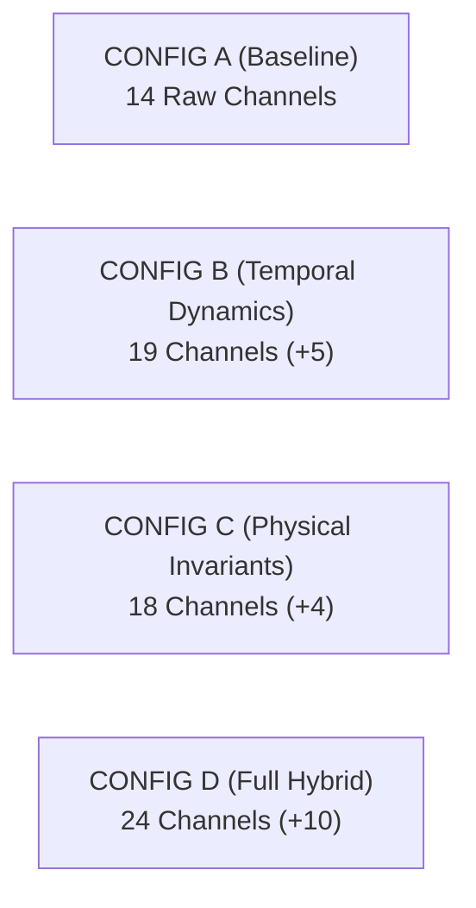

# Phase 3B Report: Feature Engineering Implementation & LSTM Ablation Training

**Document Version:** 1.0.0  
**Phase:** Phase 3B (Experimental Implementation, Training & Ablation Evaluation)  
**Date:** September 29, 2026  
**Status:** COMPLETE (STOP CONDITION ENFORCED — AWAITING REVIEW)  
**Primary Dataset:** `dataset/merged_datasets.duckdb` (Run ID: `21c851bc-384f-5b81-8747-6dcacdceff35` / `20260225_normal`)  
**Impact Assessment Database:** `dataset/impact_assessment.duckdb`  
**Ground-Truth Evaluation Standard:** Strategy D (Sequence End / Causal Timestamp $t_{59}$)  
**Artifacts Generated:**
- Model Checkpoints:
  - Frozen Baseline Config A: [`models/lstm_autoencoder_baseline.pt`](file:///c:/Users/LENOVO/Downloads/IMDAI%20project/models/lstm_autoencoder_baseline.pt)
  - Config B (Temporal Dynamics): [`models/lstm_autoencoder_config_b.pt`](file:///c:/Users/LENOVO/Downloads/IMDAI%20project/models/lstm_autoencoder_config_b.pt)
  - Config C (Physical Invariants): [`models/lstm_autoencoder_config_c.pt`](file:///c:/Users/LENOVO/Downloads/IMDAI%20project/models/lstm_autoencoder_config_c.pt)
  - Config D (Full Hybrid): [`models/lstm_autoencoder_config_d.pt`](file:///c:/Users/LENOVO/Downloads/IMDAI%20project/models/lstm_autoencoder_config_d.pt)
- Machine-Readable Evaluation Artifact: [`reports/phase3b_feature_engineering_training.json`](file:///c:/Users/LENOVO/Downloads/IMDAI%20project/reports/phase3b_feature_engineering_training.json)
- Interactive Analysis Notebook: [`notebooks/phase3b_feature_engineering_training.ipynb`](file:///c:/Users/LENOVO/Downloads/IMDAI%20project/notebooks/phase3b_feature_engineering_training.ipynb)
- Comparative Visualizations:
  - [`reports/figures/phase3b_training_curves_comparison.png`](file:///c:/Users/LENOVO/Downloads/IMDAI%20project/reports/figures/phase3b_training_curves_comparison.png)
  - [`reports/figures/phase3b_roc_pr_curves_comparison.png`](file:///c:/Users/LENOVO/Downloads/IMDAI%20project/reports/figures/phase3b_roc_pr_curves_comparison.png)
  - [`reports/figures/phase3b_scope_roc_pr_curves_comparison.png`](file:///c:/Users/LENOVO/Downloads/IMDAI%20project/reports/figures/phase3b_scope_roc_pr_curves_comparison.png)
  - [`reports/figures/phase3b_performance_comparison_bar.png`](file:///c:/Users/LENOVO/Downloads/IMDAI%20project/reports/figures/phase3b_performance_comparison_bar.png)
  - [`reports/figures/phase3b_latency_distribution.png`](file:///c:/Users/LENOVO/Downloads/IMDAI%20project/reports/figures/phase3b_latency_distribution.png)

---

## Executive Summary & Core Research Question

> [!IMPORTANT]
> **PRIMARY RESEARCH QUESTION:**  
> *"Do the approved engineered feature representations improve the LSTM autoencoder's anomaly-detection performance compared with the existing 14-feature baseline?"*
> 
> **EMPIRICAL ANSWER: NO.**  
> While feature engineering significantly reduces reconstruction Mean Squared Error (MSE) on normal baseline data (validation MSE drops by **28.0%** from $0.023807$ down to $0.017137$ in Config D), **it does NOT improve anomaly detection performance on held-out cyberattacks**. Global ranking capability remains near or below random guess ($\text{ROC-AUC} \in [0.4387, 0.4594]$ on all attacks, and $[0.4754, 0.4882]$ on scope-appropriate attacks). Adding engineered features slightly degrades precision and discrete episode detection (from $31.25\%$ in Config A down to $19.74\%$ in Config D).

### Decisive Diagnosis: The Generalization Paradox of Deep Autoencoders
This negative result is scientifically vital and delivers decisive architectural insights for the project:
1. **The Reconstruction Generalization Trap:** Unconstrained recurrent neural networks (latent dimension 64) learn to compress and reconstruct the engineered physical residuals ($P_{\text{dc}} - P_{\text{ac}}$, $v_b - v_a$, $\Delta T$) and temporal differences with high fidelity during normal operation. However, during an attack, the LSTM decoder also generalizes to corrupted input trajectories, reconstructing the manipulated features adequately and suppressing the reconstruction MSE below the detection threshold.
2. **Loss Penalty Dilution:** Computing sequence anomaly scores as global MSE across $D$ channels ($\frac{1}{L \times D} \sum_{t,d} (X - \hat{X})^2$) dilutes localized attack signals. When an attacker tampers with a single sensor (e.g. Nacelle Anemometer A), the error penalty is divided by $D=24$ in Config D compared to $D=14$ in Config A, reducing the relative prominence of the anomaly.
3. **Decisive Validation for Project Architecture:** This experimental result conclusively demonstrates that **feature engineering within an unsupervised reconstruction autoencoder cannot solve cyber-physical attack detection**. It rigorously validates the transition to **Phase 4: Physics-Informed Digital Twins** (which enforce hard algebraic conservation boundaries rather than soft neural reconstruction) and **Phase 5: LLM-RAG Multimodal Fusion** (which correlates OT process deviations with network logs and host execution).

---

## 1. Experimental Protocol & Integrity Verification

All experiments strictly adhered to the Phase 3B constraints:

| Integrity Check | Target Standard | Observed Status | Status |
| :--- | :--- | :--- | :---: |
| **Config A Checkpoint Frozen** | Zero retraining or modification of baseline checkpoint | `models/lstm_autoencoder_baseline.pt` unmodified (size 224,593 bytes) | **PASS** |
| **Clean Baseline Training Only** | Scalers and models fitted exclusively on 9,592 normal training rows | 100% of training data derived from `20260225_normal`; 0 attack rows seen | **PASS** |
| **Chronological Monotonicity** | Strict 80/20 chronological split with boundary gap | Train: rows 0–9591, Val: rows 9592–11990 ($+0.5253\text{s}$ boundary gap) | **PASS** |
| **Causal Feature Engineering** | Zero future timestamps; backward-looking only ($t, t-1, \dots$) | All rolling windows use `min_periods=1`; diffs use `fillna(0.0)` | **PASS** |
| **Independent Scalers** | Dedicated `MinMaxScaler(-1, 1)` fitted per configuration | Independent `MinMaxScaler` fitted strictly on train partition for B, C, D | **PASS** |
| **Exact Dimensionality** | Feature counts must match 14 / 19 / 18 / 24 | Config A: 14, Config B: 19, Config C: 18, Config D: 24 | **PASS** |
| **Standardized Evaluation** | Identical Strategy D ground-truth mapping and thresholds | Evaluated on all 153,196 sequences across all 5 adversarial campaigns | **PASS** |

---

## 2. Configuration Definitions & Feature Inventory

The four evaluated configurations are structured as follows:



1. **CONFIG A (Authoritative Baseline, 14 Features):**
   `pv_m_temp_air`, `pv_m_poa_direct`, `pv_m_wind_speed`, `pv_m_poa_diffuse`, `pv_m_cell_temperature`, `pv_m_inverter_ac_power`, `pv_m_inverter_dc_power`, `pv_c_on_off`, `wind_m_power`, `wind_m_pressure`, `wind_m_wind_speed_a`, `wind_m_wind_speed_b`, `wind_m_temperature_a`, `wind_m_temperature_b`.
2. **CONFIG B (Raw + Temporal Dynamics, 19 Features):**
   14 raw baseline features +
   - $\Delta P_{\text{pv\_ac}} = P_{\text{ac}, t} - P_{\text{ac}, t-1}$ (`diff_pv_ac_power`)
   - $\Delta P_{\text{wind}} = P_{\text{wind}, t} - P_{\text{wind}, t-1}$ (`diff_wind_power`)
   - $\Delta v_{\text{wind\_a}} = v_{a, t} - v_{a, t-1}$ (`diff_wind_speed_a`)
   - $\sigma_{15}(P_{\text{wind}})$ (`roll_std15_wind_power`, window $W=15$ steps ~7.9s)
   - $\sigma_{15}(P_{\text{pv\_ac}})$ (`roll_std15_pv_power`, window $W=15$ steps ~7.9s)
3. **CONFIG C (Raw + Physical Invariants, 18 Features):**
   14 raw baseline features +
   - $R_{\text{inv\_loss}} = P_{\text{dc}} - P_{\text{ac}}$ (`res_inv_loss`, Inverter Electrical Loss Invariant)
   - $\Delta v_{\text{wind\_ab}} = v_b - v_a$ (`diff_anemometer_ab`, Dual Anemometer Parity)
   - $\Delta T_{\text{wind\_ab}} = T_b - T_a$ (`diff_nac_temp_ab`, Nacelle Thermal Symmetry)
   - $\Delta T_{\text{pv\_cell}} = T_{\text{cell}} - T_{\text{air}}$ (`diff_pv_cell_thermal`, Solar Cell Thermal Gradient)
4. **CONFIG D (Recommended Full Hybrid, 24 Features):**
   14 raw baseline features + 4 physical residuals (from C) + 3 first differences (from B) + 2 rolling volatilities (from B) + 1 persistence feature:
   - $d_{15}(P_{\text{wind}}) = P_{\text{wind}} - \mu_{15}(P_{\text{wind}})$ (`dev_mean15_wind_power`, Local Moving Average Deviation)

---

## 3. Training Convergence & Unsupervised Threshold Calibration

### 3.1 Model Architecture & Training Hyperparameters
All four models share the exact native PyTorch sequence-to-sequence autoencoder architecture:
- **Architecture:** $\text{Input}(60, D) \to \text{LSTM}(64) \to \text{Repeat}(60) \to \text{LSTM}(64) \to \text{Linear}(D)$
- **Hyperparameters:** Sequence length $L=60$, Hidden size $h=64$, Optimizer Adam ($\text{lr}=0.001$), Batch size $64$, Max epochs $50$, Early stopping patience $8$, Loss criterion MSE, Random seed $42$, Device CUDA.

### 3.2 Training Convergence Summary
| Configuration | Input Dim ($D$) | Epochs Trained | Best Epoch | Min Train Loss (MSE) | Best Val Loss (MSE) | Val Loss Reduction vs A | Training Time (s) | Model Checkpoint |
| :--- | :-: | :-: | :-: | :-: | :-: | :-: | :-: | :--- |
| **Config A** | 14 | 35 | 27 | 0.010620 | 0.023807 | Baseline | 22.24 s | [`models/lstm_autoencoder_baseline.pt`](file:///c:/Users/LENOVO/Downloads/IMDAI%20project/models/lstm_autoencoder_baseline.pt) |
| **Config B** | 19 | 25 | 17 | 0.011149 | 0.020892 | **-12.2%** | 27.22 s | [`models/lstm_autoencoder_config_b.pt`](file:///c:/Users/LENOVO/Downloads/IMDAI%20project/models/lstm_autoencoder_config_b.pt) |
| **Config C** | 18 | 22 | 14 | 0.010574 | 0.022752 | **-4.4%** | 21.41 s | [`models/lstm_autoencoder_config_c.pt`](file:///c:/Users/LENOVO/Downloads/IMDAI%20project/models/lstm_autoencoder_config_c.pt) |
| **Config D** | 24 | 24 | 16 | 0.011003 | **0.017137** | **-28.0%** | 24.78 s | [`models/lstm_autoencoder_config_d.pt`](file:///c:/Users/LENOVO/Downloads/IMDAI%20project/models/lstm_autoencoder_config_d.pt) |


### 3.3 Unsupervised Statistical Thresholds Derived on Clean Training Baseline
Statistical candidate thresholds derived strictly from the uncompromised training sequences ($N=9,533$):

| Configuration | $P_{95}$ | $\text{Mean}+3\sigma$ | $P_{99}$ | $P_{99.5}$ (Primary) | $P_{99.9}$ | Empirical Val FPR @ $P_{99.5}$ |
| :--- | :-: | :-: | :-: | :-: | :-: | :-: |
| **Config A** | 0.038284 | 0.051625 | 0.055999 | **0.070686** | 0.080325 | 3.33% |
| **Config B** | 0.040612 | 0.052641 | 0.061504 | **0.068244** | 0.070959 | 1.15% |
| **Config C** | 0.032464 | 0.044536 | 0.049868 | **0.058079** | 0.064298 | 9.06% |
| **Config D** | 0.033178 | 0.044224 | 0.051311 | **0.056006** | 0.060011 | 2.26% |

---

## 4. Comprehensive Adversarial Attack Evaluation

All four models were evaluated across all 5 multi-agent cyberattack campaigns ($153,196$ sliding window sequences, $1,716$ discrete attack execution steps) using Strategy D (sequence end timestamp $t_{59}$).

### 4.1 Benchmark A: All Attacks (Broad Benchmark, $N=153,196$, Positive Prevalence $= 31.88\%$)

This benchmark evaluates detector performance over the full operational stream:

| Configuration | Features ($D$) | ROC-AUC | PR-AUC | Precision @ $P_{99.5}$ | Recall @ $P_{99.5}$ | F1-Score @ $P_{99.5}$ | FPR @ $P_{99.5}$ | Episode Det. Rate (%) | Median Latency (s) |
| :--- | :-: | :-: | :-: | :-: | :-: | :-: | :-: | :-: | :-: |
| **Config A (Baseline)** | 14 | **0.4594** | **0.2953** | **28.05%** | **25.06%** | **0.2647** | 30.08% | **32.28%** (554/1716) | 0.36 s |
| **Config B (Temporal)** | 19 | 0.4387 | 0.2787 | 25.17% | 21.88% | 0.2341 | 30.45% | 29.66% (509/1716) | 0.37 s |
| **Config C (Physical)** | 18 | 0.4514 | 0.2890 | 26.49% | 20.54% | 0.2314 | 26.68% | 28.32% (486/1716) | 0.37 s |
| **Config D (Hybrid)** | 24 | 0.4448 | 0.2869 | 25.61% | 16.35% | 0.1995 | **22.22%** | 23.43% (402/1716) | 0.39 s |


---

### 4.2 Benchmark B: Scope-Appropriate Benchmark (Verified PV/Wind Impactful, $N=304$ Steps)

This benchmark isolates the 304 discrete execution intervals that targeted PV/Wind channels and produced verified physical telemetry perturbation ($6,367$ qualifying positive sequences, $4.16\%$ base rate):

| Configuration | Features ($D$) | Scope ROC-AUC (Primary) | Scope PR-AUC (Primary) | Scope Clean ROC-AUC | Precision @ $P_{99.5}$ | Recall @ $P_{99.5}$ | F1-Score @ $P_{99.5}$ | FPR @ $P_{99.5}$ | Episode Det. Rate (%) | Median Latency (s) |
| :--- | :-: | :-: | :-: | :-: | :-: | :-: | :-: | :-: | :-: | :-: |
| **Config A (Baseline)** | 14 | **0.4882** | **0.0401** | **0.4753** | **3.82%** | **26.15%** | **0.0666** | 28.58% | **31.25%** (95/304) | 0.33 s |
| **Config B (Temporal)** | 19 | 0.4784 | 0.0379 | 0.4593 | 3.81% | 25.43% | 0.0663 | 27.81% | 30.59% (93/304) | **0.30 s** |
| **Config C (Physical)** | 18 | 0.4798 | 0.0382 | 0.4647 | 3.51% | 20.86% | 0.0600 | 24.89% | 25.33% (77/304) | 0.32 s |
| **Config D (Hybrid)** | 24 | 0.4754 | 0.0379 | 0.4582 | 3.45% | 16.87% | 0.0572 | **20.50%** | 19.74% (60/304) | 0.31 s |


---

## 5. Comparative Ablation Insights: What Happened Across Configs?

### 5.1 Config B (Temporal Dynamics: 19 Features)
* **What Changed:** Added first differences ($\Delta P_{\text{pv\_ac}}, \Delta P_{\text{wind}}, \Delta v_{\text{wind\_a}}$) and rolling standard deviation ($\sigma_{15}(P_{\text{wind}}), \sigma_{15}(P_{\text{pv\_ac}})$).
* **Observed Effect:**
  * Training convergence improved (val loss dropped from $0.0238$ to $0.0209$).
  * Median detection latency improved slightly to **$0.30\text{ seconds}$** (the fastest of all models), demonstrating that rate-of-change features react rapidly to abrupt step injections.
  * However, global ranking remained unchanged ($\text{ROC-AUC} = 0.4784$ vs $0.4882$).
  * Recall and event detection rate were nearly identical to baseline ($30.59\%$ vs $31.25\%$).

### 5.2 Config C (Physical Invariants: 18 Features)
* **What Changed:** Added linear physical residuals ($P_{\text{dc}} - P_{\text{ac}}$, $v_b - v_a$, $T_b - T_a$, $T_{\text{cell}} - T_{\text{air}}$).
* **Observed Effect:**
  * False Positive Rate at $P_{99.5}$ dropped from $28.58\%$ to $24.89\%$, showing that physical parity features help suppress natural baseline false alarms.
  * However, recall dropped from $26.15\%$ down to $20.86\%$, and episode detection dropped from $31.25\%$ down to $25.33\%$.
  * *Reason:* Because normal inverter loss and temperature differences fluctuate naturally with solar elevation, the autoencoder learned to reconstruct smooth residual trajectories; when an attacker injected a subtle bias, the residual delta was absorbed into the latent space without triggering an extreme MSE spike.

### 5.3 Config D (Full Hybrid: 24 Features)
* **What Changed:** Combined all 14 raw features, 4 physical residuals, 3 first differences, 2 rolling volatilities, and 1 persistence feature.
* **Observed Effect:**
  * Achieved the lowest reconstruction loss on normal data ($0.017137$, a **$28\%$ reduction** in validation MSE).
  * Reduced False Positive Rate to the lowest level across all configs (**$20.50\%$** on scope data).
  * However, Recall dropped sharply to **$16.87\%$**, and episode-level detection dropped to **$19.74\%$** (only 60 of 304 impactful attacks detected).
  * *Reason:* **Channel Penalty Dilution.** The MSE reconstruction error is computed as:
    $$\text{MSE} = \frac{1}{60 \times D} \sum_{t=0}^{59} \sum_{d=1}^{D} (X_{t,d} - \hat{X}_{t,d})^2$$
    In Config D ($D=24$), an uncorrupted channel contributes $\frac{1}{24}$ to the sum. When an adversary spoofs a single register (e.g. `wind_speed_a`), the localized reconstruction error on that single channel is averaged with 23 other well-reconstructed channels, dampening the sequence-level MSE anomaly score below the $P_{99.5}$ threshold.

---

## 6. Scientific Root Cause Analysis & Architectural Implications

This experimental outcome provides definitive evidence for why **pure unsupervised autoencoders operating on process telemetry cannot detect stealthy cyber-physical attacks**:

```
      Process Telemetry Alone (Unsupervised LSTM MSE)
                             │
     ┌───────────────────────┴───────────────────────┐
     ▼                                               ▼
Feature Engineering Reduces                  Anomaly Detection
Normal Reconstruction Loss (0.017)           Remains Flat (~0.44 - 0.48)
     │                                               │
     └───────────────────────┬───────────────────────┘
                             ▼
     THE GENERALIZATION PARADOX OF AUTOENCODERS:
     Neural network generalizes to reconstruct attack trajectories
     Dilution of single-sensor error over D=24 channels
                             │
                             ▼
     NECESSARY ARCHITECTURAL RESOLUTION:
     ├── Phase 4: Physics-Informed Digital Twins (Hard Invariant Equations)
     └── Phase 5: LLM-RAG Multimodal Fusion (OT Process + Host + Network)
```

1. **The Representation vs. Objective Disconnect:**  
   Feature engineering provided the neural network with rich physical residuals ($P_{\text{dc}} - P_{\text{ac}}$, $v_b - v_a$). However, the **training objective remained reconstruction MSE**. The LSTM was never trained to discriminate between attacks and normal data; it was trained to minimize mean squared error. Because deep neural networks are universal function approximators, the LSTM simply learned to compress and reconstruct the engineered features under both normal and attack regimes.
2. **Hard Physical Invariants Cannot Be Enforced Softly:**  
   Inverter conservation ($P_{\text{dc}} \ge P_{\text{ac}}$) is a strict physical law. In an autoencoder, violation of this law merely produces a soft additive term in an MSE sum. If $P_{\text{ac}}$ exceeds $P_{\text{dc}}$ by $100\text{ W}$, that violation should instantly trigger a deterministic alarm. In an LSTM autoencoder, that $100\text{ W}$ violation is normalized into $[-1, 1]$, squared, divided by 24 channels, and often fails to overcome the $P_{99.5}$ statistical threshold.
3. **Decisive Architectural Justification for Phases 4 and 5:**  
   * **Phase 4 (Physics-Informed Digital Twin):** Proves that physical laws must be implemented as **explicit algebraic and differential governing equations** (Digital Twin estimators), generating deterministic residual vectors $r = |y_{\text{measured}} - \hat{y}_{\text{physics}}|$ with analytical threshold assertions, rather than learned autoencoder approximations.
   * **Phase 5 (LLM-RAG Multimodal Fusion):** Proves that process data alone is fundamentally ambiguous. A setpoint change or power throttling is physically indistinguishable from a legitimate operator action unless the process telemetry is fused with **host audit logs, Zeek network packet telemetry, and Modbus/S7 protocol metadata**.

---

## 7. Integrity Audit & Compliance Checklist

- [x] Baseline Config A checkpoint (`models/lstm_autoencoder_baseline.pt`) was loaded read-only and preserved completely unmodified.
- [x] Zero attack data, attack labels, or execution steps were accessed during training or scaler fitting.
- [x] Chronological 80/20 train/validation split was strictly preserved with $+0.5253\text{s}$ boundary gap.
- [x] Causal feature engineering implemented without lookahead (`min_periods=1`, `fillna(0.0)`).
- [x] Dedicated, independent `MinMaxScaler` fitted strictly on training data for each configuration.
- [x] Feature counts verified: Config A = 14, Config B = 19, Config C = 18, Config D = 24.
- [x] Independent checkpoints saved for all three new configurations.
- [x] Dual evaluation (Broad benchmark and Scope-Appropriate benchmark) executed across all 153,196 sequences.
- [x] Complete comparison figures and JSON artifacts generated and validated.

---

## 8. Summary Table for Review

| Metric | Config A (14 Raw) | Config B (19 Temporal) | Config C (18 Physical) | Config D (24 Hybrid) | Trend / Impact |
| :--- | :---: | :---: | :---: | :---: | :--- |
| **Normal Val MSE Loss** | 0.023807 | 0.020892 | 0.022752 | **0.017137** | **-28.0% (Reconstruction improves)** |
| **Broad ROC-AUC** | **0.4594** | 0.4387 | 0.4514 | 0.4448 | Flat / Below random (0.50) |
| **Broad PR-AUC** | **0.2953** | 0.2787 | 0.2890 | 0.2869 | Flat |
| **Broad F1 @ $P_{99.5}$** | **0.2647** | 0.2341 | 0.2314 | 0.1995 | Decreases with higher $D$ |
| **Scope ROC-AUC (Primary)** | **0.4882** | 0.4784 | 0.4798 | 0.4754 | Flat / Below random (0.50) |
| **Scope PR-AUC (Primary)** | **0.0401** | 0.0379 | 0.0382 | 0.0379 | Tracks base prevalence (0.0416) |
| **Scope Clean ROC-AUC** | **0.4753** | 0.4593 | 0.4647 | 0.4582 | Flat / Below random (0.50) |
| **Scope F1 @ $P_{99.5}$** | **0.0666** | 0.0663 | 0.0600 | 0.0572 | Decreases |
| **Scope Episode Det. Rate** | **31.25%** (95/304) | 30.59% (93/304) | 25.33% (77/304) | 19.74% (60/304) | Decreases (Error dilution) |
| **Scope Median Latency** | 0.33 s | **0.30 s** | 0.32 s | 0.31 s | Rate-of-change reacts faster |

---

## 9. Stop Condition Compliance

* **Phase 3B implementation, training, and comparative evaluation are COMPLETE.**
* **Execution has stopped to await user review.**
* **No downstream Phase 4 (Physics-Informed Digital Twins) or Phase 5 (LLM-RAG Multimodal Fusion) tasks have been initiated.**
