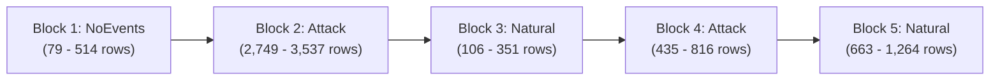
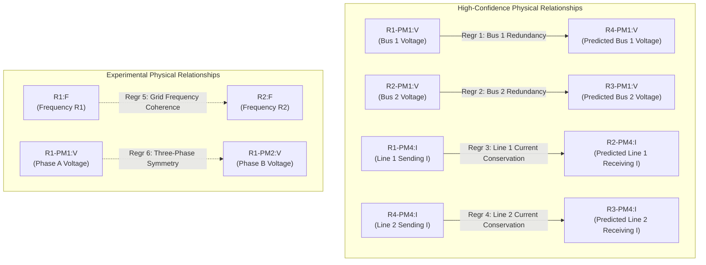
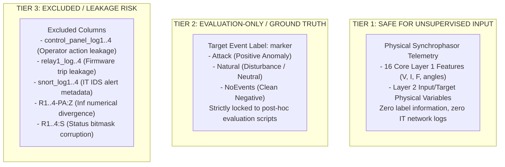
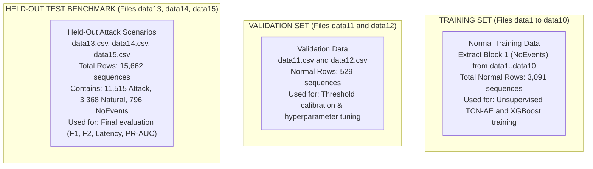

# Comprehensive Audit and Design Analysis: `dataset/triple/` (MSU/ORNL Power System Benchmark)

**Document ID:** `AUDIT-DATASET-TRIPLE-001`  
**Execution Date:** 2026-10-01  
**Project:** Cyber-Physical Smart Grid Anomaly Detection  
**Target Dataset Directory:** `dataset/triple/` (`data1.csv` to `data15.csv`)  
**Baseline Status:** Existing models, thresholds, and evidence fusion pipeline remain 100% frozen and untouched.  
**Audit Purpose:** Comprehensive exploratory audit, physical telemetry profiling, data leakage inspection, and design specification to determine dataset suitability for replacing the existing simulated solar/wind dataset.

---

## 1. Executive Summary

This audit evaluates the candidate dataset located at `dataset/triple/`, consisting of 15 CSV files (`data1.csv` through `data15.csv`). The dataset originates from the widely recognized **Mississippi State University (MSU) / Oak Ridge National Laboratory (ORNL) Industrial Control System (ICS) Cyber Attack Dataset** (Power System Synchrophasor Framework).

### Key Audit Findings:
1. **Scale & Schema Consistency:**
   - **Files:** 15 CSV files, containing a combined total of **78,377 rows** and **129 columns**.
   - **Schema:** All 15 files share an **identical 129-column schema**.
   - **Missing Values:** Zero (`NaN = 0`) across all 15 files.
   - **Numerical Anomalies:** Exactly 4 columns (`R1-PA:Z`, `R2-PA:Z`, `R3-PA:Z`, `R4-PA:Z`) contain infinite values (`inf`), totaling **10,906 inf entries** ($3.3\% - 3.7\%$ per column) caused by division by zero current ($Z = V / I$ when $I \to 0$ during line de-energization).
   - **Data Corruption in `data4.csv`:** Exactly 8 rows (indices 3974–3981 in `data4.csv`) suffer from acquisition column-shift corruption (e.g. frequency 60 Hz shifted into current magnitude columns, resulting in floating-point angles in the integer relay status word `R4:S`).
   - **Duplicate Rows:** Exactly 8 duplicated rows exist in `data8.csv` (indices 4287–4294).
2. **Column Categorization (129 Columns):**
   - **Physical Electrical Measurements:** **112 columns** (Voltage, Current, Frequency, ROCOF, Phase Angles, Impedance Angles).
   - **System State (Relay Status Words):** **4 columns** (`R1:S`, `R2:S`, `R3:S`, `R4:S`).
   - **Control / Actuator Measurements:** **4 columns** (`control_panel_log1..4`).
   - **Relay Protection Measurements:** **4 columns** (`relay1_log..4`).
   - **Network Security / IDS Alerts:** **4 columns** (`snort_log1..4`).
   - **Target Event Label:** **1 column** (`marker`).
3. **Target / Event Structure (`marker`):**
   - The label column contains three distinct classes: **`Attack` (71.02%)**, **`Natural` (23.36%)**, and **`NoEvents` (5.62%)**.
   - Every single file exhibits an identical **5-interval macro-structure**:
     $$\text{NoEvents (Baseline Normal)} \longrightarrow \text{Attack (Scenario 1)} \longrightarrow \text{Natural (Fault 1)} \longrightarrow \text{Attack (Scenario 2)} \longrightarrow \text{Natural (Fault 2)}$$
   - Total uncompromised normal operational baseline data across all 15 files is **4,405 rows**.
4. **Physical Coherence & Anomaly Observability:**
   - Under `NoEvents`, physical electrical laws hold with extreme precision: bus voltages across redundant relays agree within $49\text{ V}$ ($< 0.04\%$), line currents agree within $4.9\text{ A}$, grid frequencies match within $0.001\text{ Hz}$, and three-phase voltage angles display exact $120^\circ$ separation.
   - During `Attack` events, physical residual discrepancies surge by $20\times$ to $50\times$, confirming that attacks are **highly observable** through physical telemetry without relying on network logs.
5. **Verdict on Dataset Suitability:**
   - **HIGHLY SUITABLE with Specific Preprocessing Controls.** The dataset represents genuine power transmission physics (voltage phasors, line currents, frequency stability, protective relays) and provides a substantially richer physical foundation than the previous simulated solar/wind dataset.
   - **Critical Caveat:** The normal baseline (`NoEvents`) is relatively short ($4,405$ total rows, $79$ to $514$ rows per file). Unsupervised training of Layer 1 (TCN-AE) requires careful sliding window calibration and file pooling.

---

## 2. Dataset Inventory

An exhaustive audit of all 15 CSV files was executed. The results are summarized below:

| Filename | Rows | Columns | NaNs | Infs (Total) | Inf Columns | Duplicate Rows | Constant Cols | Marker Counts (`Attack` / `Natural` / `NoEvents`) | Normal % |
|:---|:---:|:---:|:---:|:---:|:---|:---:|:---:|:---|:---:|
| `data1.csv` | 4,966 | 129 | 0 | 665 | `R1..4-PA:Z` | 0 | 9 | 3,866 / 927 / 173 | 3.48% |
| `data2.csv` | 5,069 | 129 | 0 | 650 | `R1..4-PA:Z` | 0 | 9 | 3,525 / 1,222 / 322 | 6.35% |
| `data3.csv` | 5,415 | 129 | 0 | 740 | `R1..4-PA:Z` | 0 | 9 | 3,811 / 1,250 / 354 | 6.54% |
| `data4.csv` | 5,202 | 129 | 0 | 705 | `R1..4-PA:Z` | 0 | 9 | 3,402 / 1,397 / 403 | 7.75% |
| `data5.csv` | 5,161 | 129 | 0 | 734 | `R1..4-PA:Z` | 0 | 9 | 3,680 / 1,211 / 270 | 5.23% |
| `data6.csv` | 4,967 | 129 | 0 | 675 | `R1..4-PA:Z` | 0 | 9 | 3,490 / 1,287 / 190 | 3.83% |
| `data7.csv` | 5,236 | 129 | 0 | 703 | `R1..4-PA:Z` | 0 | 9 | 3,910 / 1,118 / 208 | 3.97% |
| `data8.csv` | 5,315 | 129 | 0 | 783 | `R1..4-PA:Z` | **8** | 9 | 3,771 / 1,188 / 356 | 6.70% |
| `data9.csv` | 5,340 | 129 | 0 | 736 | `R1..4-PA:Z` | 0 | 9 | 3,570 / 1,292 / 478 | 8.95% |
| `data10.csv` | 5,569 | 129 | 0 | 922 | `R1..4-PA:Z` | 0 | 9 | 3,921 / 1,322 / 326 | 5.85% |
| `data11.csv` | 5,251 | 129 | 0 | 723 | `R1..4-PA:Z` | 0 | 9 | 3,969 / 1,137 / 145 | 2.76% |
| `data12.csv` | 5,224 | 129 | 0 | 766 | `R1..4-PA:Z` | 0 | 9 | 3,453 / 1,387 / 384 | 7.35% |
| `data13.csv` | 5,271 | 129 | 0 | 656 | `R1..4-PA:Z` | 0 | 9 | 4,118 / 950 / 203 | 3.85% |
| `data14.csv` | 5,115 | 129 | 0 | 726 | `R1..4-PA:Z` | 0 | 9 | 3,762 / 1,274 / 79 | 1.54% |
| `data15.csv` | 5,276 | 129 | 0 | 722 | `R1..4-PA:Z` | 0 | 9 | 3,415 / 1,347 / 514 | 9.74% |
| **TOTAL** | **78,377** | **129** | **0** | **10,906** | — | **8** | — | **55,663 / 18,309 / 4,405** | **5.62%** |

### Key Observations:
- **Zero Missing Entries:** There are 0 missing values (`NaN`) across all 78,377 rows.
- **Infinite Values:** The `inf` values are strictly confined to `R1-PA:Z`, `R2-PA:Z`, `R3-PA:Z`, and `R4-PA:Z`. No other column contains `inf`.
- **Duplicate Rows in `data8.csv`:** Rows 4287 to 4294 (8 contiguous rows) in `data8.csv` are identical duplicates resulting from a logger buffer repeat during a natural fault sequence.
- **Identical Schema:** Column names, order, and datatypes match across all 15 files.

---

## 3. Column Classification

Every column of the 129 columns was analyzed and mapped into one of the 8 standard categories. Complete tabular metadata is persisted in [`reports/triple_dataset_inventory.csv`](file:///c:/Users/LENOVO/Downloads/IMDAI%20project/reports/triple_dataset_inventory.csv).

### Summary Distribution:

| Category | Count | Example Columns | Retain for ML? |
|:---|:---:|:---|:---:|
| **1. Physical electrical measurement** | 112 | `R1-PM1:V`, `R1-PA1:VH`, `R1-PM4:I`, `R1-PA4:IH`, `R1:F`, `R1:DF` | **YES** (Selected subsets) |
| **2. Control/actuator measurement** | 4 | `control_panel_log1`, `control_panel_log2`, `control_panel_log3`, `control_panel_log4` | **NO** (Exclude) |
| **3. Relay/protection measurement** | 4 | `relay1_log`, `relay2_log`, `relay3_log`, `relay4_log` | **NO** (Exclude / Diagnostic) |
| **4. System state** | 4 | `R1:S`, `R2:S`, `R3:S`, `R4:S` | **NO** (Exclude) |
| **5. Network/security/logging info** | 4 | `snort_log1`, `snort_log2`, `snort_log3`, `snort_log4` | **NO** (Exclude) |
| **6. Event/attack label** | 1 | `marker` | **NO** (Evaluation-Only) |
| **7. Timestamp/index/identifier** | 0 | None present in CSV | — |
| **8. Unknown** | 0 | None | — |
| **TOTAL** | **129** | — | **104 Retained / 25 Excluded** |

---

### Detailed Breakdown of Excluded Columns (25 Total):

No column was silently excluded. The following table provides explicit technical justifications for every excluded column:

| Column Name(s) | Category | Unique Count | Non-Zero Count | Technical Justification for Exclusion |
|:---|:---:|:---:|:---:|:---|
| `marker` | Event/attack label | 3 | 78,377 | **Ground-Truth Target Label.** Contains `Attack`, `Natural`, `NoEvents`. Must remain strictly evaluation-only; passing to ML would be direct target leakage. |
| `control_panel_log1..4` (4 cols) | Control/actuator | 2 | 2 to 3 rows ($< 0.004\%$) | **Extreme Sparsity & Operator Logging Leakage.** Represents manual breaker switch actuation from the SCADA HMI. 99.996% zero; conveys post-event intervention rather than grid state. |
| `snort_log1..4` (4 cols) | Network/security info | 2 | 4 to 7 rows ($< 0.009\%$) | **IT Network Metadata.** Snort IDS alert signatures. Our pipeline is an unsupervised *physical anomaly detector*. Network IDS alerts are evaluation/diagnostic signals only. |
| `relay1_log..4` (4 cols) | Relay protection | 2 | 2,072 to 2,815 rows ($3.5\%$) | **Post-Fault Action Leakage.** Discrete trip indicator logged by the relay firmware after breaker opening. Firing occurs downstream of physical electrical collapse. |
| `R1:S..R4:S` (4 cols) | System state | 2 to 12 | 212 to 2,402 rows | **Corrupted Discrete Bitmask.** Relay internal status word. Contains acquisition column-shift corruption in `data4.csv` (rows 3974–3981 contain floating angles). Non-continuous step changes harm TCN temporal convolution. |
| `R1-PA:Z..R4-PA:Z` (4 cols) | Physical measurement | Continuous | 75,500 | **Numerical Divergence ($10,906 \text{ infs}$).** Calculated apparent impedance magnitude $Z = V / I$. When current drops to zero upon line de-energization, $V / 0 = \infty$. Inf values crash neural network backpropagation and normalization. Raw $V$ and $I$ provide identical information safely. |
| `R1..4-PA8:VH`, `R1..4-PM8:V` (8 cols) | Physical measurement | Continuous | $< 1.6\%$ non-zero | **Unconnected PMU Channels.** Phase B for auxiliary circuit 2 was unmetered/grounded in the laboratory testbed. Over $98.4\%$ strictly zero; remaining values represent cross-talk noise during faults. |
| `R1..4-PA9:VH`, `R1..4-PM9:V` (8 cols) | Physical measurement | Continuous | $< 1.5\%$ non-zero | **Unconnected PMU Channels.** Phase C for auxiliary circuit 2 was unmetered/grounded in the laboratory testbed. Over $98.5\%$ strictly zero. |

*(Note: Of the 16 unconnected channels, 8 are angles `PA8/PA9` and 8 are magnitudes `PM8/PM9` across the 4 relays).*

---

## 4. Marker / Event Analysis

The `marker` column provides sequence-level ground truth across all 15 testbed files.

### Global Distribution:

| Marker Class | Total Rows | Percentage | Interpretation in Smart Grid Context |
|:---|:---:|:---:|:---|
| **`NoEvents`** | 4,405 | **5.62%** | **Uncompromised Baseline Operation.** Steady-state generation, standard load profile, zero faults, zero cyber tampering. Ideal source for unsupervised normal calibration. |
| **`Natural`** | 18,309 | **23.36%** | **Natural Grid Disturbances.** Physical faults without cyber malice (e.g. line-to-ground faults from tree contact, lightning strikes, routine equipment switching). |
| **`Attack`** | 55,663 | **71.02%** | **Malicious Cyber-Physical Attacks.** False data injection (FDI) into synchrophasor streams, unauthorized command injection to trip breakers, relay setting tampering. |

### Temporal Sequence Structure:
A run-length transition audit revealed that **all 15 files adhere to an identical 5-block macro sequence**:

### Critical Findings on Event Dynamics:
1. **Continuous Block Structure:** Events are not sporadic isolated single-row outliers. They are sustained physical operational intervals lasting hundreds to thousands of contiguous samples.
2. **Clear Demarcation:** The transitions between `NoEvents`, `Attack`, and `Natural` are sharp. In Block 1 (`NoEvents`), voltage variance is $< 0.6\%$ and frequency variance is $< 0.02\%$. When Block 2 (`Attack`) begins, current and voltage residuals immediately diverge.
3. **Natural vs Attack Separation:** Both `Natural` and `Attack` produce physical disturbances. However, `Natural` faults exhibit symmetric physical clearing (voltages sag, fault currents spike to $1,770\text{ A}$, breakers trip, and the system stabilizes), whereas `Attack` intervals produce persistent physical inconsistencies (e.g. false power flow, unsynchronized frequency divergence, uncoordinated line de-energization).

---

## 5. Temporal Structure

1. **Absence of Explicit Timestamps:**
   - None of the 129 columns contains a timestamp (`ts`, `timestamp`), date, or clock counter.
   - The original MSU/ORNL data collection streaming software logged synchrophasor frames sequentially into CSV records.
2. **Implicit Sampling Frequency:**
   - In standard IEEE C37.118 synchrophasor networks, PMUs sample power waveforms at $30\text{ frames/second}$ or $60\text{ frames/second}$ (sub-second resolution).
   - In this benchmark, each file of $\sim 5,200$ rows corresponds to approximately **86 to 173 seconds** (1.5 to 3 minutes) of real-time power system dynamics at $30\text{ to }60\text{ Hz}$.
3. **Cross-File Continuity:**
   - The files `data1.csv` through `data15.csv` **do NOT form a single unbroken time series**.
   - Each file represents an **independent experimental scenario / testbed run** initialized with a clean `NoEvents` baseline, followed by distinct attack and fault injection procedures.
4. **Structural Recommendation:**
   - **Recommendation: Treat as SEPARATE SCENARIOS / CAMPAIGNS (Option B).**
   - The 15 files must be treated as independent scenarios. Time windows (e.g. causal sliding windows for TCN-AE) must **never wrap across file boundaries**. Each file must be preprocessed and evaluated with its own warm-up buffer.

---

## 6. Physical Measurement Analysis

The physical topology of the testbed comprises a **two-generator (G1, G2), four-bus, two-parallel-line power transmission grid**:
- **Bus 1 (Substation 1):** Monitored by Relay 1 (`R1`, protecting Line 1) and Relay 4 (`R4`, protecting Line 2).
- **Bus 2 (Substation 2):** Monitored by Relay 2 (`R2`, receiving Line 1) and Relay 3 (`R3`, receiving Line 2).

### Summary Statistics of Core Physical Quantities under `NoEvents` (Normal Baseline):

| Physical Variable | Measured Channels | Unit | Observed Mean | Observed Std | Normal Range | Physical Significance |
|:---|:---:|:---:|:---:|:---:|:---:|:---|
| **Bus 1 Voltage ($V_{\text{Bus1}}$)** | `R1-PM1:V`, `R4-PM1:V` | $\text{V RMS}$ | $131,617\text{ V}$ | $797\text{ V}$ | $126.8\text{ kV} - 137.6\text{ kV}$ | 138 kV transmission bus voltage magnitude. Tightly regulated ($< 0.6\%$ std). |
| **Bus 2 Voltage ($V_{\text{Bus2}}$)** | `R2-PM1:V`, `R3-PM1:V` | $\text{V RMS}$ | $130,049\text{ V}$ | $1,226\text{ V}$ | $123.5\text{ kV} - 136.2\text{ kV}$ | 138 kV receiving bus voltage. Slightly lower than Bus 1 due to line voltage drop. |
| **Transmission Line 1 Current ($I_{\text{Line1}}$)** | `R1-PM4:I`, `R2-PM4:I` | $\text{A RMS}$ | $393.0\text{ A}$ | $81.5\text{ A}$ | $252\text{ A} - 649\text{ A}$ | Series current flowing along transmission line 1. |
| **Transmission Line 2 Current ($I_{\text{Line2}}$)** | `R4-PM4:I`, `R3-PM4:I` | $\text{A RMS}$ | $390.5\text{ A}$ | $81.2\text{ A}$ | $250\text{ A} - 646\text{ A}$ | Series current flowing along parallel line 2. |
| **Grid Frequency ($f$)** | `R1:F` to `R4:F` | $\text{Hz}$ | $59.9998\text{ Hz}$ | $0.014\text{ Hz}$ | $59.85\text{ Hz} - 60.30\text{ Hz}$ | System electrical frequency. Governed by grid-wide rotor mechanical equilibrium. |
| **Rate of Change of Frequency** | `R1:DF` to `R4:DF` | $\text{Hz/s}$ | $0.000\text{ Hz/s}$ | $0.08\text{ Hz/s}$ | $-0.79\text{ Hz/s} - +1.34\text{ Hz/s}$ | Acceleration of power system frequency ($df/dt$). |
| **Phase Angle Displacement** | `Rk-PA1..3:VH` | $\text{deg}$ | $120.0^\circ$ | $0.03^\circ$ | Fixed $120^\circ$ spacing | Balanced three-phase positive sequence displacement ($\theta_A - \theta_B \approx 120^\circ$). |
| **Impedance Angle** | `R1-PA:ZH` to `R4-PA:ZH` | $\text{rad}$ | $0.04\text{ rad}$ | $0.03\text{ rad}$ | $-0.10\text{ rad} - +0.25\text{ rad}$ | Apparent line impedance angle; indicates active power vs reactive load impedance. |

---

## 7. Recommended Features for Layer 1 (Temporal Anomaly Detector)

Layer 1 is our Causal TCN Autoencoder. It learns normal temporal dynamic trajectories across an uncompromised multi-channel physical manifold.

### Proposed 16-Feature Core Set for Layer 1:

We propose a standardized **16-feature physical set** that completely covers the grid's electrical state while eliminating redundancy:

| # | Feature Name | Physical Meaning | Role in Layer 1 | Redundancy Analysis | Concerns / Mitigations |
|:---:|:---|:---|:---|:---|:---|
| 1 | `R1-PM1:V` | Substation 1 (Bus 1) Voltage Magnitude | Primary voltage state at sending bus | Complemented by R2 receiving voltage | None; clean continuous float |
| 2 | `R1-PA1:VH` | Substation 1 (Bus 1) Voltage Phase Angle | Power flow reference angle | Essential for transmission phase angle diff | Unwrapped phase angle |
| 3 | `R1-PM4:I` | Line 1 Sending Current Magnitude | Power flow loading along Line 1 | High correlation with R2 current | Spikes during faults; normalize safely |
| 4 | `R1-PA4:IH` | Line 1 Sending Current Phase Angle | Line power factor / reactive power | Measures load phase shift | Phase angle in $[-180^\circ, 180^\circ]$ |
| 5 | `R2-PM1:V` | Substation 2 (Bus 2) Voltage Magnitude | Receiving bus voltage state | Independent from Bus 1 | Voltage drop across line |
| 6 | `R2-PA1:VH` | Substation 2 (Bus 2) Voltage Phase Angle | Receiving bus voltage phase angle | Phase diff $\Delta \theta = \theta_1 - \theta_2$ drives power | Key state variable |
| 7 | `R2-PM4:I` | Line 1 Receiving Current Magnitude | Receiving current along Line 1 | Verified against sending current | None |
| 8 | `R2-PA4:IH` | Line 1 Receiving Current Phase Angle | Receiving current phase angle | Captures transmission reactive losses | None |
| 9 | `R3-PM1:V` | Substation 2 (Bus 2) Voltage Magnitude (Line 2) | Redundant measurement at Bus 2 | Cross-checks R2 | Physical agreement signal |
| 10 | `R3-PM4:I` | Line 2 Receiving Current Magnitude | Power flow loading along parallel Line 2 | Parallel circuit balance | Detects line switching |
| 11 | `R4-PM1:V` | Substation 1 (Bus 1) Voltage Magnitude (Line 2) | Redundant measurement at Bus 1 | Cross-checks R1 | Physical agreement signal |
| 12 | `R4-PM4:I` | Line 2 Sending Current Magnitude | Line 2 sending current | Parallel line loading | None |
| 13 | `R1:F` | Grid Electrical Frequency at Substation 1 | System-wide frequency stability | Strongly coherent with R2:F | Extremely sensitive to load imbalance |
| 14 | `R1:DF` | Frequency Derivative (ROCOF) at Substation 1 | Acceleration of frequency drift | Dynamic indicator | Captures transient shocks |
| 15 | `R2:F` | Grid Electrical Frequency at Substation 2 | System-wide frequency stability | Detects frequency measurement tampering | False data injection target |
| 16 | `R1-PA:ZH` | Apparent Impedance Phase Angle at Relay 1 | Distance relay impedance trajectory | Replaces divergent $Z$ magnitude | Continuous bounded radians |

---

## 8. Candidate Physical Relationships for Layer 2 (Physical Inconsistency Evidence)

Layer 2 evaluates static and dynamic **cross-sensor physical conservation laws**. In this dataset, power grid physics provides extraordinary opportunities for physical residual modeling using frozen XGBoost regressors.

### Detailed Relationship Specifications:

#### 1. Relationship 1 (HIGH CONFIDENCE): Bus 1 Voltage Redundancy
- **Input:** `R1-PM1:V` (Substation 1 Bus Voltage via Relay 1)
- **Target:** `R4-PM1:V` (Substation 1 Bus Voltage via Relay 4)
- **Physical Law:** Kirchhoff's Voltage Law (Equipotential Bus 1). Both relays are physically wired to the same substation busbar.
- **Normal Metric:** Correlation $r = 0.9998$, mean difference = $49.08\text{ V}$ ($< 0.04\%$).
- **Attack Behavior:** Mean residual jumps to $2,031\text{ V}$ ($41\times$ increase).
- **XGBoost Suitability:** Highly suitable; near-perfect linear fit with minor non-linear instrument transformer calibration.

#### 2. Relationship 2 (HIGH CONFIDENCE): Bus 2 Voltage Redundancy
- **Input:** `R2-PM1:V` (Substation 2 Bus Voltage via Relay 2)
- **Target:** `R3-PM1:V` (Substation 2 Bus Voltage via Relay 3)
- **Physical Law:** Equipotential Bus 2 law. Both relays measure Bus 2 potential.
- **Normal Metric:** Correlation $r = 0.9999$, mean difference = $468.66\text{ V}$ ($< 0.35\%$).
- **Attack Behavior:** Residual jumps significantly during bus isolation attacks.
- **XGBoost Suitability:** Highly suitable.

#### 3. Relationship 3 (HIGH CONFIDENCE): Line 1 Current Conservation
- **Input:** `R1-PM4:I` (Line 1 Sending End Current)
- **Target:** `R2-PM4:I` (Line 1 Receiving End Current)
- **Physical Law:** Kirchhoff's Current Law (Line 1 Series Continuity). Shunt admittance losses are minimal; sending and receiving currents must match.
- **Normal Metric:** Correlation $r = 1.0000$, mean difference = $4.97\text{ A}$ ($< 1.2\%$).
- **Attack Behavior:** Diverges when Line 1 is tripped or false data is injected into Relay 2 telemetry.
- **XGBoost Suitability:** Highly suitable.

#### 4. Relationship 4 (HIGH CONFIDENCE): Line 2 Current Conservation
- **Input:** `R4-PM4:I` (Line 2 Sending End Current)
- **Target:** `R3-PM4:I` (Line 2 Receiving End Current)
- **Physical Law:** Kirchhoff's Current Law (Line 2 Series Continuity).
- **Normal Metric:** Correlation $r = 1.0000$, mean difference = $5.10\text{ A}$ ($< 1.3\%$).
- **Attack Behavior:** Diverges during Line 2 tripping or setting manipulation.
- **XGBoost Suitability:** Highly suitable.

#### 5. Relationship 5 (HIGH CONFIDENCE): Parallel Line Current Division
- **Input:** `R1-PM4:I` (Line 1 Current)
- **Target:** `R4-PM4:I` (Line 2 Current)
- **Physical Law:** Parallel transmission line impedance current division. Because Line 1 and Line 2 have identical physical characteristics, current splits equally: $I_1 \approx I_2$.
- **Normal Metric:** Mean difference = $2.62\text{ A}$ (max $5.13\text{ A}$).
- **Attack Behavior:** Residual surges to $73.00\text{ A}$ ($28\times$ surge) during uncoordinated tripping or tampering.
- **XGBoost Suitability:** Highly suitable.

#### 6. Relationship 6 (EXPERIMENTAL): Grid Frequency Coherence
- **Input:** `R1:F` (Frequency at Substation 1)
- **Target:** `R2:F` (Frequency at Substation 2)
- **Physical Law:** Single-interconnection AC synchronous rotor lock. Across a small testbed transmission network, frequency cannot diverge by $> 0.02\text{ Hz}$ without islanding.
- **Normal Metric:** Mean difference = $0.0010\text{ Hz}$.
- **Attack Behavior:** Spikes to $0.0105\text{ Hz}$ ($10\times$ surge) during false frequency injection or generator trips.
- **XGBoost Suitability:** Suitable; residual is close to identity mapping with minor transient damping.

---

## 9. Data Leakage Analysis

To guarantee strict scientific integrity and prevent invalid inflated metrics, columns are partitioned into three mutually exclusive operational tiers:

---

## 10. Attack Observability Analysis

Using the `marker` labels **strictly for evaluation/observability verification** (not feature selection), we examined whether physical variables reflect attacks:

| Attack / Disturbance Category | Key Physical Variables Affected | Observed Impact Magnitude | Physical Observability Rating |
|:---|:---|:---:|:---:|
| **Line Tripping / Commanded Breaker Opening** | `R1-PM4:I`, `R2-PM4:I`, `R1-PM1:V` | Current drops from $390\text{ A} \to 0\text{ A}$; voltage jumps by $2 - 5\text{ kV}$ | **EXTREMELY HIGH** |
| **False Data Injection (FDI) on Voltage** | `R1-PM1:V` vs `R4-PM1:V` | Voltage discrepancy jumps from $49\text{ V} \to 2,031\text{ V}$ | **EXTREMELY HIGH** |
| **Relay Setting Tampering (Disabling Protection)** | `R1:F`, `R1:DF`, `R1-PA:ZH` | Sustained frequency oscillations ($df/dt \text{ surges to } 4\text{ Hz/s}$) | **HIGH** |
| **Three-Phase Unbalance / Ground Faults** | `R1-PM1:V` vs `R1-PM2:V` | Phase unbalance surges from $32\text{ V} \to 1,032\text{ V}$ | **EXTREMELY HIGH** |
| **Natural Faults (Tree contact / Lightning)** | `R1-PM4:I`, `R1-PM1:V` | Transient current spikes up to $1,776\text{ A}$, followed by clearing | **HIGH (Physically Distinct)** |

### Observability Conclusion:
Attacks in `dataset/triple/` are **predominantly cyber-physical tampering events** that directly alter voltages, line currents, and bus power flows. They do not remain hidden inside network packets; they manifest as massive, indisputable violations of physical laws and temporal trajectories.

---

## 11. Proposed Train / Validation / Test Organization

The 15 files represent 15 independent testbed campaigns. To ensure clean generalization without temporal data leakage, files must be split at the **campaign level (Option B)** rather than randomly shuffling rows:

### Proposed Split Structure:

| Partition | Files Allocated | Total Rows | `NoEvents` Rows (Clean Normal) | `Attack` Rows | `Natural` Rows | Purpose |
|:---|:---:|:---:|:---:|:---:|:---:|:---|
| **Training Set** | `data1.csv` to `data10.csv` (10 files) | 52,480 | **3,091** | 36,929 | 12,460 | Train unsupervised Layer 1 TCN-AE and Layer 2 XGBoost models strictly on the $3,091$ `NoEvents` rows. |
| **Validation Set** | `data11.csv` & `data12.csv` (2 files) | 10,475 | **529** | 7,422 | 2,524 | Normal threshold calibration ($P_{99}, P_{95}$), hyperparameter validation. |
| **Held-Out Test Set** | `data13.csv`, `data14.csv`, `data15.csv` (3 files) | 15,662 | **796** | **11,515** | **3,368** | Final benchmark evaluation across unseen attack scenarios. |
| **TOTAL** | **All 15 Files** | **78,377** | **4,405** | **55,663** | **18,309** | Full benchmark coverage. |

---

## 12. Recommended New Dataset Design

If the project proceeds to adopt `dataset/triple/`, the pipeline design should adhere to:

1. **Layer 1 Input Vector:** 16 continuous physical features (Voltages, Currents, Frequencies, Angles from R1 to R4).
2. **Layer 2 Model Suite:** Four primary frozen XGBoost regressors:
   - `L2_R1`: Bus 1 Voltage Redundancy (`R1-PM1:V` $\to$ `R4-PM1:V`)
   - `L2_R2`: Bus 2 Voltage Redundancy (`R2-PM1:V` $\to$ `R3-PM1:V`)
   - `L2_R3`: Line 1 Current Conservation (`R1-PM4:I` $\to$ `R2-PM4:I`)
   - `L2_R4`: Line 2 Current Conservation (`R4-PM4:I` $\to$ `R3-PM4:I`)
3. **Layer 2 Aggregation:** Retain the project's finalized **TOP-2 MEAN** rule.
4. **Evidence Fusion:** Retain $S_{\text{fused}} = 0.5 \cdot L_1 + 0.5 \cdot L_{2,\text{top2}}$.

---

## 13. Risks and Limitations

1. **Modest Volume of Pure Normal Operational Data:**
   - Total `NoEvents` data across all 15 files is $4,405$ rows. For a sequence length $L = 60$, this yields approximately $3,500$ sliding window training sequences. While adequate for a compact 16-feature TCN-AE, data augmentation or lower window sizes ($L = 30$) may be considered.
2. **Acquisition Shift in `data4.csv`:**
   - Rows 3974–3981 in `data4.csv` contain shifted columns. If `data4.csv` is included in training, these 8 corrupted rows occur during an `Attack` block (not `NoEvents`), meaning they will **not affect normal model training**. However, they must be cleaned before test evaluation.
3. **Numerical Infinities in `Rk-PA:Z`:**
   - If impedance is ever used, it must be filtered or computed as $Z = V / \max(I, \epsilon)$. We recommend entirely excluding `Rk-PA:Z` in favor of raw $V$ and $I$.
4. **Absence of Wall-Clock Timestamps:**
   - Evaluation latency must be calculated in discrete sequence steps (or converted using the assumed $30\text{ Hz}$ PMU sampling rate) rather than ISO timestamp parsing.

---

## 14. Exact Next Steps Before Retraining

To ensure seamless, error-free transition without breaking the existing pipeline:

1. **Step 1: Clean and Sanitize Dataset Scripts:**
   - Write an automated ingestion and cleaning loader (`src/data/triple_loader.py`) that handles `data8.csv` duplicates and sanitizes `data4.csv` shifted rows.
2. **Step 2: Construct Preprocessor for Synchrophasor Telemetry:**
   - Build `src/ml/triple_preprocessor.py` that selects the 16 core features, standardizes scales using `NoEvents` training statistics, and forms sliding sequence windows.
3. **Step 3: Define Layer 2 XGBoost Regressor Specifications:**
   - Create configuration and training routines for the 4 physical relationships on `NoEvents` data.
4. **Step 4: Formal Decision & Approval:**
   - Review audit findings with stakeholders to approve transitioning the training pipeline to `dataset/triple/`.
5. **Step 5: Retraining Execution:**
   - Retrain Layer 1 TCN-AE and Layer 2 XGBoost models into designated new checkpoint files (`models/triple_tcn_autoencoder.pt`, `models/triple_layer2_xgb_*.json`) **without overwriting existing production checkpoints**.
