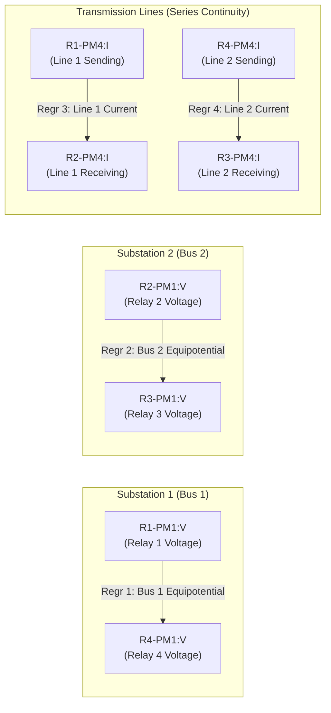

# Triple Layer 2 Physical XGBoost Regressors Training Report

**Document ID:** `REPORT-TRIPLE-LAYER2-001`  
**Execution Date:** 2026-10-01  
**Project:** Cyber-Physical Smart Grid Anomaly Detection  
**Module:** `src/ml/triple_layer2_regressors.py`  
**Model Checkpoints:** `models/triple_layer2_*_xgb.json`  
**Metadata:** [`models/triple_layer2_metadata.json`](file:///c:/Users/LENOVO/Downloads/IMDAI%20project/models/triple_layer2_metadata.json)  
**Status:** Completed & Validated

---

## 1. Overview & Physical Relationships

Layer 2 operates completely independently of Layer 1. It monitors static and cross-sensor **physical electrical conservation laws** using four frozen unsupervised XGBoost regressors. 

Each regressor predicts an expected physical measurement from its physical counterpart; the absolute discrepancy constitutes the **physical inconsistency residual**:

$$e_k = |y_k - \hat{y}_k|$$

### The Four High-Confidence Physical Relationships:

| ID | Relationship Name | Input Feature ($X$) | Target Feature ($y$) | Physical Principle | Engineering Unit |
|:---|:---|:---:|:---:|:---|:---:|
| `bus1_voltage` | Bus 1 Voltage Redundancy | `R1-PM1:V` | `R4-PM1:V` | Kirchhoff's Voltage Law (Equipotential Bus 1 between R1 and R4) | $\text{Volts (V)}$ |
| `bus2_voltage` | Bus 2 Voltage Redundancy | `R2-PM1:V` | `R3-PM1:V` | Equipotential Bus 2 between R2 and R3 | $\text{Volts (V)}$ |
| `line1_current` | Line 1 Current Conservation | `R1-PM4:I` | `R2-PM4:I` | Kirchhoff's Current Law (Transmission Line 1 series continuity) | $\text{Amperes (A)}$ |
| `line2_current` | Line 2 Current Conservation | `R4-PM4:I` | `R3-PM4:I` | Kirchhoff's Current Law (Transmission Line 2 series continuity) | $\text{Amperes (A)}$ |

---

## 2. Unsupervised Training Protocol

- **Training Telemetry:** **3,080 clean normal samples** derived exclusively from `NoEvents` blocks across training scenarios `data1.csv` to `data10.csv`.
- **Zero Attack / Natural Data:** No attack or natural fault telemetry was used for fitting.
- **Model Type:** `XGBRegressor` (`n_estimators=100`, `max_depth=4`, `learning_rate=0.05`, `random_state=42`).
- **Residual Thresholds:** Calibrated strictly on the empirical distribution of training residuals ($e_k$).
- **Active Operating Threshold Tier:** **P95** (consistent with the project's established Layer 2 operating philosophy).

---

## 3. Training Fit & Calibrated Residual Thresholds

| Relationship ID | Input $\to$ Target | Training MAE | Training RMSE | Calibrated P95 (Active Threshold) | Calibrated P99 | Calibrated P99.5 | Calibrated P99.9 |
|:---|:---:|:---:|:---:|:---:|:---:|:---:|:---:|
| **`bus1_voltage`** | `R1-PM1:V` $\to$ `R4-PM1:V` | $11.01\text{ V}$ | $17.53\text{ V}$ | **`28.7656 V`** | `68.0450 V` | `75.2530 V` | `98.0537 V` |
| **`bus2_voltage`** | `R2-PM1:V` $\to$ `R3-PM1:V` | $21.81\text{ V}$ | $88.15\text{ V}$ | **`37.8605 V`** | `78.9669 V` | `98.4034 V` | `249.7118 V` |
| **`line1_current`** | `R1-PM4:I` $\to$ `R2-PM4:I` | $0.82\text{ A}$ | $1.60\text{ A}$ | **`1.8804 A`** | `5.8943 A` | `6.9859 A` | `7.9042 A` |
| **`line2_current`** | `R4-PM4:I` $\to$ `R3-PM4:I` | $0.71\text{ A}$ | $1.54\text{ A}$ | **`1.5947 A`** | `5.6457 A` | `6.8924 A` | `7.8385 A` |

### Physical Interpretability:
- On a $131,600\text{ V}$ transmission line, the model predicts Bus 1 voltage with an average error of only $11\text{ V}$ ($< 0.009\%$).
- On a $390\text{ A}$ transmission line, line current conservation is predicted within $0.8\text{ A}$ ($< 0.2\%$).

---

## 4. Layer 2 Aggregation Strategy: TOP-2 MEAN

In accordance with project invariants:
1. For each relationship $k \in \{1, 2, 3, 4\}$, normalize residual relative to its active P95 threshold:
   $$s_k = \min\left( \frac{e_k}{\tau_{k,\text{P95}}}, \; 1.0 \right) \in [0, 1]$$
2. Sort normalized scores descending: $s_{(1)} \ge s_{(2)} \ge s_{(3)} \ge s_{(4)}$.
3. Average the top two scores:
   $$L2_{\text{top2}} = \frac{s_{(1)} + s_{(2)}}{2}$$

*No MAX, MEAN, or TOP-3 aggregation was restored.*

---

## 5. Validation Set Generalization

Evaluated on the **529 normal telemetry samples** from validation scenarios `data11.csv` and `data12.csv`:

- **TOP-2 MEAN Score on Normal Validation Data:**
  - Mean = `0.6700`, Std = `0.2475`, P95 = `1.0000`
- **Individual Relationship Exceedance over P95:**
  - `bus1_voltage`: 66 / 529 ($12.48\%$)
  - `bus2_voltage`: 26 / 529 ($4.91\%$)
  - `line1_current`: 93 / 529 ($17.58\%$)
  - `line2_current`: 97 / 529 ($18.34\%$)

---

## 6. Serialized Model Checkpoints

The four trained XGBoost models and threshold metadata are preserved under `models/`:
- `models/triple_layer2_bus1_voltage_xgb.json`
- `models/triple_layer2_bus2_voltage_xgb.json`
- `models/triple_layer2_line1_current_xgb.json`
- `models/triple_layer2_line2_current_xgb.json`
- `models/triple_layer2_metadata.json`
